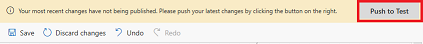

# Work with the Test Bot

As you design your AI for Customer Service Virtual Agent bot, you can use the Test Bot to see how the virtual agent leads a customer through the bot's conversation path. To help you find and fix unexpected behavior, you can enable tracing to take you through the conversation path step by step, and quickly navigate to the corresponding node in the conversation editor.

## To test a topic in the Test Bot

1. Open the topic and click **Edit conversation** to open the conversation editor.

   > [!div class="mx-imgBorder"]
   > 

    You can also select the topic in the topics list and click the edit icon.

   > [!div class="mx-imgBorder"]
   > 

2. To make the topic available to the Test Bot, click **Push to Test** in the upper right corner of the Bot Designer.

   > [!div class="mx-imgBorder"]
   > 

3. At the **Type your message** prompt at the bottom of the Test Bot pane, enter a trigger phrase for the topic.

   > [!div class="mx-imgBorder"]
   > 

    The trigger phrase starts the topic's conversation, and the Test Bot displays the bot responses and user response choices you specified.

   > [!div class="mx-imgBorder"]
   > 

4. Continue the conversation path until you complete the conversation.

   > [!div class="mx-imgBorder"]
   > 

5. To restart the conversation, click **Restart conversation** at the top of the chat bot pane.

   > [!div class="mx-imgBorder"]
   > 

You can return to the conversation editor at any time to revise the topic's dialog, and continue to fine-tune the bot until you are ready to deploy it.