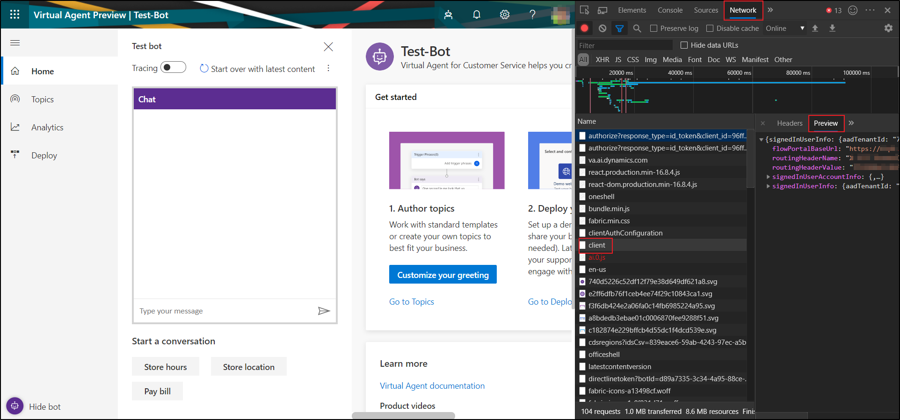
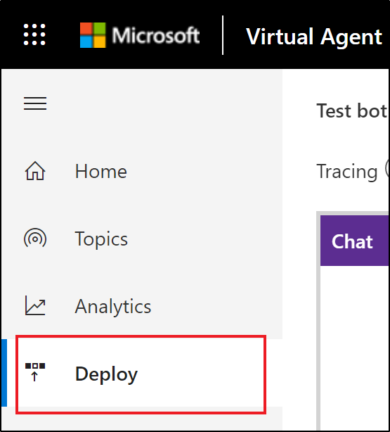

# Use your existing Bot Framework bot with Dynamics 365 Virtual Agent for Customer Service

This article covers how to use the Microsoft Bot Framework dispatcher tool to integrate an existing bot with your Dynamics 365 Virtual Agent for Customer Service bot.

* [Retrieve topics, utterances and secrets from your Virtual Agent tenant](#retrieve-topics-utterances-and-secrets-from-your-virtual-agent-tenant)
* [Train dispatcher custom model with your Virtual Agent topics](#train-dispatcher-custom-model-with-your-virtual-agent-topics)
* [Register and trigger your new dispatch endpoint in code](#register-and-trigger-your-new-dispatch-endpoint-in-code)
* [Deploy your bot and test the dispatcher](#deploy-your-bot-and-test-the-dispatcher)

## Prerequisites

  * Bot build using [Microsoft Bot Framework SDK v4](https://github.com/microsoft/botframework)
  * Visual Studio 2017 or later - [click here to download](https://visualstudio.microsoft.com/vs/)
  * Understanding of [Microsoft Bot Framework's Dispatch tool](https://docs.microsoft.com/azure/bot-service/bot-builder-tutorial-dispatch?view=azure-bot-service-4.0&tabs=csaddref%2Ccsbotconfig)
  * Understanding how to [test and debug bots using Bot Framework Emulator](https://docs.microsoft.com/azure/bot-service/bot-service-debug-bot?view=azure-bot-service-4.0)

### Code samples & dependencies

Code snippets used in this document are available in these articles:

  * [Bot Framework Dispatch tool app sample](https://github.com/Microsoft/BotBuilder-Samples/tree/master/samples/csharp_dotnetcore/14.nlp-with-dispatch)
  * [TO DO - Dynamics Bot Content Converter](https://msazure.visualstudio.com/CCI/_git/Users?path=%2Fsabacha%2FCCIToLU&version=GBmaster)
<!-- please resolve to do -->
  * [Microsoft Bot Framework LUDown utility](https://github.com/microsoft/botbuilder-tools/tree/master/packages/Ludown)
  * [NuGet Package manager](https://nodejs.org/en/)
<!-- link goes to nodeJS download, did you mean https://www.nuget.org/downloads -->
  * [.NET Core 2.1 runtime](https://dotnet.microsoft.com/download/thank-you/dotnet-sdk-2.1.700-windows-x64-installer)

## Retrieve topics, utterances and secrets from your Virtual Agent tenant

We will need to retrieve your Virtual Agent bot's content (topics & utterances), your tenant’s endpoint and direct line secret.

### Retrieve bot ID, tenant ID, and auth token from your bot

1.	In Microsoft Edge, select F12 to open DevTools. For other browsers, similar functionality is available.

2.	[Sign in to your Virtual Agent tenant](http://va.ai.dynamics.com) using your Azure AD credentials. 

3.	Go to the **Network** tab.
    

4.	Filter and look for “client” requests.

5.	Copy the following details. 
    ```javascript
    signedInUserAccountInfo.defaultBot.aadTenantId
    signedInUserAccountInfo.defaultBot.id
    signedInUserAccountInfo.defaultBot.name
    ```
6.	Store the above information in a file, you will need it later.

### Retrieve topics and utterances from your bot

  1.	Export `BotContent` and `Annotations` from Common Data Store. [Review how to export data from Virtual Agent](https://docs.microsoft.com/dynamics365/ai/customer-service-virtual-agent/gdpr-export).
  
  2.  Download the zip file and unzip it to find two CSV files: `annotations.csv` and `msdynce_botcontents.csv`
  
### Convert the exported content to LU format

1. Convert your bot content into LU format using our [TO DO - sample "ContentConverter" utility](https://).
  <!--resolve to do -->

   > [!NOTE]
   > You'll need to use Visual Studio installed to compile and run this sample.

2. Use the following command to compile and run this code sample.

    ```
    dotnet run -p ContentConverter.csproj -c Release -- -i <path to msdynce_botcontents.csv> -o <path to annotations.csv> -b <your bot id>
    ```

3. Convert the LU file to LUIS Json file format.

    ```
    ludown parse ToLuis --in content.lu
    ```

## Train dispatcher custom model with your Virtual Agent topics

Train and recreate the dispatcher app and add your exported topics and utterances with your existing Cognitive Service intents (eg. LUIS and/or QnA maker) using the Dispatch tool. For more information, [follow the guidance in the Dispatch tool tutorial](https://docs.microsoft.com/azure/bot-service/bot-builder-tutorial-dispatch?view=azure-bot-service-4.0&tabs=cs).

1.  Install the dispatch tool using NuGet package manager.

    ```
    CMD> npm install -g botdispatch
    ```

2.  Add topics and utterances that you exported earlier using the Dispatch tool.

    ```
    CMD> dispatch add -type file -name l_dynamicsbot -f luis.json
    Please enter required field(s) below.
    
    What name would you like for your dispatch:
    l_dynamicsbot
    What's your LUIS authoring key (from https://www.luis.ai/user/settings):
    <enter authoring key from URL above>
    What's your LUIS authoring region [westus, westeurope, australiaeast]:
    <pick your region: eg. westus>
    File: content.lu added to l_dynamicsbot.dispatch
    ```

3.  Generate a dispatch model containing exported topics and utterances
    > [!NOTE] 
    > You'll need to re-train your dispatch model when more intents are added in future.

    ```
    CMD> dispatch create
    
    Exporting services for dispatch...
    Creating dispatch LUIS model json...
    Creating training data...
    Updating l_dynamicsbot model...
    Importing l_dynamicsbot model...
    Setting up intents to child services mapping for l_dynamicsbot...
    Add subscription key and publish child LUIS apps...
    Training l_dynamicsbot model...
    Publishing l_dynamicsbot model...
    Writing summary file ('test_prediction')...
    {
      "authoringRegion": "westus",
      "hierarchical": true,
      "useAllTrainingData": false,
      "dontReviseUtterance": false,
      "copyLuisData": true,
      "services": [
        {
          "path": "luis.json",
          "type": "file",
          "name": "l_dynamicsbot"
        }
      ],
      "serviceIds": [
        "1"
      ],
      "appId": "<REDACTED>",
      "authoringKey": "<REDACTED>",
      "version": "Dispatch",
      "region": "westus",
      "type": "dispatch",
      "name": "l_dynamicsbot"
    }
    Please review your dispatch model in ..\Summary.html
    ```

## Register and trigger your new dispatch endpoint in code

The following steps will require you to add code that registers your new dispatch endpoint and trigger it whenever a user's utterance matches intent. We are using the [sample provided by Microsoft Bot Framework](https://github.com/Microsoft/BotBuilder-Samples/tree/master/samples/csharp_dotnetcore/14.nlp-with-dispatch).

1.  Update `appsettings.json` in your dispatcher app to include the new endpoint for Virtual Agent.
  
    ```csharp
    {
      "DynamicsBotId": "<Bot Id>",
      "DynamicsBotTenantId": "<Tenant Id>",
      "DynamicsBotName": "<Bot Name>",
      "DynamicsBotTokenEndpoint": "https://va.ai.dynamics.com/api/botmanagement/v1/directline/directlinetoken",
    }
    ```

2.  Add a new `DynamicsBot` class to your project

    ```csharp
    public class DynamicsBot
    {
      private readonly HttpClient _httpClient;
    
      public DynamicsBot(DynamicsBotEndpoint endpoint, string botName)
      {
        Endpoint = endpoint;
        BotName = botName;
        _httpClient = new HttpClient();
      }
    
      public string BotName { get; }
    
      public DynamicsBotChannelData ChannelData { get; }
      public DynamicsBotEndpoint Endpoint { get; }
    
      public async Task<string> GetTokenAsync()
      {
        var httpRequest = new HttpRequestMessage();
        httpRequest.Method = new HttpMethod("GET");
        httpRequest.RequestUri = Endpoint.TokenUrl;
        var response = await _httpClient.SendAsync(httpRequest);
        var responseStr = await response.Content.ReadAsStringAsync();
        return SafeJsonConvert.DeserializeObject<DirectLineToken>(responseStr).token;
      }
    }
    
    public class DynamicsBotChannelData
    {
      public DynamicsBotChannelData(string botId, string tenantId, string contentVersion)
      {
        dynamics_bot_id = botId;
        dynamics_bot_tenant_id = tenantId;
      }
    
      public string dynamics_bot_id { get; }
      public string dynamics_bot_tenant_id { get;  }
    }
    
    public class DynamicsBotEndpoint
    {
      public DynamicsBotEndpoint(string botId, string tenantId, string tokenEndPoint)
      {
        BotId = botId;
        TenantId = tenantId;
        TokenEndPoint = tokenEndPoint;
        UriBuilder uriBuilder = new UriBuilder(tokenEndPoint);
        uriBuilder.Query = $"botId={BotId}&tenantId={TenantId}";
        TokenUrl = uriBuilder.Uri;
      }
    
      public string BotId { get; }
    
      public string TenantId { get; }
    
      public string TokenEndPoint { get; }
    
      public Uri TokenUrl { get; }
    }
    
    public class DirectLineToken
    {
      public string token { get; set; }
    }
    ```

3.  Add a reference to the DynamicsBot in `IBotServices.cs` file
  
    ```csharp
    public interface IBotService
    {
      LuisRecognizer Dispatch { get; }
      QnAMaker SampleQnA { get; }
      DynamicsBotService DynamicsBotService { get; }
    }
    ```
 
4. Update BotServices constructor to instatiate `DynamicsBotService` in `BotServices.cs` file

    ```csharp
    DynamicsBotService = new DynamicsBotService(new DynamicsBotEndpoint(
        configuration["DynamicsBotId"],
        configuration["DynamicsBotTenantId"],
        configuration["DynamicsBotTokenEndpoint"]),
        configuration["DynamicsBotName"]
    );
    ```
  
5.  Update `DispatchBot.cs` to add a trigger for DynamicsBot on intent match
  
    ```csharp
    private async Task ProcessDynamicsBotAsync(ITurnContext<Microsoft.Bot.Schema.IMessageActivity> turnContext, CancellationToken     cancellationToken)
    {
        var token = await _botService.DynamicsBotService.GetTokenAsync();
    
        using (var directLineClient = new DirectLineClient(token))
        {
            var conversation = await directLineClient.Conversations.StartConversationAsync();
            var conversationtId = conversation.ConversationId;
    
            var response = await directLineClient.Conversations.PostActivityAsync(conversationtId, new Microsoft.Bot.Connector.DirectLine.Activity()
            {
                Type = Microsoft.Bot.Connector.DirectLine.ActivityTypes.Message,
                From = new Microsoft.Bot.Connector.DirectLine.ChannelAccount { Id = "userId", Name = "userName" },
                Text = turnContext.Activity.Text,
                ChannelData = JObject.FromObject(_botService.DynamicsBotService.ChannelData),
                TextFormat = "plain",
                Locale = "en-Us",
            });
    
            Thread.Sleep(4000);
    
            var activities = await GetActivitiesAsync(directLineClient, conversationtId, _botService.DynamicsBotService.BotName);
    
            var activity = turnContext.Activity as Microsoft.Bot.Schema.Activity;
    
            await turnContext.SendActivitiesAsync(
                       activities
                       .Select(message =>
                       {
                           var reply = activity.CreateReply(message.Text);
                           reply.Attachments = message?.Attachments?.Select(a => new Microsoft.Bot.Schema.Attachment()
                           {
                               Content = a.Content,
                               ContentType = a.ContentType,
                               ContentUrl = a.ContentUrl
                           }).ToList();
    
                           reply.SuggestedActions = new Microsoft.Bot.Schema.SuggestedActions()
                           {
                               Actions = message?.SuggestedActions?.Actions?.Select(a => new Microsoft.Bot.Schema.CardAction()
                               {
                                   Title = a.Title,
                                   Value = a.Value,
                                   Type = a.Type,
                                   Image = a.Image
                               }).ToList(),
                           };
    
                           return reply;
                       })
                       .ToArray());
        }
    }
    
    private async Task<List<Microsoft.Bot.Connector.DirectLine.Activity>> GetActivitiesAsync(DirectLineClient directLineClient, string conversationtId, string botName)
    {
        ActivitySet response = null;
        List<Microsoft.Bot.Connector.DirectLine.Activity> result = new List<Microsoft.Bot.Connector.DirectLine.Activity>();
        string watermark = null;
    
        do
        {
            response = await directLineClient.Conversations.GetActivitiesAsync(conversationtId, watermark);
            watermark = response.Watermark;
    
            result = response?.Activities?.Where(x =>
              x.Type == Microsoft.Bot.Connector.DirectLine.ActivityTypes.Message &&
                string.Equals(x.From.Name, botName, StringComparison.Ordinal)).ToList();
    
            if (result != null && result.Any())
            { return result; }
    
            Thread.Sleep(1000);
        } while (response.Activities.Any());
    
        return result;
    }
    ```

6.  If you want your DynamicsBot to handle unmatched intents for a single fallback, update the method `DispatchToTopIntentAsync`.
  
    ```csharp
    case "l_dynamicsbot":
    case "None":
    default:
        await ProcessDynamicsBotAsync(turnContext, cancellationToken);
        break;
    ```

## Deploy your bot and test the dispatcher

We're ready to test our dispatcher to ensure seamless interaction between DynamicsBot and your other bots.

1.  [Deploy your DynamicsBot](https://docs.microsoft.com/dynamics365/ai/customer-service-virtual-agent/getting-started-deploy#to-share-your-bot-on-the-demo-website).
    
  
2.  Build (Ctrl + Shift + B) and run (F5) your dispatcher app.
  
3.  Open Bot Emulator where you add the name and endpoint to your bot.
    
