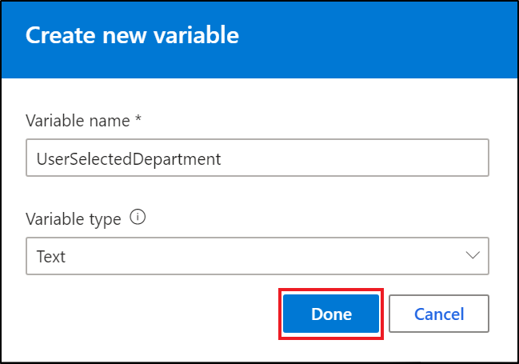

# Work with variables

Variables let you save responses from your customers in a conversation with a bot so that you can reuse them later in the conversation. For example, you can save a customer's name in a variable called *UserName*. The bot can then address the customer by name as the conversation continues.

You can use variables to create logical expressions that dynamically route the customer down different conversation paths.

Virtual Agent supports four types of variables:

* String -- A string of text that the customer enters.
* Age -- A positive number within the range of standard age.
* Currency -- A numeric currency value.
* Number -- A single positive or negative integer.

## To create a variable

1. In the bot conversation editor, select the ellipses in the upper-right corner of the **User responses** node where you want to add the variable.

   > 

2. Select **Properties** to open the Properties pane.

   > 

3. Select **Name variable** to open the **Create variable** window.

   > 

4. Specify a name and type for the variable, and then select **Save**.

   > 

Virtual Agent adds the variable to a customer's response and uses expressions to dynamically route the conversation path, letting you tailor the bot's response.

   > 
