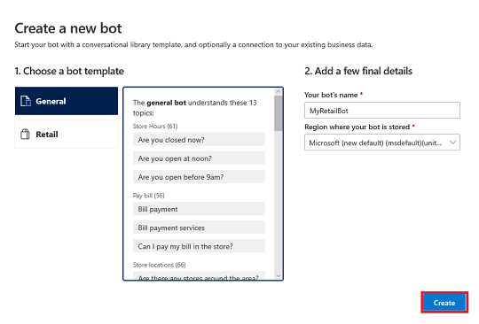
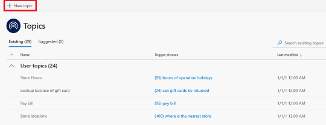
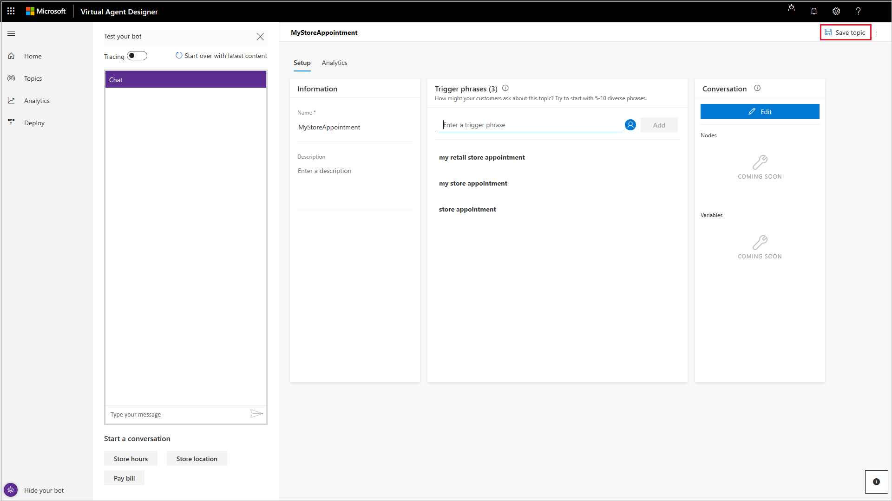
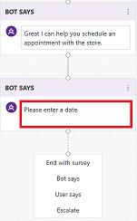
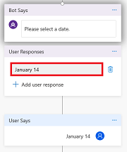
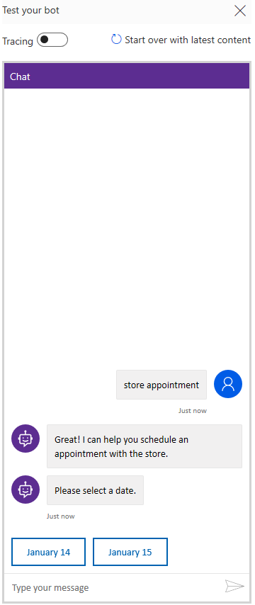
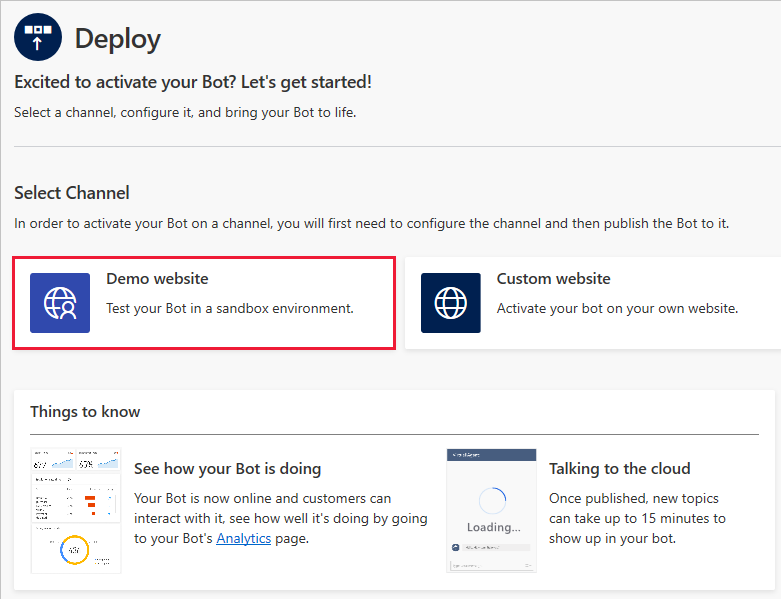
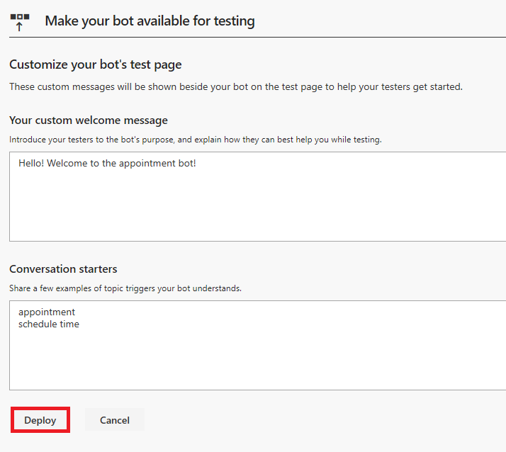
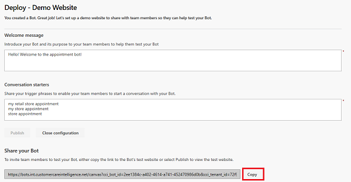
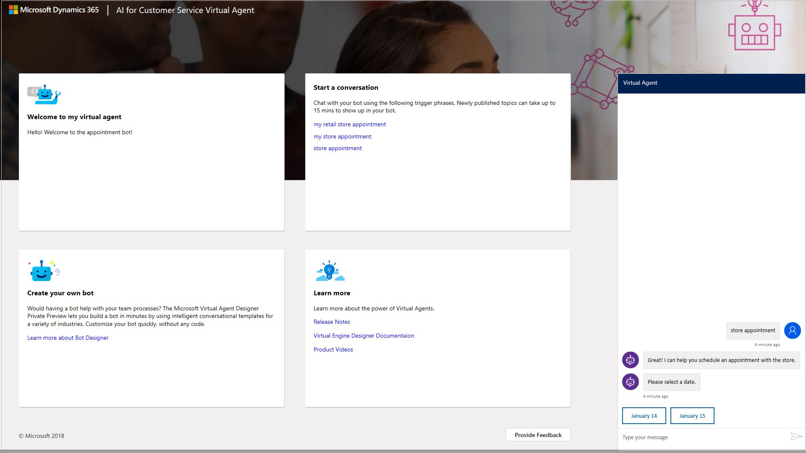

# Quickstart - Create and deploy a customer service virtual agent

Dynamics 365 AI for Customer Service Virtual Agent Designer lets you quickly create and deploy your own customer service virtual agent. The virtual agent can chat with customers, ask clarifying questions to identify issues, and guide each customer to a resolution.

This Quickstart takes you through the end-to-end experience of creating a virtual agent, adding topics, deploying your virtual agent, and analyzing data from your virtual agent.

## To create and deploy your own virtual agent

1. Create the virtual agent.

   Navigate to [https://va.ai.dynamics.com/marketing](https://va.ai.dynamics.com/marketing) in your browser and click **Sign In**.

   On the **Create a new bot** screen, select the template you want to use, either Retail or General. Then specify a name and environment for the bot and click **Create**.

   > [!div class="mx-imgBorder"]
   > 

   When you first create your virtual agent, it may take some time to load. For more information on creating a bot, see [Creating a bot](getting-started-create-bot.md).

   **Note:**   Because access to your virtual agent is managed by your Azure Active Directory (AAD) tenant administrator, other users with admin permissions have access to your virtual agent content.

2. Create a topic, which defines the conversation path a customer takes with the virtual agent for a specific customer intent. For example, a customer may want to make an appointment at a store.

   Click **Topics** in the navigation pane, and then click **New topic** to open the **Create a new topic** screen.

   > [!div class="mx-imgBorder"]
   > 

   For more information on creating a topic, see [Creating topics for your bot](getting-started-create-topics.md).

3. Specify a name, description, and one of more trigger phrases for the topic. A trigger phrase is a phrase that a customer enters to start a conversation with the virtual agent. You can specify more than one trigger phrase for a topic.

   Click **Add** to add the trigger phrase.

   > [!div class="mx-imgBorder"]
   > 

   Then click **Save topic**.

   > [!div class="mx-imgBorder"]
   > 

4. Design the virtual agent's conversation path.

   Click **Edit** to open the conversation editor.

   > [!div class="mx-imgBorder"]
   > 

5. In the conversation editor, add virtual agent and customer responses to the conversation.

   To specify a response by the virtual agent, select **Bot says** and then enter a response in the **Bot says** box.

   > [!div class="mx-imgBorder"]
   > 

   To specify a response by the customer, select **User says** and then enter a response in the **User responses** box.

   > [!div class="mx-imgBorder"]
   > 

   Click **Save** to save the conversation.

6. Test the topic in the Test Bot.

   Enter a trigger phrase for the topic at the **Type your message** of the Test Bot, and then follow the conversation path.

   > [!div class="mx-imgBorder"]
   > 

7. Deploy the virtual agent. Once the virtual agent is created, you have the option to activate it either on a demo website or your own custom website.

   Click **Deploy** in the navigation pane to open the Deploy page.

   To deploy the virtual agent to the demo website, click **Demo website**.

   > [!div class="mx-imgBorder"]
   > 

   On the Deploy - Demo Website page, enter a welcome message for your virtual agent and some examples of topic triggers to use as conversation starters for team members testing your virtual agent, and then click **Publish**.

   > [!div class="mx-imgBorder"]
   > 

   For more information on deploying your virtual agent, see [Deploying your bot](getting-started-deploy.md).

8. Share your virtual agent.

   When you deploy your virtual agent to the demo website, the Virtual Agent Designer adds a **Share your bot** section to the Deploy page that includes the URL for the virtual agent's demo website. Click **Copy** to copy the URL.

   > [!div class="mx-imgBorder"]
   > 

   You can share demo website with your team members who can test the virtual agent by pasting the URL into their browser.

9. Test the virtual agent in the demo website.

   Enter a trigger phrase at the **Type your message** prompt, and then follow the conversation path.

   > [!div class="mx-imgBorder"]
   > 

10. Use analytics to see how your virtual agent is performing.

    To view the analytics dashboards, click **Analytics** in the navigation pane to open the Analytics page. It can take some time for data from conversations with the virtual agent to populate the Analytics page.

   > [!div class="mx-imgBorder"]
   > 

The Analytics page includes built-in dashboards, interactive charts, and visual filters that give you actionable insights into critical performance metrics, operational data, and emerging trends to help you improve your virtual agent.

For more information on using analytics, see [Using analytics to improve your bot](getting-started-analytics.md).

For more information on working with the Virtual Agent Designer, see [Working with the Virtual Agent Designer](getting-started-bot-designer.md).