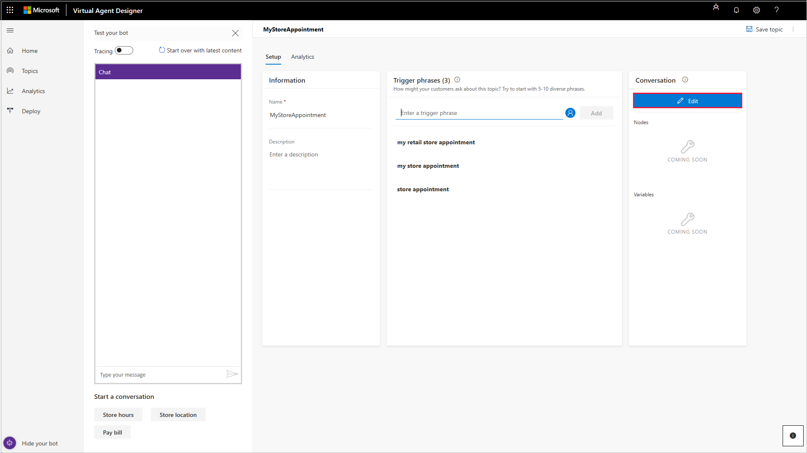
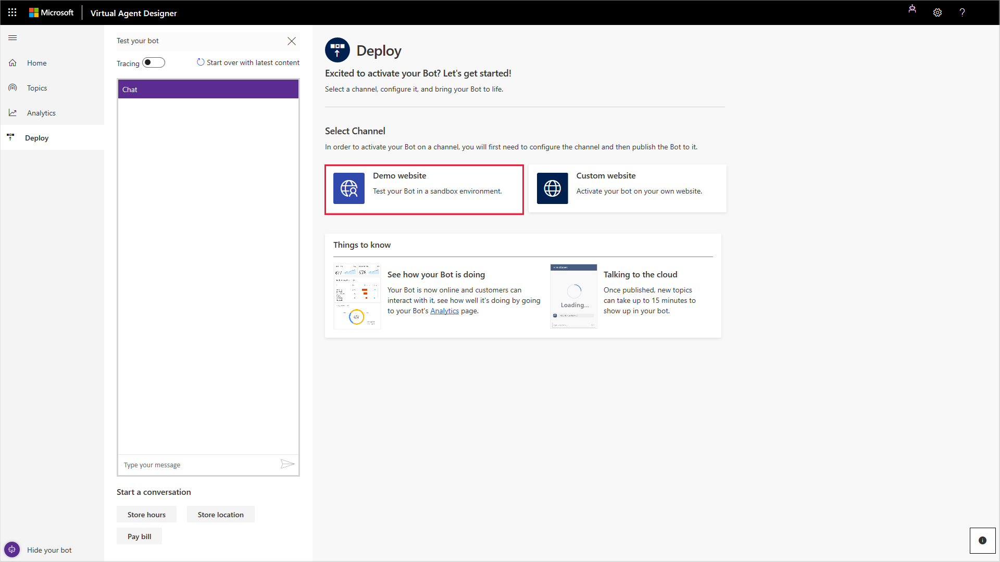
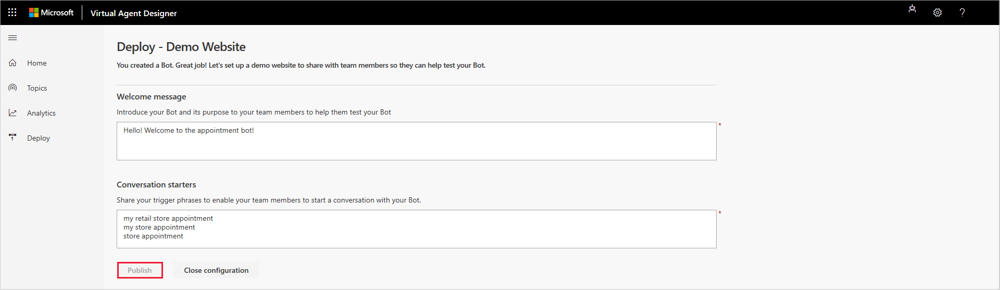
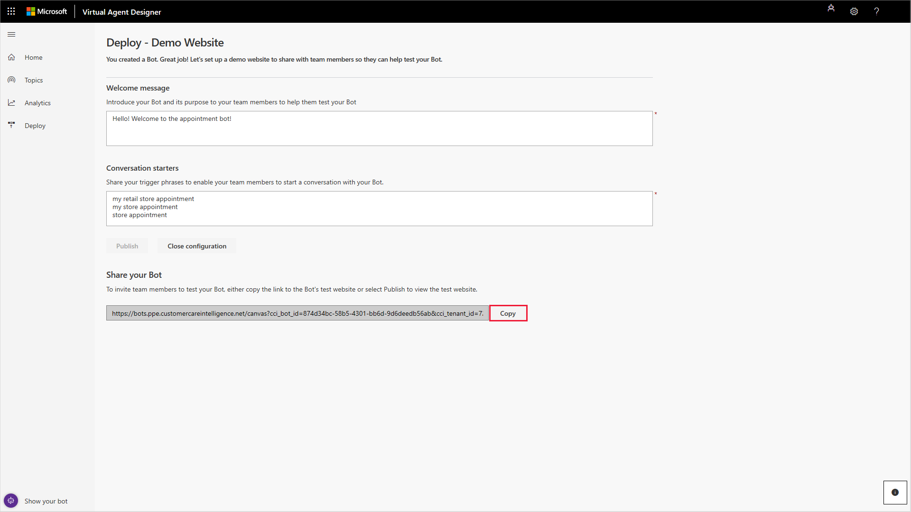

# Quickstart: Create and deploy a customer service bot

Virtual Agent lets you quickly create and deploy your own customer service bot. The bot can chat with customers, ask clarifying questions to identify issues, and guide each customer to a resolution.

This Quickstart takes you through the end-to-end experience of creating a bot, adding topics, deploying your bot, and analyzing data from your bot.

## To create and deploy your own bot

1. If you have not already created a PowerApps environment, create one. You must select an environment when you create your bot.

    For more information about creating a PowerApps environment, see [Creating a PowerApps environment](getting-started-new-environment.md).

2. Create the bot.

   Navigate to [https://va.ai.dynamics.com](https://va.ai.dynamics.com) in your browser to open the Virtual Agent environment.

   On the **Create a new bot** screen, specify a name for the bot.

   In the **More options** section, select your bot's environment and click **Create**.

   When you first create your bot, it might take some time. For more information on creating a bot, see [Creating a bot](getting-started-create-bot.md).

   **Note:**   Because access to your bot is managed by your Azure Active Directory (AAD) tenant administrator, other users with admin permissions have access to your bot content.

3. Customize the bot's built-in greeting topic. For more information on customizing the bot greeting, see [Creating a custom greeting for your bot](getting-started-create-greeting.md).

    Then create your own custom topic, which defines the conversation path a customer takes with the bot for a specific customer intent. For example, a customer might want to make an appointment at a store.

   Select **Topics** in the navigation pane, and then select **New topic** to open the **Create a new topic** screen.

   

   For more information on creating a topic, see [Creating topics for your bot](getting-started-create-topics.md).

4. Specify a name, description, and one or more trigger phrases for the topic. A trigger phrase is a phrase that a customer enters to start a conversation with the bot. You can specify more than one trigger phrase for a topic.

   Select **Add** to add the trigger phrase, and then select **Save topic**.

   

5. Design the bot's conversation path.

   Select **Edit** to open the conversation editor.

   

   In the conversation editor, add bot and customer responses to the conversation. As you add responses, you may want to expand the conversation editor design canvas. For more information on working with the design canvas, see [Working with the conversation editor design canvas](expanding-design-canvas.md).

   Enter the bot's response to the trigger phrase in the **Bot says** box.

   

   To specify an additional response by the bot, select **Bot says**, and then enter the response in the **Bot says** box.

   

   To specify a response by the customer, select **User says**, and then enter a response in the **User responses** box. You can provide several options for the user’s response. The options display as clickable buttons.

   

   Enter a response in the **User responses** box.

   

   To give the customer a choice between different responses, select **Add user response**.

   

   Then specify the additional response in the **User responses** box.

   

   The conversation editor creates separate paths in the conversation, depending on the customer's response. The conversation path leads the customer to the appropriate resolution for each user response.

   Add additional bot and user responses to complete the conversation path. Select **Save** to save the conversation.

6. Test the topic in the Test bot pane.

   Enter a trigger phrase for the topic at the **Type your message** prompt of the Test bot pane, and then follow the conversation path.

   

   If the Test bot pane already displays a conversation, select **Start over with latest content** at the top of the Test bot pane to restart the conversation.

   

7. Deploy the bot. Once the bot is created, you have the option to activate it either on a demo website or your own custom website.

   Select **Deploy** in the navigation pane to open the Deploy page.

   To deploy the bot to the demo website, select **Demo website**.
   
   

   On the Deploy - Demo Website page, enter a welcome message for your bot and some examples of topic triggers to use as conversation starters for team members testing your bot, and then select **Publish**.

   

   For more information on deploying your bot, see [Deploying your bot](getting-started-deploy.md).

8. Share your bot.

   When you deploy your bot to the demo website, Virtual Agent adds a **Share your bot** section to the Deploy page that includes the URL for the bot's demo website. Select **Copy** to copy the URL.

   

   You can share the demo website with your team members, who can test the bot by pasting the URL into their browser.

9. Test the bot in the demo website.

   Enter a trigger phrase at the **Type your message** prompt, and then follow the conversation path.
  
   

10. Use analytics to see how your virtual agent is performing.

    To view the analytics dashboards, select **Analytics** in the navigation pane to open the Analytics page. It can take some time for data from conversations with the virtual agent to populate the Analytics page.

    

The Analytics page includes built-in dashboards, interactive charts, and visual filters that give you actionable insights into critical performance metrics, operational data, and emerging trends to help you improve your virtual agent.

For more information on using analytics, see [Using analytics to improve your bot](getting-started-analytics.md).

For more information on working with Virtual Agent, see [Working with Virtual Agent](getting-started-bot-designer.md).
