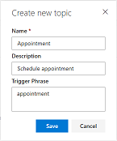

# Quickstart - Create and deploy a customer service bot using AI for Customer Service Virtual Agent

Dynamics 365 AI for Customer Service Virtual Agent lets you quickly create and deploy your own customer service bot. The Customer Service Virtual Agent can chat with customers, ask the appropriate clarifying questions to identify issues, and guide each customer to a resolution.

## To create and deploy your own virtual agent

1. Launch the AI for Customer Service Virtual Agent in your browser to display the **Create a new bot** screen, select the template you want to use, and specify a name and environment for the bot. Then click **Create**.

   > [!div class="mx-imgBorder"]
   > 

    AI for Customer Service Virtual Agent creates the bot and opens it in the Bot Designer.

2. Create a topic, which defines the conversation path a customer takes with the virtual agent. Click **Topics** in the navigation pane, and then click **New topic** to open the **Create a new topic** screen.

   > [!div class="mx-imgBorder"]
   > 

3. Specify a name, description, and one of more trigger phrases for the topic.

    A trigger phrase is a phrase that a customer enters in the chat window to start a conversation with the virtual agent. You can specify more than one trigger phrase for a topic. Then click **Save**.

   > [!div class="mx-imgBorder"]
   > 
