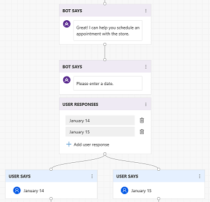
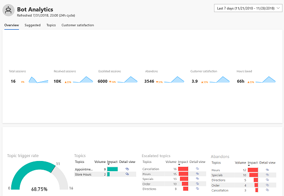

# Quickstart - Create and deploy a customer service bot using AI for Customer Service Virtual Agent

Dynamics 365 AI for Customer Service Virtual Agent lets you quickly create and deploy your own customer service bot. The Customer Service Virtual Agent can chat with customers, ask the appropriate clarifying questions to identify issues, and guide each customer to a resolution.

## To create and deploy your own virtual agent

1. Launch the Virtual Agent Designer in your browser to display the **Create a new bot** screen, and select the template you want to use, either Retail or General. Specify a name and environment for the bot, and then click **Create**.

   > [!div class="mx-imgBorder"]
   > 

2. Create a topic, which defines the conversation path a customer takes with the virtual agent for a specific customer intent. For example, a customer may want to make an appointment at a store. Click **Topics** in the navigation pane, and then click **New topic** to open the **Create a new topic** screen.

   > [!div class="mx-imgBorder"]
   > 

3. Specify a name, description, and one of more trigger phrases for the topic.

    A trigger phrase is a phrase that a customer enters in the chat window to start a conversation with the virtual agent. You can specify more than one trigger phrase for a topic. Click **Add** to add the trigger phrase.

   > [!div class="mx-imgBorder"]
   > 

    Then click **Save topic**.

   > [!div class="mx-imgBorder"]
   > 

4. Design the virtual agent's conversation path. Click **Edit conversation** to open the conversation editor.

   > [!div class="mx-imgBorder"]
   > 

5. In the conversation editor, add bot and user responses to the conversation, then click **Save**.

   > [!div class="mx-imgBorder"]
   > 

6. Test the topic in the Test Bot. Click **Push to Test** in the upper right corner of the Virtual Agent Designer to make the current version of the bot available for testing in the Test Bot. Enter a trigger phrase for the topic at the **Type your message** of the Test Bot, and then follow the conversation path.

   > [!div class="mx-imgBorder"]
   > 

7. Deploy the bot. Once the bot is created, you have the option to activate the bot on one of two web channels: The test web site or your own custom web site.  You can select the web channel and configure it on the Deploy page.

   > [!div class="mx-imgBorder"]
   > 

    To deploy the bot to the test web site, enter a welcome message for your bot and some examples of topic triggers to use as conversation starters for customers interacting with your bot, and then click **Deploy**.

   > [!div class="mx-imgBorder"]
   > 

8. Share your bot. When you deploy your bot, the Virtual Agent Designer adds a **Share your bot** section to the Deploy page that includes the URL for the bot's test web environment. Click **Copy** to copy the URL.

   > [!div class="mx-imgBorder"]
   > 

    Users can open the web test environment and test the bot by pasting the URL into their browser.

9. Test the bot in the test web environment. Enter a trigger phrase at the **Type your message** prompt, and then follow the conversation path.

   > [!div class="mx-imgBorder"]
   > 

10. Use bot analytics to see how your virtual agent is performing. To view the bot analytics dashboards, click **Analytics** in the navigation pane to open the Analytics page. It can take some time for the data to populate the Analytics page.

   > [!div class="mx-imgBorder"]
   > 

The Analytics page includes built-in dashboards, interactive charts, and visual filters that give you actionable insights into critical performance metrics, operational data, and emerging trends to help you improve your virtual agent.

For more information on creating a bot, see [Creating a bot](getting-started-create-bot.md).

For more information on creating topics, see [Creating topics for your bot](getting-started-create-topics.md).

For more information on deploying your bot, see [Deploying your bot](getting-started-deploy.md).

For more information on using bot analytics, see [Using bot analytics to improve your bot](getting-started-analytics.md).

For more information on working with the Virtual Agent Designer, see [Working with the Virtual Agent Designer](getting-started-bot-designer.md).