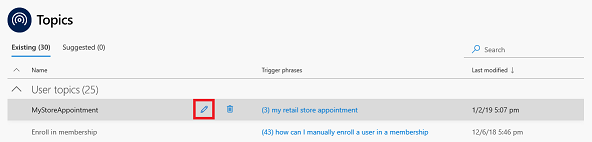

# Quickstart - Create and deploy a customer service bot using AI for Customer Service Virtual Agent

Dynamics 365 AI for Customer Service Virtual Agent lets you quickly create and deploy your own customer service bot. The Customer Service Virtual Agent can chat with customers, ask the appropriate clarifying questions to identify issues, and guide each customer to a resolution.

## To create and deploy your own virtual agent

1. Launch the AI for Customer Service Virtual Agent in your browser to display the **Create a new bot** screen, select the template you want to use, and specify a name and environment for the bot. Then click **Create**.

   > [!div class="mx-imgBorder"]
   > 

    AI for Customer Service Virtual Agent creates the bot and opens it in the Bot Designer.

2. Create a topic, which defines the conversation path a customer takes with the virtual agent. Click **Topics** in the navigation pane, and then click **New topic** to open the **Create a new topic** screen.

   > [!div class="mx-imgBorder"]
   > 

3. Specify a name, description, and one of more trigger phrases for the topic.

    A trigger phrase is a phrase that a customer enters in the chat window to start a conversation with the virtual agent. You can specify more than one trigger phrase for a topic. Then click **Save**.

   > [!div class="mx-imgBorder"]
   > 

4. Design the virtual agent's conversation path. Select the topic in the topics list and click the edit icon to open the design canvas.

   > [!div class="mx-imgBorder"]
   > 

5. On the design canvas, add bot and user responses to the conversation, then click **Save**.

   > [!div class="mx-imgBorder"]
   > 

6. Test the topic in the test bot. Click **Push to Test** in the upper right corner of the Bot Designer, enter a trigger phrase for the topic at the **Type your message** of the test bot, and follow the conversation path.

   > [!div class="mx-imgBorder"]
   > 

7. Deploy the bot. On the Deploy page, enter a welcome message for your bot and some examples of topic triggers to use as conversation starters, and then click **Deploy**.

   > [!div class="mx-imgBorder"]
   > 

8. Test the bot in the test web environmnet. Enter a trigger phrase at the **Type your message** prompt, and then follow the conversation path.

   > [!div class="mx-imgBorder"]
   > 

9. Share your bot. On the Deploy page, click **Copy** to copy the URL for the bot test environment web page, and then distribute the URL.

   > [!div class="mx-imgBorder"]
   > 

10. Use bot analytics to see how your virtual agent and customer service system are performing. To view the bot analytics dashboards, click **Analytics** in the navigation pane to open the Analytics page.

   > [!div class="mx-imgBorder"]
   > 

The Analytics page includes built-in dashboards, interactive charts, and visual filters that give you actionable insights into critical performance metrics, operational data, and emerging trends to help you improve your virtual agent.

For more information on creating a bot, see [Creating a bot](getting-started-create-bot.md).

For more information on creating topics, see [Creating topics for your bot](getting-started-create-topics.md).

For more information on deploying your bot, see [Deploying your bot](getting-started-deploy.md).

For more information on using bot analytics, see [Using bot analytics to improve your bot](getting-started-analytics.md).

For more information on working with the Bot Designer, see [Working with the Bot Designer](getting-started-bot-designer).