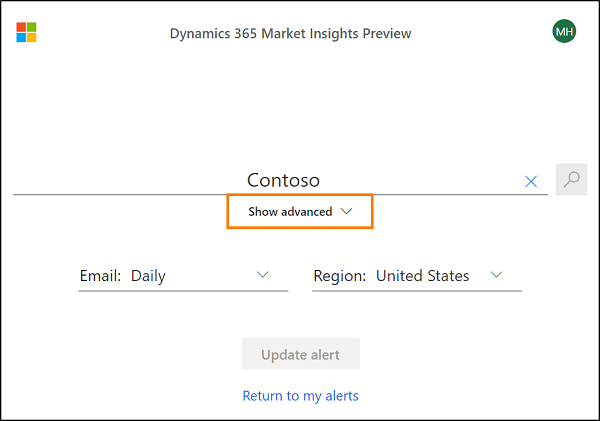
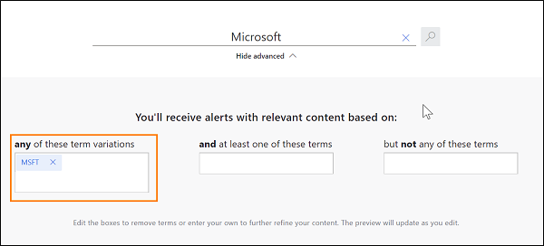
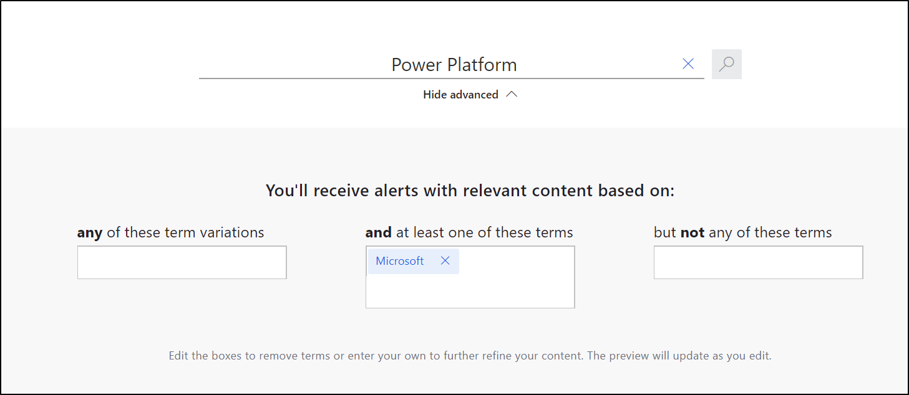
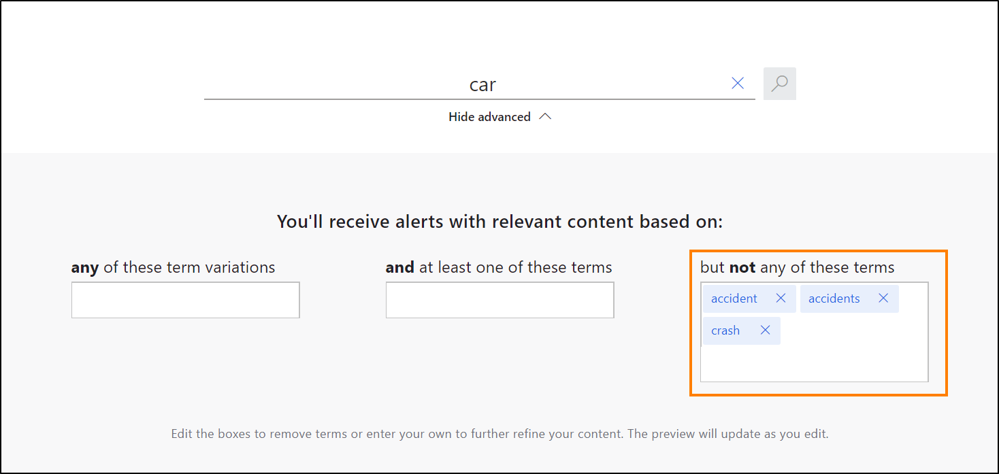

# Manage your alerts

We aim to keep your efforts minimal when managing your alerts. After crating your first alert, you can always return to the start page and add more alerts, or edit existing ones.

## Sign in to the app

You can sign in to the app using one of the following accounts: 
- Microsoft account - sends to your organizational email address 
- LinkedIn account - sends to the primary email address of your LinkedIn profile
- Google account - sends to your Google email address

1. Go to [https://alerts.mi.ai.dynamics.com/](https://alerts.mi.ai.dynamics.com/).
2. Select **Sign in** on the top of the page. 
3. Choose which account to sign in with. 
4. Enter your sign-in credentials, usually, this is a combination of an email address and a password.
5. Allow Market Insights Alerts to connect with the authenticating service. 
6. Start tracking topics that matter to you or manage existing alerts.

## Create an alert

1. [Sign in](#sign-in-to-the-app) to [https://alerts.mi.ai.dynamics.com/](https://alerts.mi.ai.dynamics.com/).
2. Enter a term or a topic and select the search icon {ICON}. Select **Show advanced** if you want to [specify more details for your search](#refine-your-topic).
3. Next to **Email** choose if you want to receive the news **Daily**, or **Weekly**.
4. Select the preferred **Region** for the News and Insights. 
5. Select **Create alert** to finalize your alert.

## Edit an alert

1. [Sign in](#sign-in-to-the-app) to [https://alerts.mi.ai.dynamics.com/](https://alerts.mi.ai.dynamics.com/).
2. In the list of alerts, select the Pen icon {ICON} for the alert you want to edit.
3. Apply your changes and select **Update alert**

## Delete an alert

1. [Sign in](#sign-in-to-the-app) to [https://alerts.mi.ai.dynamics.com/](https://alerts.mi.ai.dynamics.com/).
2. In the list of alerts, select the Trashbin icon {ICON} for the alert you want to delete.
3. Confirm your deletion.

## Tips on refining your topic

Use the **Show Advanced** toggle to refine your search.

Add **more variations of the search term** to *broaden* your search. Example: You want to find generic news about the company Microsoft. When searching for Microsoft, consider searching for the stock ticker symbol (MSFT) too.

Add **inclusions** to *narrow* your search and find news that include both, the search term AND at least one of the terms in box. Example: You want to find news about the Microsoft's Power Platform, but not for generic power platforms. 

Add **exclusions** to *narrow* your search and find news that include the search term but don't include the terms in the box. Example: You want to find news about car industry, but not about car accidents.

## Provide feedback about an alert

We'd love to hear what you think about this new service and how we can tailor the experience to your needs. 
You can share your feedback by [sending us an email](afeed@microsoft.com).