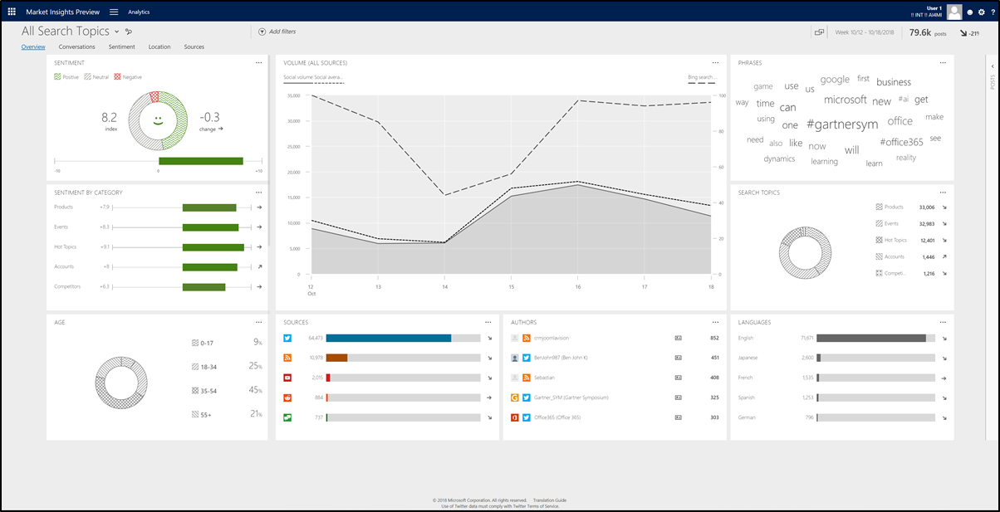

# Understand widgets on the overview page

<!--from editor: Does the following sentence need a URL? If not and it's just an informational sentence, please change the brackets to parentheses.-->

[This topic is pre-release documentation and is subject to change.]

Start your analysis with an overview of the data that your solution has acquired so far. Find key widgets that provide information such as the volume of posts, their sources, sentiment, demographic data (in the United States), and where the posts are coming from.  
  
In [!INCLUDE[Market Insights](../includes/pn-market-insights-short.md)], go to **Analytics** > **Overview** to access the overview page.  

  
## Age

Shows the distribution of age groups based on Bing search data. The demographic segmentation by age relates to the keywords in your search topics. It shows which segment of people have searched for keywords in your search topics on Bing during your timeframe.

> [!NOTE]
> This widget only shows for organizations based in the United States. No data is available when selecting **Today** as the timeframe because search volume data is not real-time and experiences a minimum of a 24-hour lag. It can’t interact with any other filters and it isn’t clickable. If no keyword rule is part of the selected search topics for your dataset, this widget won’t show.

## Authors

The normal view of this widget shows the top five authors and sources, based on the volume of posts and trend indicator. Select the **Full view** button  to expand the widget and find more details such as reach, source, and location for the 100 most-active authors and their posts. 

To add a filter for multiple authors at once, select the check boxes on the left side of the list for all authors that you want to include. Then select **INCLUDE** in the list header. To remove an author from the filter, select the check boxes on the left side of the list for all authors that you want to remove from the filter. Then select **EXCLUDE** in the list header.

> [!NOTE]
> Full view also has a **Delete** button  you can use to [delete a selected author](manage-authors.md) and the author’s posts. You must have a **Power Analyst** or **Administrator** user role to delete an author.
> When you delete an author, none of the author’s previous posts will be available in the solution’s database; they are permanently deleted. No new posts from this author will be acquired in the future.  

## Gender

Shows the distribution of genders based on Bing search data. The demographic segmentation by gender relates to the keywords in your search topics. It shows which segment of people have searched for keywords in your search topics on Bing during your timeframe.

> [!NOTE]
> This widget only shows for organizations based in the United States. No data is available when selecting **Today** as the timeframe because search volume data is not real-time and experiences a minimum of a 24-hour lag. It can’t interact with any other filters and it isn’t clickable. If no keyword rule is part of the selected search topics for your dataset, this widget won’t show.

## Languages

Lists the five most-used languages based on the volume of posts and trend indicator.

## Location insights

Visualizes the posts with location information on a map to show where the posts are coming from. You can also [define an activity map](activity-maps.md) to see new posts in real-time, with additional functionality. 

Dynamic widget. Shows only if posts with location information are available in the selected data set.

## Phrases

Lists frequently mentioned phrases, based on the posts in your current data set. The larger a phrase appears, the more posts contain the phrase.

## Post types

Shows the volume of posts and comments on [!INCLUDE[tn_facebook](../includes/tn-facebook.md)] pages, separated by page and by author.

Dynamic widget. Shows only if the data set contains at least one search topic with a [!INCLUDE[tn_facebook](../includes/tn-facebook.md)] pages rule.

## Search topics

Shows the top five categories if you include all search topics in your dataset, or search topics if you include a category in your dataset, based on volume and trend indicator.

## Sentiment

Shows the sentiment index across all posts that have a sentiment value in the selected dataset. It also shows changes in the sentiment index compared to the last similar timeframe and the trend indicator.    

You can [manually change the sentiment values](analytics-sentiment.md) if you find that sentiment for a post is analyzed incorrectly. 

Dynamic widget. Shows only if the data set contains posts with sentiment values.

## Sentiment by category/search topic

View the sentiment index and sentiment trends for all posts that have a sentiment value in categories or search topics, sorted by volume.  

Select the **Full view** button  to expand the widget for more details.

Dynamic widget. Shows only if your data set contains posts with sentiment value. If you include all search topics in your data set, it will show the sentiment by categories. If you include a category in your data set, it will show the sentiment by search topic.

## Sources

Shows the number of posts in the most active sources and summarizes how many posts were found in other sources. Select the **Full view** button  to expand the widget for more details.  

## Volume

Shows the total number of posts and the average number of posts for the selected dataset over time.

Additionally, organizations based in the United States see an additional line for **Bing Search trend**. This line indicates the volume of searches on Bing (on an aggregated, anonymized, and normalized basis) for the keywords in your dataset.

The trend line is scaled from 0-100, with 0 representing very low search volume and 100 representing peak search volumes. The peak search volume is defined relatively to its own search volume and therefore not an absolute peak across different search topics. 

> [!NOTE]
> **Bing Search trends** aren’t available when selecting **Today** as the timeframe because search volume data is not real-time and experiences a minimum of a 24-hour lag. It can’t interact with any other filters and it isn’t clickable. If no keyword rule is part of the selected search topics for your dataset, this line won’t show.

### See also  
[Analyze social data using widgets](analyze-social-data-using-widgets.md)   
[Use filters to see relevant data](use-filters.md)    
[Explore more options with your data set](more-options-with-data-set.md)    
[Understand the public perception using sentiment analysis](analytics-sentiment.md)
