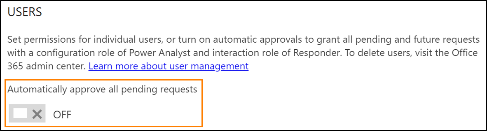

# Assign permissions and user roles

(This topic is pre-release documentation and is subject to change.)

Approve and withdraw access to [!INCLUDE[Dynamics 365 Market Insights](../includes/pn-market-insights-long.md)]. Manage user permissions by assigning and editing [user roles](user-roles.md). Reach out to users by email in [!INCLUDE [pn-market-insights-short](../includes/pn-market-insights-short.md)].  
  
> [!NOTE]
>  You must be a [!INCLUDE[Market Insights](../includes/pn-market-insights-short.md)] Administrator to perform these tasks.  
  
## Approve or withdraw access requests  
When a self-service user signs up for [!INCLUDE[Market Insights](../includes/pn-market-insights-short.md)] when a subscription already exists, they get added to the existing tenant but can't access the service immediately. A [!INCLUDE[Market Insights](../includes/pn-market-insights-short.md)] admin needs to approve or deny their request.

Users in [!INCLUDE[Market Insights](../includes/pn-market-insights-short.md)] can have on of the following statuses: 
- **Pending**: New users who are requesting access after using the self-service sign-up
- **Active (New)**: New users who were assigned a license to [!INCLUDE[Market Insights](../includes/pn-market-insights-short.md)] by the global admin and got the default roles in [!INCLUDE[Market Insights](../includes/pn-market-insights-short.md)]
- **Active (All)**: All active users in the [!INCLUDE[Market Insights](../includes/pn-market-insights-short.md)] solution (excluding pending and withdrawn users)
- **Withdrawn**: Users with a [!INCLUDE[Market Insights](../includes/pn-market-insights-short.md)] license whose access was withdrawn by an administrator

### Approve a new user
  
1.  Navigate to **Settings** > **User Management**.  
  
2.  In the **Users** pane, select **Pending** from the **Status** drop-down menu.  
  
3.  Select the check boxes for the users you want to approve and select the **Edit Selected**  button.  
  
4.  In the **Edit User Role** pane, select the [user roles](user-roles.md) from the drop-down menus.  
  
5.  To confirm, select **Save** .  

### Automatically approve new users

Administrators in [!INCLUDE[Market Insights](../includes/pn-market-insights-short.md)] can configure the solution to automatically approve new users signing up using the self-service sign-up. 

1.  Navigate to **Settings** > **User Management**.  
  
2.  In the **Users** pane, set the **Automatically approve all pending requests** toggle to **On**.    
    

### Withdraw access of a user

1.  Navigate to **Settings** > **User Management**.  
  
2.  In the **Users** pane, select **Active(All)** from the **Status** drop-down menu.  
  
3.  Select the check boxes for the users you want to block from [!INCLUDE[Market Insights](../includes/pn-market-insights-short.md)] and select the **Edit Selected**  button.  
  
4.  In the **Edit User Role** pane, set the **Access allowed** toggle to **No**.  
  
5.  To confirm, select **Save** .  

  
## Change a role for a user  
  
1.  Navigate to **Settings** > **User Management**.  
  
2.  In the **Users** pane, select the list entry you want to edit.
    > [!TIP]
    >  Find licensed users using the **Search for users** input field and filter for users with a specific role by choosing a role in the **Configuration role** or **Interaction role** drop-down list.   
  
3.  In the **Edit User Role** dialog box, select the user role from the drop-down menus.  
  
4.  Click **Save** . The user will receive an email with the updated user roles and permissions.    
  
> [!NOTE]
> Users that are listed as [delegated administrator](delegated-admin.md) for [!INCLUDE[Market Insights](../includes/pn-market-insights-short.md)] always have Administrator and Manager user roles. A lock icon  next to the user’s name indicates that you can’t change the permissions.  
  
## Send email to users
  
Use your email client to send email to [!INCLUDE[Market Insights](../includes/pn-market-insights-short.md)] users. You don’t need to research a user’s email address. The email opens with the recipient’s address already filled in.  
  
1.  Navigate to **Settings** > **User Management**.  
  
2.  Identify the user you want to contact and click the **Email**  button in the **Users** list.  
  
## Privacy notice  
[!INCLUDE[cc_privacy_msl_cookies](../includes/cc-privacy-market-insights-cookies.md)]  
  
### See Also  
[Administer Market Insights](settings-administration.md)   
[Understand user roles](user-roles.md)   

 
