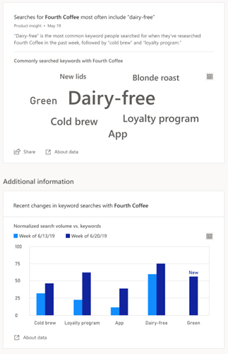

# Awareness insights

## Overview

Value prop

## Rising topics

## Search trends

## Data and frequency

**Top Insights** aggregates data from web searches that were performed by users to compare different products. The main attributes from those searches are extracted, ranked and observed over time. Trends are normalized over time to ensure the data stays anonymous.

- Top ranked keywords will refresh every week
- Top keywords trend will display the last week

If the search volume changes significantly or new top keyword is found, a notification will be sent through the app on weekly basis.
