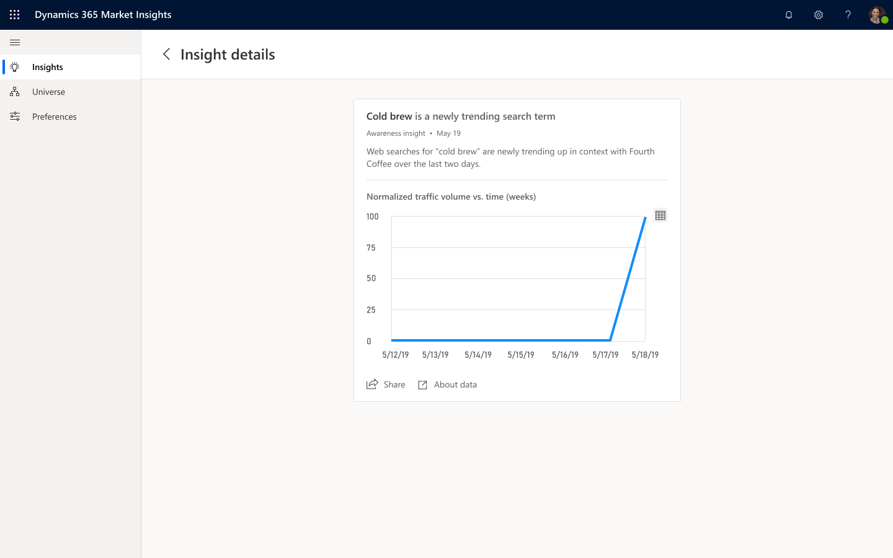
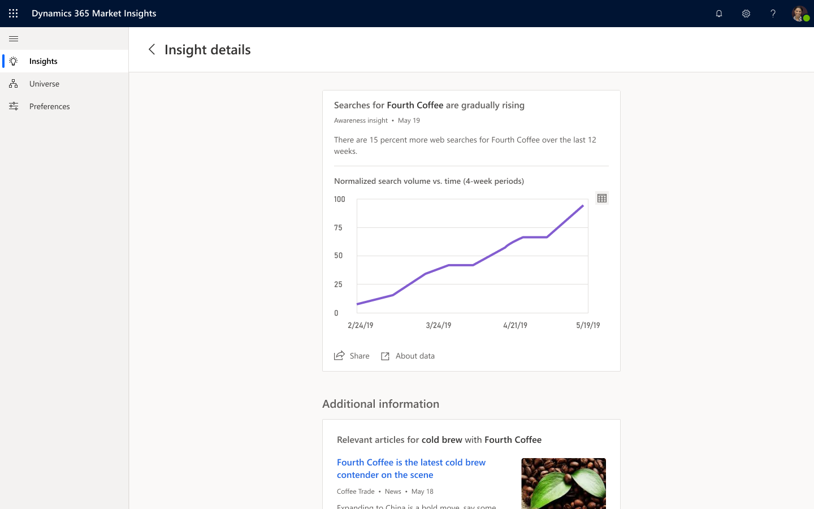

# Awareness insights

## Overview

Staying on top of the market for a product or service is critical to success. There are several aspects of a business universe that the product leader needs to understand to stay on top. Awareness insights helps business professionals understand their customer's interest in elements of their business universe by finding tending search terms and highlighting how awareness and interest evolves over time; based on what people are searching for online.

## Trending terms

**Trending terms** identifies specific search terms that are trending based on what people are searching for related to a given element in the universe.

> [!div class="mx-imgBorder"]
> 

## Search activity

**Search activity** analyzes the volume of searches for a given element. If a significant change in search volume is detected, a new insight will show in the feed.

> [!div class="mx-imgBorder"]
> 

## Data and frequency

**Trending terms** and **Search activity** are both based on significant changes in the volume of online web searches for their respective context.

When opening the insight details for any of them, you'll find a chart that visualizes the change in volume. If there's a new trending search term or an significant spike in volume, the chart is displayed on a 1-week scale. If the volume changes gradually over time, the chart is based on a time frame of 4 months.

Additionally, you'll find relevant articles that provide more context for the change shown in the insight.
