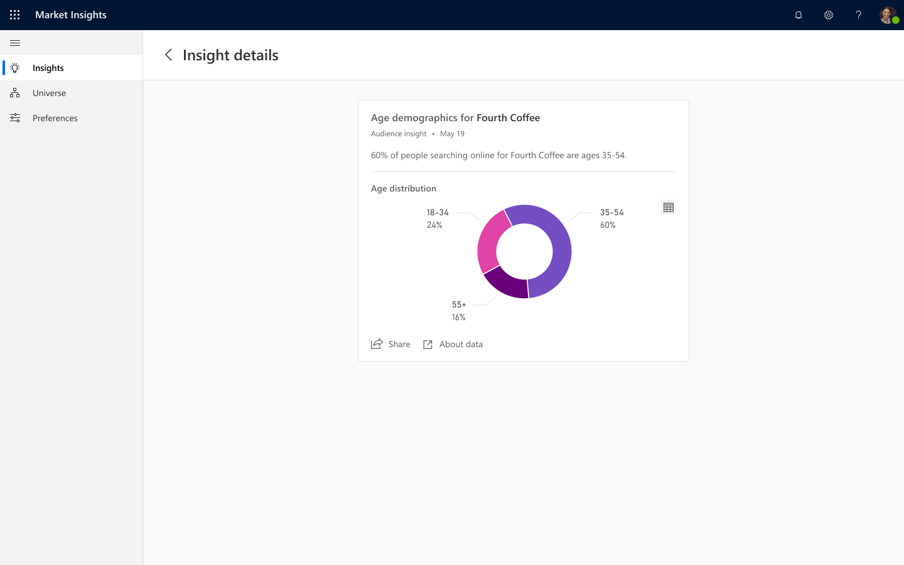

# Demographic insights

[!INCLUDE [market-insights-eos](../includes/market-insights-eos.md)]

(This topic is pre-release documentation and is subject to change.)

## Overview

Obtaining accurate customer demographic information can be an expensive and time consuming task.

**Gender** and **Age** insights provide a view with the percentage of male and female distributions, as well as age distribution of those who are searching for elements you defined.

> [!div class="mx-imgBorder"]
> 

## Data and frequency

**Age** and **Gender** distribution will show after finishing the initial setup. Generally, Age and gender distribution data can take up to 24 hours to appear, especially after adding or editing an element in the universe.

**Age** and **Gender** distribution data is recalculated every week and surfaced in the feed.

**Demographic insights** aggregate data from web search users who search for related terms of the selected element. Each web search user is assigned to a demographic segment by using data science models on their search query terms and patterns from multiple search sessions.
