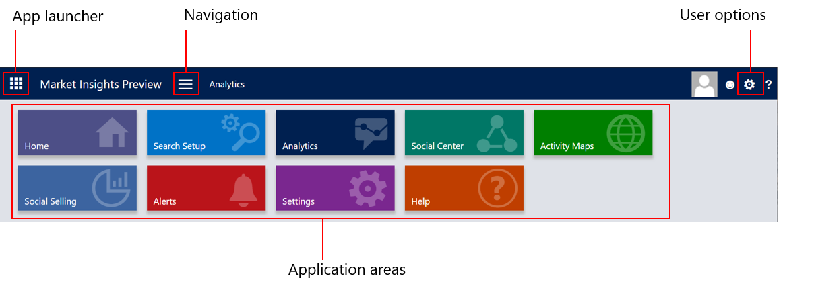
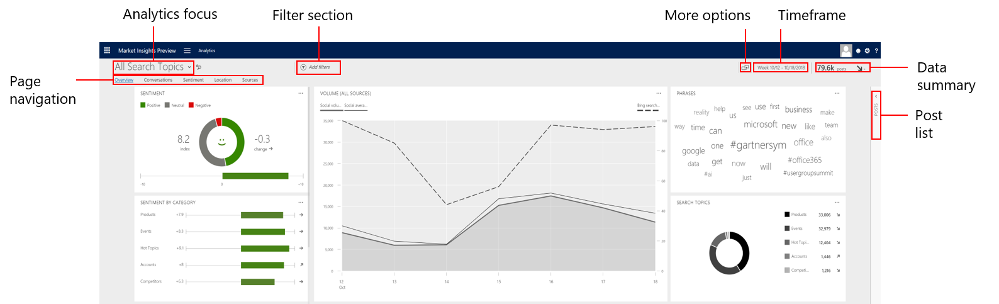
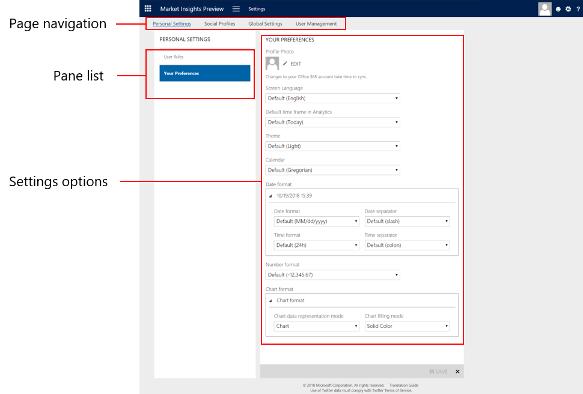

# Get started with [!INCLUDE[Market Insights](../includes/pn-market-insights-short.md)]

(This topic is pre-release documentation and is subject to change.)

This topic introduces common user-interface elements and useful tips to work efficiently with [!INCLUDE[Dynamics 365 Market Insights](../includes/pn-market-insights-long.md)]. You'll get a basic understanding of the application’s logic and conceptual approaches to help you start to work with the various features and areas.  
  
## Prerequisites  
 To provide you the best experience with [!INCLUDE[Market Insights](../includes/pn-market-insights-short.md)], it's a good idea to keep your browser updated to the latest version.  
  
- **Supported browsers**  
  
  - At least [!INCLUDE[pn_Internet_Explorer](../includes/pn-internet-explorer.md)] 11  
  
  - Latest version of [!INCLUDE[tn_Google_Chrome](../includes/tn-google-chrome.md)]  
  
  - Latest version of [!INCLUDE[tn_Mozilla_Firefox](../includes/tn-mozilla-firefox.md)]  
  
  - Latest version of [!INCLUDE[tn_Apple_Safari](../includes/tn-apple-safari.md)]  
  
- **Supported mobile devices**  
  
  - [!INCLUDE[pn_windows_phone_8](../includes/pn-windows-phone-8.md)] and [!INCLUDE[pn_windows_phone_81](../includes/pn-windows-phone-81.md)] devices with [!INCLUDE[pn_Internet_Explorer](../includes/pn-internet-explorer.md)] mobile  
  
  - [!INCLUDE[tn_Apple_ipad](../includes/tn-apple-ipad.md)] and [!INCLUDE[tn_iphone](../includes/tn-iphone.md)] running at least iOS 7 with [!INCLUDE[tn_Apple_Safari](../includes/tn-apple-safari.md)] browser  
  
  - Tablets and phones running at least [!INCLUDE[tn_android](../includes/tn-android.md)] 4.2 with [!INCLUDE[tn_Google_Chrome](../includes/tn-google-chrome.md)] Mobile browser  
  
## Sign in to [!INCLUDE[Market Insights](../includes/pn-market-insights-short.md)]  
  
[Sign in to Market Insights](https://mi.ai.dynamics.com/login) directly or review additional options to [access Market Insights](sign-in.md)  

> [!NOTE]
> The first user, usually the global admin, needs to sign in to [!INCLUDE[Market Insights](../includes/pn-market-insights-short.md)] and confirm the solution isn’t used by or on behalf of a government customer before other users can access the service. 
 
## Navigate the application’s main areas  
 Use the bar at the top of the page to move between all of the different areas of [!INCLUDE[Market Insights](../includes/pn-market-insights-short.md)]. Pages that you see depend on the permissions that your system administrator assigned to you.  

   
  
 The navigation controls are as follows:  
  
- **App launcher**: Quickly go to your [!INCLUDE[pn_Office_365](../includes/pn-office-365.md)] portal and select from your available services.  
  
- **Open default page**: Start a fresh analysis on **Analytics** > **Overview** and reset all active filters.  
  
- **Navigation**: Click this button to see the application areas and quickly switch to the area that you are looking for.  
  
- **Sign out/Change Profile**: You can change your profile by clicking the **View Office 365 profile option** or Sign out from [!INCLUDE[Market Insights](../includes/pn-market-insights-short.md)] and your [!INCLUDE[pn_Office_365](../includes/pn-office-365.md)] user account.  
  
- **User options**: Get one-click access to the **My Preferences** area, and see further information about [!INCLUDE[Market Insights](../includes/pn-market-insights-short.md)].  
  
- **Help options**: See context-sensitive help topics that apply to the area you’re working in, and quickly access the [!INCLUDE[Market Insights](../includes/pn-market-insights-short.md)] forums and support contacts.  
  
- **Application areas**: The main areas to work in [!INCLUDE[Market Insights](../includes/pn-market-insights-short.md)].  
  
- **Search Setup**: Create and edit search topics, defining the posts that [!INCLUDE[Market Insights](../includes/pn-market-insights-short.md)] acquires. Get an overview of your solution’s data acquisition status and its progress towards the post quota. Maintain lists of blocked content to optimize the quality of your data.  
  
  [!INCLUDE[proc_more_information](../includes/proc-more-information.md)] [Set up searches to listen to social media conversations](set-up-searches.md)  
  
- **Analytics**: See widgets that show the data in your solution. Switch between different pages in Analytics to see more detailed information about the areas that matter the most to you. Add filters to slice and dice your data according to your business needs.  
  
  [!INCLUDE[proc_more_information](../includes/proc-more-information.md)] [Analyze social data using widgets](analyze-social-data-using-widgets.md)  
  
- **Private Messages**: Find all private messages in the solution with a single click. This is not an application but a shortcut to a view on the post list with the filter for private messages enabled.  
  
  [!INCLUDE[proc_more_information](../includes/proc-more-information.md)] [View posts and conversations in Market Insights](posts-conversations.md)  
  
- **Social Center**: Create and manage real-time streams of posts that match a selected data set. Depending on your user role and license type, you can share streams with other users of your solution.  
  
  [!INCLUDE[proc_more_information](../includes/proc-more-information.md)] [Keep track of live data streams with Social Center](social-center.md)  
  
- **Activity Maps**: Create and manage activity maps to see real-time visualizations of posts with location information. Show this on a large screen and let your audience know where in the world your topics are discussed.  
  
  [!INCLUDE[proc_more_information](../includes/proc-more-information.md)] [Define activity maps to view real-time data](activity-maps.md)  
  
- **Social Selling**: Work with the Social Selling Assistant directly from within [!INCLUDE[Market Insights](../includes/pn-market-insights-short.md)] and get recommendations on relevant and shareable content that really matters to you.  
  
  [!INCLUDE[proc_more_information](../includes/proc-more-information.md)] [Empower your salespeople with the Social Selling Assistant](social-selling-assistant-overview.md)  
  
- **Alerts**: Create and manage alerts to get the most recent posts or significant changes delivered by email to the specified recipients.  
  
  [!INCLUDE[proc_more_information](../includes/proc-more-information.md)] [Stay up to date with alerts](email-alerts.md)  
  
- **Settings**: All users can define how the application displays for them. Administrators can manage user roles, set system-wide settings, and configure many more options.  
  
  [!INCLUDE[proc_more_information](../includes/proc-more-information.md)] [Administer Market Insights](settings-administration.md)  
  
- **Help**: Visit the [!INCLUDE[Dynamics 365 Market Insights](../includes/pn-market-insights-long.md)] Help Center (opens a new website) to see the latest help topics.  
  
## Get around in the Analytics area  
 In most cases, the first thing you’ll see when you sign in to [!INCLUDE[Market Insights](../includes/pn-market-insights-short.md)] is the Analytics area. By default, you’re looking at a data set that contains all posts that all search topics gathered in the specified time frame.  
  
   
  
 All pages in the Analytics area share the following structure:  
  
- **Analysis focus**: Define the data that your current analysis focuses on, and select a search topic, a category of search topics, or all search topics. You can switch between the different options at any time to narrow or extend your data set.  
  
- **Filter section**: Add or edit filters to slice and dice your data set according to your needs. At a glance, see the filters that are applied to your current data set, and quickly edit or remove them.  
  
- **More options**: Use the current filters to work with the same data set in another area of Market Insights. [!INCLUDE[proc_more_information](../includes/proc-more-information.md)] [Explore more options with your data set](more-options-with-data-set.md)  
  
- **Time frame**: Select the dates for which you want to analyze your data. You can select a custom date or predefined values.  
  
- **Data summary**: See the number of posts and the trend of your current data set.  
  
- **Page navigation**: Move between the different pages of the Analytics area. Each page provides a more detailed view of important aspects of your data.  
  
  - **Overview**: See at a glance what’s happening in your selected data set before you drill down into the more detailed pages. [!INCLUDE[proc_more_information](../includes/proc-more-information.md)] [Understand widgets on the Overview page](analytics-overview.md)  
  
  - **Conversations**: Find  phrases that are driving the social conversations in your data set. See more detailed analysis about trending phrases, and dive into the posts that mention them. [!INCLUDE[proc_more_information](../includes/proc-more-information.md)] [Find out what people are talking about](analytics-conversations.md)  
  
  - **Sentiment**: See the public perception of the posts toward a search topic. Find  phrases that get mentioned in a positive or negative context and track your sentiment index over time. [!INCLUDE[proc_more_information](../includes/proc-more-information.md)] [Understand the public perception using sentiment analysis](analytics-sentiment.md)  
  
  - **Location**: Gain insights about the geographical location of authors and posts, and learn more about where social conversations are most active. [!INCLUDE[proc_more_information](../includes/proc-more-information.md)] [See the locations for the posts](analytics-location.md)  
  
  - **Sources**: Find  sources that are used most in your data set. See detailed analysis, and drill down into the details of source-specific analysis. [!INCLUDE[proc_more_information](../includes/proc-more-information.md)] [Analyze the sources for the posts](analytics-sources.md)  
  
- **Dynamic widgets**: This area of the page contains widgets that display when certain criteria are present. For example, a map on the **Location Insights** widget shows when you select filters that may include posts with location data. When you change your data set by editing filters or changing the analysis focus, the widgets may refresh with the updated data, may disappear if the display conditions are no longer met, or may appear if the display conditions apply. [!INCLUDE[proc_more_information](../includes/proc-more-information.md)] [Analyze social data using widgets](analyze-social-data-using-widgets.md)  
  
- **Static widgets**: The widgets in this area of the page are always there. When you change your data set by editing filters or changing the analysis focus, the widgets refresh with the updated data. [!INCLUDE[proc_more_information](../includes/proc-more-information.md)] [Analyze social data using widgets](analyze-social-data-using-widgets.md)  
  
- **Post list**: Expand this area to see the most recent posts that match your current data set. Update your data set or your time frame, or load more posts to dive deeper into the contents. Take action and engage with your audience directly from within the application.  
  
  [!INCLUDE[proc_more_information](../includes/proc-more-information.md)] [View posts and conversations in Market Insights](posts-conversations.md)  
  
## Get around in the Settings area  
 Administer your [!INCLUDE[Dynamics 365 Market Insights](../includes/pn-market-insights-long.md)] solution, and set the options for your solution and its users. To set up your solution and get your users started quickly, see [Set up Market Insights](set-up-first-steps.md).  
  
   
  
- **Page navigation**: Move between the different pages of the settings area. Each page lets you set options that apply system-wide or to individual users only. Depending on your user role, you may not see all pages in the area.  
  
  1. **Personal Settings**: Define how the application displays for you. The values are initially set by an administrator, but you can change the defaults according to your needs. [!INCLUDE[proc_more_information](../includes/proc-more-information.md)] [Set your preferences for the user interface](user-preferences.md)  
  
  2. **Global Settings**: Administrators can set system-wide defaults that apply to all new users and newly-created search topics. [!INCLUDE[proc_more_information](../includes/proc-more-information.md)] [Manage global settings](manage-global-settings.md)  
  
  3. **Social Profiles**: Manage social profiles that you own or that were shared with you to engage with your audience directly in [!INCLUDE[Market Insights](../includes/pn-market-insights-short.md)]. [!INCLUDE[proc_more_information](../includes/proc-more-information.md)] [Manage social profiles](manage-social-profiles.md)  
  
  4. **User Management**: Administrators define permissions and roles for the users of their solution. [!INCLUDE[proc_more_information](../includes/proc-more-information.md)] [Understand user roles](user-roles.md)  
  
  5. **Connections**: Administrators can connect [!INCLUDE[Market Insights](../includes/pn-market-insights-short.md)] with [!INCLUDE[pn_microsoftcrm](../includes/pn-microsoftcrm.md)] to create new records in the connected [!INCLUDE[pn_crm_shortest](../includes/pn-crm-shortest.md)] instances, or stream posts as events to [!INCLUDE[pn_microsoft_azure_event_hubs](../includes/pn-microsoft-azure-event-hubs.md)]. [!INCLUDE[proc_more_information](../includes/proc-more-information.md)] [Manage connections in Market Insights](manage-connections.md), [Set up the connection between Dynamics 365 and Market Insights](connect-dynamics-365-record-creation.md), [Stream data from Market Insights to Microsoft Azure Event Hubs](stream-data-to-event-hubs.md)  
  
  6. **Automation Rules**: Create rules that automatically perform actions on a specified data set. [!INCLUDE[proc_more_information](../includes/proc-more-information.md)] [Route posts using automation rules](automation-rules.md)  
  
- **Settings options**: Set the values on the settings pages according to your needs. [!INCLUDE[proc_more_information](../includes/proc-more-information.md)] [Administer Market Insights](settings-administration.md)  
  
  
### Privacy notices  
 [!INCLUDE[cc_privacy_msl_social_services_content](../includes/cc-privacy-market-insights-social-services-content.md)]  
  
 [!INCLUDE[cc_privacy_msl_index_cached_data](../includes/cc-privacy-market-insights-index-cached-data.md)]  
  
### See Also  
 [Manage global settings](manage-global-settings.md)   
 [Set up searches to listen to social media conversations](set-up-searches.md)
 
