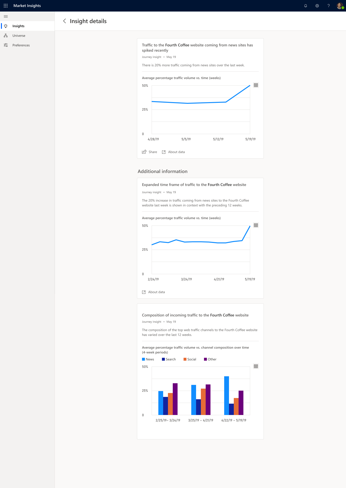

# Journey insights

## Overview

Tracking traffic volume change to or from a website is critical to keep track of  customer’s online behavior. Journey insights helps to detect gradual or sharp website traffic volume change and identify the channels causing the traffic changes. This enables business professionals to understand campaign effectiveness and customer preference. More importantly, Journey insights enables understanding of both proprietary and 3rd-party websites, including competitor’s website. For example, you can be notified when a competing brand’s website has seen significant traffic increase from news sites over the past weeks.  

**Traffic volume change of a website** provides a view of the top channel contributing to the detected web traffic change and associated timeline with the website of your interest.

> [!div class="mx-imgBorder"]
> 

## Data and frequency

**Traffic volume change of a website** aggregates data of website traffic by visits from a variety of channels. The contribution to the overall website traffic volume change is analyzed across a time frame. Trends are normalized over time to ensure the data stays anonymous.

Traffic volume from or to a website will refresh daily.

If the traffic volume changes significantly, caused by a certain channel, a notification will be sent through the app the following day.
