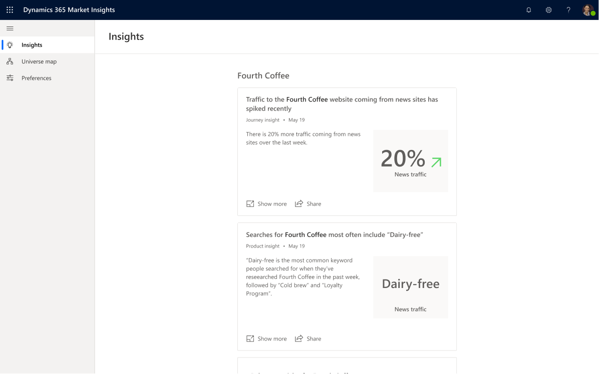

# Dynamics 365 Market Insights Preview - track topics that matter to you

Dynamics 365 Market Insights Preview is no longer available as a standalone application to new customers starting from Apr 10, 2020 and will end the service for all existing customers by May 11, 2020. We will incorporate the core technology and learnings from Market Insights preview into [Dynamics 365 Customer Insights](https://dynamics.microsoft.com/ai/customer-insights/) and [Microsoft Bing Industry Updates](https://newspro.microsoft.com/baw/homepage). Read the [Market Insights discontinuation FAQ](eos-faq.md) to learn more.

(This topic is pre-release documentation and is subject to change.)

Today, business professionals face several challenges to understanding their customers and their market. An enormous amount of information is continuously being updated and coming from many different sources. In addition, some of the information needed might not be accessible. It might also take weeks or months to collect and understand the information about a specific topic, and this information is often expensive to access, gather, and process. In the worst case, you might miss an important event or find out about it too late. These challenges result in low visibility into market trends and missed opportunities to build customer relationships.

With Dynamics 365 Market Insights, you can close this gap with access to a variety of insights about the things you're interested in most (such as your products, customers, competitors, partners, events, and general topics). These insights come from a variety of data sources (including but not limited to news, web data, internet browsing behavior, and search activity) and are delivered to you in a concise, timely, and proactive manner. In addition to providing relevant news about your topics, Market Insights also enables you to make more informed decisions based on what consumers say, seek, and feel about their products and brands.

Market Insights aims at helping business professionals stay ahead of the game on topics related to their work in a quick and easy way. The insights are designed specifically for business leaders and employees in Sales, Marketing, Customer Service, or Finance departments.

> [!div class="mx-imgBorder"]
> 

- Find out what your **customers** are *saying, seeking, and feeling* about your brand, product, company, or your competitors.
- Know what your **competitors** are doing and learn about product launches, pricing changes, or hiring updates.
- Track what's happening in the **industry** and if there are product trends, new entrants to the market, or rumors of mergers and acquisitions.
- Keep an eye on **major events** that are important to your business like conferences, trade shows, or specific product launches.

## Key benefits for Market Insights

We are just getting started and will keep catering to the specific needs of business professionals on-the-go to make them productive and well-informed.

### Advanced understanding of business topics

The service recognizes products, brands and companies so you can be assured that if you want to follow the operating system "Microsoft Windows", you only see results for the software and not for windows in general. You can even define relations between the elements in your business universe to your specifications to help you stay focused on what matters most to you.

### Insights from online activity

We go beyond what's in the news about your topic to give you actionable information that can help with your job. We derive insights from people's activity on the web and searches on the web to bring you what's trending related to your topic before it even makes it to the news. Or, you can see how some news/event impacted consumer behavior online.

### Less spam

We apply data science and machine learning to your topic, finding articles with the best keyword matches, the highest number of views, and the most recent publication dates. By filtering out much of the noise, we're able to give you a clearer picture of the news that are important to your business.

### Content relevant for business professionals

In addition, we bring you content that is more relevant for business professionals like mergers, acquisitions, product launches/sunsets, customer issues etc. As our service evolves, we will continue making improvements and love to hear your feedback. Send us feedback directly from the app experience so we can improve the service.

### Features tailored to business professionals

Simple things like combining notifications into a single email can be a huge time saver for business professionals. You can choose a delivery time and receive notifications for your daily commute, for example. Sharing with your professional network can help your expertise and trustworthiness around a the topics you are following.
