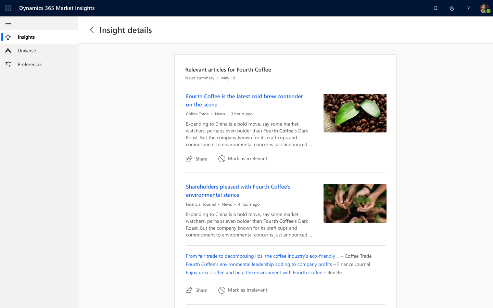

# News insights

## News articles

Good business decisions are driven by good information. Business and sales professionals need to stay updated on their own and their customers' activities on a daily basis. However, it can be time costly to navigate individual websites in search of what's most relevant.

**News** provides a view that shows the three most relevant articles in your feed and gives you access to more information about them.

### News data and frequency

**News** feed will update constantly to reflect the latest articles about the topics that matter to you.

**News** aggregates all recent news headlines that match your topic of interest. Using machine learning and data science, noise is eliminated and the news displayed come from trusted sources that published recently and that have higher number of views.
