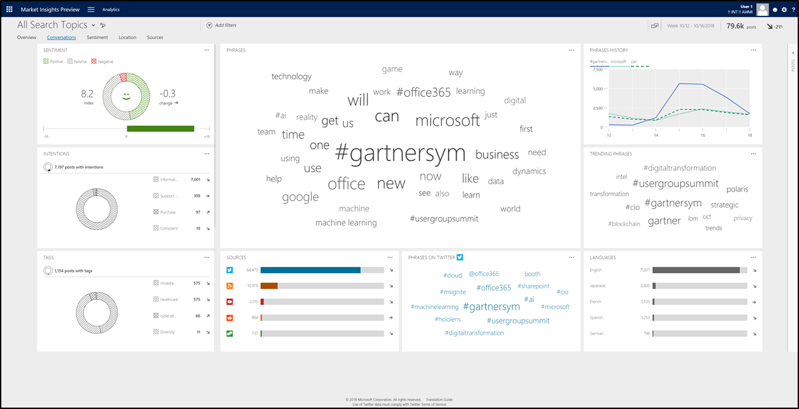

# Connect with customers. Empower your organization. Create real results.

[This topic is pre-release documentation and is subject to change.]

The speed at which we do business, and the number of channels we're using to do it, are both rapidly increasing. Employees and customers have a wide array of choices when it comes to communicating, and social media channels are key components of the customer journey as customers connect with your brand, your employees, and each other.

Social media is no longer relegated to a select few in the marketing department. Empower a broader set of employees and connect with customers by using [Market Insights, part of Dynamics 365](https://go.microsoft.com/fwlink/p/?linkid=842309). [Market Insights puts social media at the fingertips of your sales teams, customer service agents, and everyone across the organization.](https://dynamics.microsoft.com/microsoft-social-engagement/) Service agents can meet customers on the channel of their choice&mdash;on social media or through more traditional service channels&mdash;to solve problems effectively. Sales teams can gather intelligence, source new leads, and build credibility through social selling. Marketers can measure and manage brand reputation. Employees in any role can leverage social insights to better understand the voice of the customer. You can harness the power of social media to go beyond likes or shares to create real, measurable business results.

## Getting started

Setting up [!INCLUDE[Market Insights](../includes/pn-market-insights-short.md)] doesn't take long. The following topics will help you get started quickly.

- [Get started with Market Insights](get-started.md): Find important information to help you get around in [!INCLUDE[Market Insights](../includes/pn-market-insights-short.md)].

- [Administer Market Insights](settings-administration.md): If you're an administrator, review this information to get your users set up quickly with the appropriate permissions. Learn how you can integrate [!INCLUDE[Market Insights](../includes/pn-market-insights-short.md)] with other services, like [!INCLUDE[pn_crm_shortest](../includes/pn-crm-shortest.md)].

- [Set up searches to listen to social media conversations](set-up-searches.md): Capturing the right data for your business is a crucial step for successfully analyzing social media data. Set up searches and refine the quality of the results they give you, organize searches to meet your needs, and maintain an optimal post quota.

- [Analyze social data by using widgets](analyze-social-data-using-widgets.md): Visualize data in different areas to analyze your search results. See which filters are available to form a dataset and how you can apply them to various widgets.

- [Engage on social networks](engage-on-social-networks.md): Interact with other users on social media and keep the conversations flowing. Create streams to follow the conversations that matter most to you, and reply to posts directly from within [!INCLUDE[Market Insights](../includes/pn-market-insights-short.md)]. Find out how you can connect a social profile with [!INCLUDE[Market Insights](../includes/pn-market-insights-short.md)] and share it with other users of the solution.

- [Stay up to date with alerts](email-alerts.md): Stay on top of what's happening on the social web. Set up alerts to be sent directly to your inbox, and find out right away when something important happens.

## Business scenarios

The business scenarios that [!INCLUDE[Market Insights](../includes/pn-market-insights-short.md)] helps address lead to many different implementation scenarios. We've compiled overviews for three of the core business scenarios: sales, marketing, and service.

- Sales: [Social selling - grow your network and boost sales](overview-sales-scenario.md)

- Service: [Address customer service scenarios on social media with Market Insights](overview-service-scenario.md)

- Marketing: [Manage your brand and reputation on social media](overview-marketing-scenario.md)

## Product updates

We frequently release updates to introduce new capabilities, improve existing features, and fix various issues.

- Have a look at [what's new in Market Insights](what-s-new.md) to learn about the latest changes.

- Read the latest [Market Insights readme](http://go.Microsoft.com/fwlink/p/?LinkId=393612) for any late-breaking changes to this release.

- Download the [Market Insights translation guide](http://go.Microsoft.com/fwlink/p/?LinkID=391086) for a list of languages [!INCLUDE[Market Insights](../includes/pn-market-insights-short.md)] is translated into, which languages you can search on, and which languages support sentiment analysis.

### See also

[What's new in Market Insights](what-s-new.md)    
[Market Insights FAQ](faq.md)   
