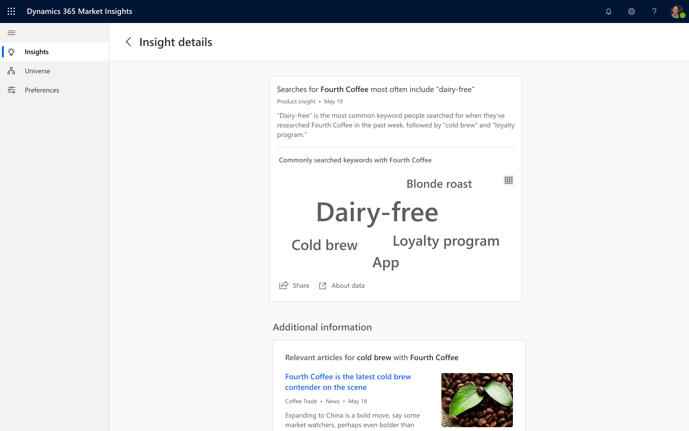

# Product attributes insight

## Overview

Customers often search online to compare features of competing products or services before making a decision. For example, customers who are interested in purchasing a new computer may care more about one feature than another (for example, screen size vs. battery life).  
**Commonly searched keywords** provides a view with the top 5 keywords associated with your, or any, products or services.

> [!div class="mx-imgBorder"]
> 

## Data and frequency

**Commonly searched keywords** aggregates data from web searches that were performed by users to compare different products. The main attributes from those searches are extracted, ranked and observed over time. Trends are normalized over time to ensure the data stays anonymous.

- Top ranked keywords will refresh every week

If the search volume changes significantly or new top keyword is found, a notification will be sent through the app on weekly basis.
