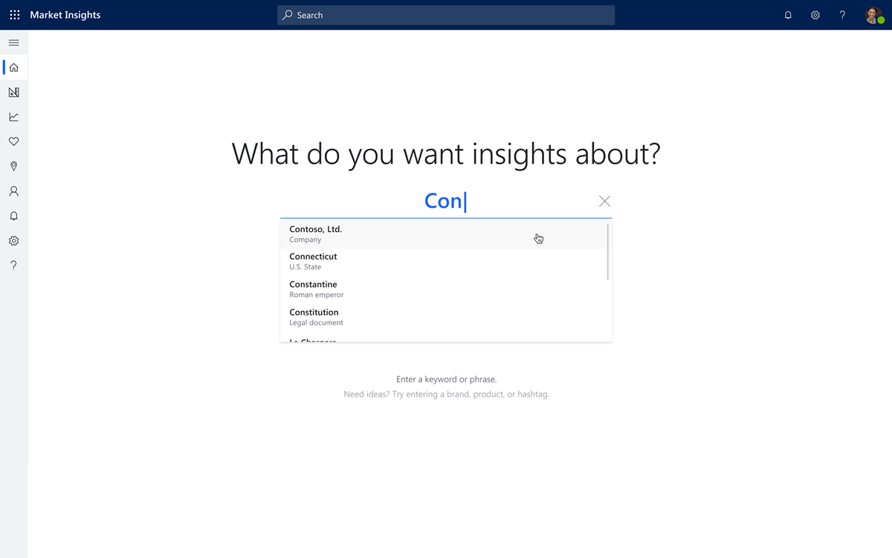

# What's new or changed in [!INCLUDE[Market Insights](../includes/pn-market-insights-short.md)]

(This topic is pre-release documentation and is subject to change.)

This topic describes features that are either new or changed in [!INCLUDE[Market Insights](../includes/pn-market-insights-short.md)].

Ask questions and get help from experts and the product team in the [AI for Market Insights Community forum](https://community.dynamics.com/365/aimarketinsights).

If you can think of ways how we can further improve the product and service, please [add your idea to the ideas list](https://experience.dynamics.com/ideas/list/?forum=e6202680-69d9-e811-a96b-000d3a1be7ad). 

## Public Preview update  (January 30, 2019)

###  AI assisted query builder

To get relevant market insights, it is extremely important to ensure that search rules are set up correctly to provide insights on brands, products, and topics that are very relevant and precise to the user’s needs. Currently, it can be difficult for users to get the configuration of search rules correct on the first run because it typically takes time to refine search rules to the level of precision required. 

As a result, the relevance and cost of generating insights heavily depend on cutting out the noise and getting your search set up right.

Our AI-powered assisted query builder solves this core problem. During the first run experience, you can start typing a search term and will be presented with suggested terms. By providing a highly relevant list of brands, products, and entities to select, the assisted query builder helps to reduce the cognitive load of search setup so that you spend less time setting up searches and more time acting on the insights.

## Public Preview update 2 (December 19, 2018)

### Introducing new languages

This release introduces new languages for sentiment analysis, search rules, and the user interface.

The following languages are available with Update 1.12:

- Indonesian (Bahasa)
- Czech
- Hungarian
- Hindi
- Korean

### New sign-in URL

We've introduced a quick and easy way to sign in to [!INCLUDE[Market Insights](../includes/pn-market-insights-short.md)] by accessing the URL [https://ai.mi.dynamics.com/login](https://ai.mi.dynamcis.com/login). 

Save this URL to your bookmarks if you don't want to sign in to Office 365 before accessing [!INCLUDE[Market Insights](../includes/pn-market-insights-short.md)].

## Public Preview update 1 (November 21, 2018)

### Extended availability of age, gender, and search trend data

The Bing Search trend data in the **Volume** widget is now available for organizations based in the United States, the United Kingdom, France, Germany, Canada, Australia, Italy, and Spain. The **Age** and **Gender** widgets on **Analytics** > **Overview** are now available in these countries/regions, too. 

### Announcing search rules for [!INCLUDE [tn-instagram](../includes/tn-instagram.md)] business accounts and removal of [!INCLUDE [tn-instagram](../includes/tn-instagram.md)] keyword search

As of December 10, 2018, we will introduce the ability to track your own [!INCLUDE [tn-instagram](../includes/tn-instagram.md)] business accounts in [!INCLUDE[Market Insights](../includes/pn-market-insights-short.md)]. You will be able to acquire posts and comments on your own [!INCLUDE [tn-instagram](../includes/tn-instagram.md)] business accounts. To use this new functionality, the [!INCLUDE [tn-instagram](../includes/tn-instagram.md)] Business Account needs to be linked to the respective [!INCLUDE [tn-facebook](../includes/tn-facebook.md)] page. Users in [!INCLUDE[Market Insights](../includes/pn-market-insights-short.md)] will need to authenticate or re-authenticate their [!INCLUDE [tn-facebook](../includes/tn-facebook.md)] Acquisition profile and set up [!INCLUDE [tn-instagram](../includes/tn-instagram.md)] Account search rules.

[!INCLUDE [tn-instagram](../includes/tn-instagram.md)] is retiring keyword searches on December 10, 2018, and users will not be able to create new keyword search rules in [!INCLUDE[Market Insights](../includes/pn-market-insights-short.md)] for [!INCLUDE [tn-instagram](../includes/tn-instagram.md)]. Existing keyword search rules containing [!INCLUDE [tn-instagram](../includes/tn-instagram.md)] as a source will continue to exist as is, and the data acquired for these rules is preserved, as long as the rules are not changed. However, no new [!INCLUDE [tn-instagram](../includes/tn-instagram.md)] data will be acquired for these rules. If the user changes such a rule, [!INCLUDE [tn-instagram](../includes/tn-instagram.md)] needs to be removed as a source to be able to save the edited search rule. In case you want to preserve your [!INCLUDE [tn-instagram](../includes/tn-instagram.md)] data acquired to date, we recommend that you create a separate search rule with the changes and keep the rule with [!INCLUDE [tn-instagram](../includes/tn-instagram.md)] data untouched.

For detailed information, see [Instagram account search and Instagram keyword search removal](instagram-data-acquisition.md).