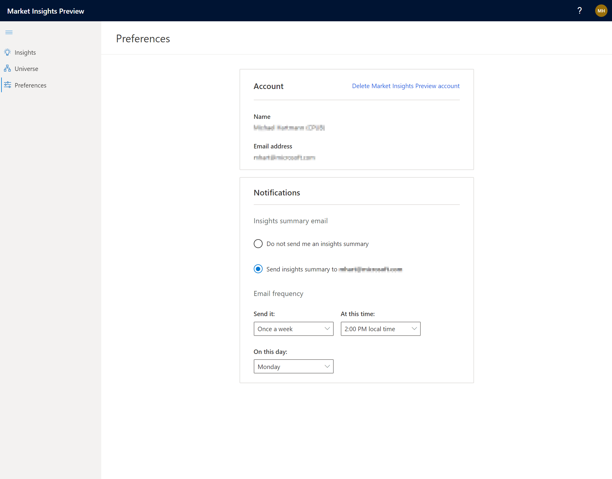

# Manage your settings

[!INCLUDE [market-insights-eos](../includes/market-insights-eos.md)]

(This topic is pre-release documentation and is subject to change.)

The settings page in Market Insights Preview lets you manage your preferences.

To find your settings, open the left navigation and select **Preferences**.

> [!div class="mx-imgBorder"]
> 

## Manage your user account

### Delete your account

1. In the left navigation select **Preferences**.
2. In the **Account** section, select **Delete Market Insights Preview Account**.
3. Select **Yes, delete my account** to confirm the deletion.

All configurations and insights will be removed when you delete your account. However, you can always come back and create a new account with the same email address and start over.

## Configure your notifications

### Receive notifications

You can choose if you want to receive a summary email with your insights on a daily or weekly basis.

1. In the left navigation select **Preferences**.
2. In the **Notification** section, select **Send insights summary to <email address>**.
3. Under **Email frequency**, choose how often and when you want to receive the summary email.
4. Select **Save** to apply your changes.

### Stop receiving notifications

1. In the left navigation select **Preferences**.
2. In the **Notification** section, select **Do not send me an insights summary**.
3. Select **Save** to apply your changes.

