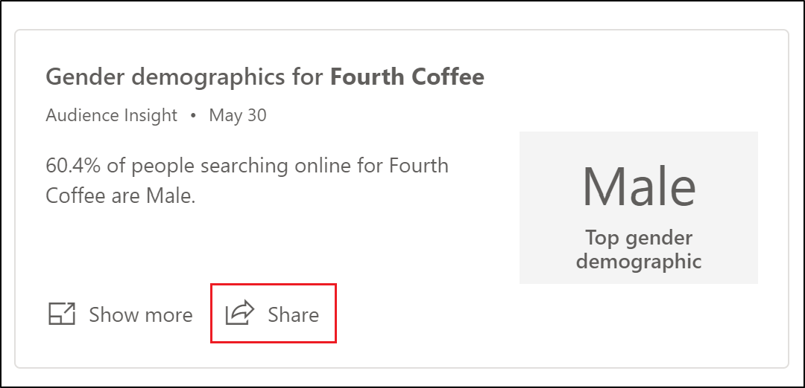

# Share insights 

Share insights with colleagues or your audience by using the **Share** control on any insight in the feed or the details page. You can share an insight directly to Twitter and LinkedIn, or copy the link to the insight to distribute it using other media.

> [!IMPORTANT]
> The item you are sharing is the insight in the details view without additional information. If you decide to share an insight, the insight will be made publicly available to anyone with the link to that page. No authentication is required to view the insight.
