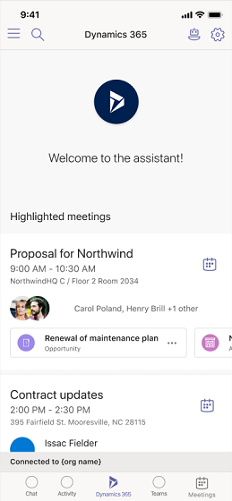

# Access Dynamics 365 assistant application on Teams

[!INCLUDE [cc-beta-prerelease-disclaimer](../includes/cc-beta-prerelease-disclaimer.md)]

> [!IMPORTANT]
> - [!INCLUDE[cc_preview_features_definition](../includes/cc-preview-features-definition.md)]  
> - [!INCLUDE[cc_preview_features_expect_changes](../includes/cc-preview-features-expect-changes.md)]
> - Microsoft doesn't provide support for this preview feature. Microsoft Dynamics 365 Technical Support won’t be able to help you with issues or questions. Preview features aren't meant for production use and are subject to a separate [supplemental terms of use](https://go.microsoft.com/fwlink/p/?linkid=870960).

The Dynamics 365 assistant application on mobile devices lets you view and track daily meetings, customer interactions, and insights in your organization.

## Prerequisites

Review the following prerequisites to access the Dynamics 365 assistant application on mobile devices:

-	Verify that you have installed the Microsoft Teams app on your mobile device. 

-	Verify that the Dynamics 365 app for Microsoft Teams is added to the apps list in Teams. To learn more, see [Install Dynamics 365 assistant application on Microsoft Teams](install-assistant-application-microsoft-teams.md).

## Open Dynamics 365 app

On your mobile device, open the Microsoft Teams app and select the Dynamics 365 app when it is pinned to the app bar.

> [!div class="mx-imgBorder"]
> 

> [!NOTE]
>  If the app is not pinned to the app bar, select **More (...)** and then select and open the app.
> > [!div class="mx-imgBorder"]
> > 

## First-run experience

1.	[Open the Dynamics 365 app](#open-dynamics-365-app) on Teams. 

2.	Review the display cards on the app. On the last card, select **Got it** to move to the home page.
    
    > [!div class="mx-imgBorder"]
    > 

3.	The home page displays with a welcome message. You are now connected to the organization that you are associated with.
 
    > [!div class="mx-imgBorder"]
    > 

    > [!NOTE]
    > If you want to change your sales organization, see [Change sales organization](change-sales-organization.md).

### See also

[Install Dynamics 365 assistant application on Microsoft Teams](install-assistant-application-microsoft-teams.md)

[Learn the basics](learn-basics-dynamics-365-application-teams.md)