# Insight cards reference

Insight cards help keep you up to date with your work in Dynamics 365 Sales, letting you know when you need to follow up on an email, attend a meeting, and much more. They're displayed throughout the application to provide relevant information for the context you're working in. The cards are generated by the assistant<!--Is there a reason not to use "Sales Insights" in the assistant name?--> based on data stored in Dynamics 365 Sales and your [!INCLUDE[pn_Exchange](../includes/pn-exchange.md)] inbox and calendar. This topic lists each of the available cards and provides details about what each card does, how it gets generated, and how you can use it. More information: [Use Sales Insights Assistant to guide customer communications](assistant.md)

> [!NOTE]
> Your system administrator must enable the assistant before you can try it out. For prerequisites, how to enable the feature, and how to set it up, see [Configure Sales Insights Assistant](configure-assistant.md).  

The assistant displays cards in the following categories:<!--Not "typically," unless there are exceptions that you're willing to explain.-->

- [Upcoming meetings](#upcoming-meetings)

- [Reminders](#reminders)

- [Insights](#insights)
  
## Upcoming meetings

The following cards are available under **Upcoming meetings**.
<!--These tables will be nearly unreadable on mobile devices. Can we think about options for making it narrower? If we took away the "Availability" column, we could move the product name so it would be the first line in the Description column, or break the table in two and have one for D365 Sales and one for D365 Sales Insights table. Or maybe we could reduce the width of the graphics by a fourth or a third? I'd be glad to experiment with that.-->

<table class="tg">
  <tr>
    <td><a href="#MeetingToday">Meeting today/Meeting today (Exchange)</td>
    <td><a href="#UpcomingMeeting">Upcoming meeting/Upcoming meeting (Exchange)</a></td>
    <td><a href="#RelatedNEWS">Related news</a></td>
  </tr>
  <tr>
    <td><a href="#NearbyCustomers">Nearby customers</a></td> 
    <td></td>
    <td></td>
  </tr>
</table>

|Insight card    | Availability | Description |
|-------------|--------------|-------------|
|**Meeting today**    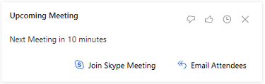 **Meeting today (Exchange)** ") | Dynamics 365 Sales | **Description**: Tells that you have a meeting scheduled for today.  The Meeting Today card is derived from your appointments in your Dynamics 365 Sales organization.  The Meeting Today (Exchange) card is derived from your Exchange server. **Features**: Shows the meeting title, with a link to the meeting record. Shows the meeting description, location, start time, and key participants. Open the detailed view to see the "regarding" entity and a collection of closely related insight cards, including relevant people, companies, opportunities, nearby customers, news, and more. **Actions**:  Join meeting Email attendees|
| **Upcoming meeting**    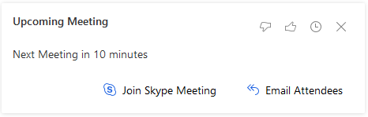  **Upcoming meeting (Exchange)**    "| Dynamics 365 Sales | **Description**:  Tells that you have a meeting scheduled to start in 30 minutes or less. When available, this card is given highest priority and appears at the top of the stack. That way, you'll have all of your important meeting information available.   The Meeting Today card is similar, but it's shown all day until the meeting ends, provides fewer features, and is given lower priority.  **Features**:  Shows the meeting title, with a link to the meeting record. Shows the meeting description (shortened if necessary).  Shows the regarding record (with link).  Shows a list of attendees (with a link to the full list if there are more than four). Displays a map of the location (if relevant and available; not for online meetings).  Open the detailed view to see a collection of closely related insight cards, including relevant people, companies, opportunities, news, and more. **Actions**:  Join meeting   Email attendees |
| **Related news**    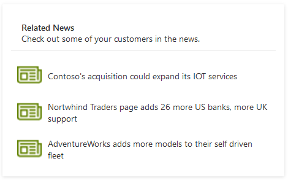 | Dynamics 365 Sales Insights | **Description**:  Displays news headlines related to companies that are participating at the meeting. It's shown in the card details view when you tap a meeting card from the assistant feed.  **Features**:  Shows the date when the news was last updated.  Thumbnail image and headline for each found article. Select the thumbnail to view the full article. |
| **Nearby customers**    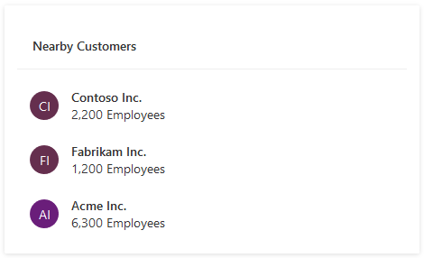| Dynamics 365 Sales Insights | **Description**:  Finds customers that are located near the meeting location. It's shown in the card details view when you tap a meeting card from the assistant feed.  **Features**:  Shows the name of the nearest city.   Shows basic information about each company.|

## Reminders

The following cards are available under **Reminders**.

<table class="tg">
  <tr>
    <td><a href="#ActivityDueDate"><i>{activity}</i> due today</a></td> 
    <td><a href="#CloseDateComingSoon">Close date coming soon</a></td>
    <td><a href="#MissedCloseDate">Missed (opportunity) closed date</a></td>    
  </tr>
  <tr>
    <td><a href="#EmailOpened">Email opened</a></td>
    <td><a href="#EmailReminder">Email reminder</a></td>
    <td><a href="#NoActivityWithType">No activity with {<i>record type</i>}</a></td>
  </tr>
  <tr>
    <td><a href="#RecentMeetingExchange">Recent meeting/Recent meeting (Exchange)</a></td>
    <td></td>
    <td></td>
  </tr>
</table>

|Insight card    | Availability | Description |
|-------------|--------------|-------------|
| **{*Activity*} due today**     | Dynamics 365 Sales | **Description**:  Tells you that an activity assigned to you is due today.  **Features**: Indicates the type of activity (email, letter, phone call, task, or custom).  **Actions**:  Close task Complete|
| **Close date coming soon**      | Dynamics 365 Sales | **Description**:  Tells you that an open opportunity will soon reach its estimated close date.  **Features**:  Identifies the opportunity. Tells how far away the close date is. **Actions**:  Open opportunity **Configuration options**:  Set how many days before the close date to start showing the card. The default value is set by your administrator. **Note**: When you're viewing a dashboard, you'll only see these cards for opportunities that are assigned to you, but when you view a specific opportunity you'll see this card even if that opportunity is assigned to somebody else. |
| **Missed (opportunity) close date**     | Dynamics 365 Sales | **Description**:  Tells you that an open opportunity has passed its close date.  **Features**:  Identifies the opportunity. **Actions**:  Open opportunity **Note**: When you're viewing a dashboard, you'll only see these cards for opportunities that are assigned to you, but when viewing a specific opportunity you'll see this card even if that opportunity is assigned to somebody else.|
|**Email opened**    | Dynamics 365 Sales Insights | **Description**:  A followed email was opened by its recipient. **Features**: Names the contact you sent the email to. Provides descriptive text that shows the subject of the email, the time it was opened, and the approximate location where it was opened. **Actions**: Call {*contact*} Open contact **Prerequisites**: [Enable email engagement](configure-email-engagement.md) to use this card. |
| **Email reminder**     | Dynamics 365 Sales Insights | **Description**:   You set a follow-up reminder for an email you recently sent, and its trigger conditions have just been met. Trigger conditions always include a date but can also include conditionals such as whether the email wasn't opened or replied to by that date. **Features**:  Names the contact you sent the email to. Tells you that you set a follow-up reminder for this email. Provides a description that summarizes the trigger conditions. **Actions**: Call {*Contact*} Open contact **Prerequisites**: [Enable email engagement](configure-email-engagement.md) to use this card. |
| **No activity with {*record type*}**     | Dynamics 365 Sales Insights | **Description**: Tells you that a record that you own has been inactive for some time. Applies to contact, opportunity, lead, account, and case records. **Features**:  Identifies the type and name of the relevant record. Explains why the card was generated. **Actions**: Send email Open entity **Configuration options**:   Set the number of days of inactivity that must pass before the card is generated. You can set a different value for each type of supported record (contact, opportunity, lead, account, and case). |
| **Recent meeting**   **Recent meeting (Exchange)**  "| Dynamics 365 Sales  | **Description**:  Tells you that a meeting that you organized (where you're the record owner) has recently ended, giving you an opportunity to document the meeting in Dynamics 365 Sales. The card is displayed for 30 minutes after the scheduled end of the meeting, and then removed. **Features**: Identifies the meeting. **Actions**: Open meeting Take notes |

## Insights

The following cards are available under **Insights**.

<table class="tg">
  <tr>
    <td><a href="#IssueDetected">Issue detected</a></td>
    <td><a href="#StakeHolderRecommendation">Stakeholder recommendation</a></td>
    <td><a href="#CompetitorMentioned">Competitor mentioned</a></td> 
  </tr>
  <tr>
    <td><a href="#CustomerQuestion">Customer question</a></td>
    <td><a href="#BuyingIntentDetectedEmail">Buying intent detected in email</a></td>
    <td><a href="#OpportunityRisk">Opportunity at risk (phrase detection)</a></td>
  </tr>
  <tr>
    <td><a href="#MeetingRequested">Meeting requested</td>
    <td><a href="#FileRequested">File requested</a></td>
    <td><a href="#MissedEmail">Missed email</a></td>
  </tr>
  <tr>
    <td><a href="#TodaysTopPeople">Today's top people</a></td>
    <td><a href="#TodaysTopRecords">Today's top records</td>
    <td><a href="#UpcomingFlight">Upcoming flight</a></td>
  </td>
  <tr>
    <td><a href="#SuggestedActivities">Suggested activities</a></td>
    <td><a href="#SuggestedContacts">Suggested contacts</a></td>
    <td><a href="#ConsentSuggestion">Consent suggestion</a></td>
  </tr>
  <tr>
    <td><a href="#ContactMovedToNewOrg">Contact moved to a new org</a></td>
    <td></td>
    <td></td>
  </tr>
</table>

|Insight card    | Availability | Description |
|-------------|--------------|-------------|
| **Issue detected**   | Dynamics 365 Sales | **Description**:  An email from a known contact in your inbox appears to include a support request. **Features**: Shows the name of the contact. Tells you that an email that appears to include a support request has arrived. Displays the sentence from the email that appears to be asking for help. **Actions**:  Create case Open email |
| **Stakeholder recommendation**   | Dynamics 365 Sales | **Description**:   An email about an open opportunity has arrived, and it includes an extra recipient who isn't yet listed as a stakeholder for that opportunity. **Features**: Shows the name of the potential stakeholder. Tells you that this person might be a stakeholder in an open opportunity. Displays a short description that includes the name of the opportunity. **Actions**: Add as stakeholder Always do this **Note**: This is the same as the configuration setting available for this card type, and you can reset it by [going to your assistant settings](assistant.md).<!--Edit okay? It seems to me that the target article doesn't actually describe resetting this configuration, so I assume this cross-reference is meant to help the reader find out how to get to the settings page.--> **Configuration options**: You can choose to add the stakeholder automatically rather than show the card.|
| **Competitor mentioned**   | Dynamics 365 Sales | **Description**:   A tracked email that's set as regarding a sales opportunity appears to refer to a company that's listed as a competitor in your system. **Features**: Shows the name of the competitor. Tells you that a competitor was mentioned in an email. Select the card to open the opportunity that the email is regarding. **Actions**: Add as competitor Always do this  **Note**: This is the same as the configuration setting available for this card type, and you can reset it by [going to your assistant settings](assistant.md). **Configuration options**: Set this feature to add the competitor automatically rather than showing the card. |
| **Customer question**  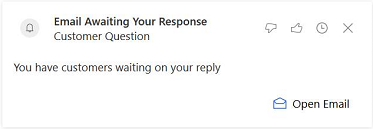 | Dynamics 365 Sales | **Description**: An email from a known contact in your inbox appears to be asking a question. **Features**: Shows the name of the contact. Tells you that a question has arrived. Displays the sentence from the email that appears to be asking a simple question. |
| **Buying intent detected in email**  | Dynamics 365 Sales | **Description**:  An email from a known or unknown contact appears to be asking for more information about a product. For known contacts, this might be an upsell opportunity. For unknown contacts, this might be a new lead. **Features**: Shows the name of the sender. Tells you that an email has arrived that might represent an upsell or new lead opportunity. Displays the sentence from the email that appears to be asking for product information. **Actions**: Open email. |
|**Opportunity at risk (phrase detection)**  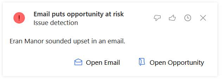| Dynamics 365 Sales | **Description**: Tells you when an email regarding an open opportunity is received that includes negative sentiment, which can put the opportunity at risk. **Actions**: Open opportunity.|
| **Meeting requested** 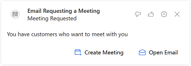 | Dynamics 365 Sales | **Description**:  An email from a known contact in your inbox appears to include a meeting request. **Features**: Shows the name of the contact. Tells you that a meeting request has arrived. Displays the sentence from the email that appears to be asking for a meeting. **Actions**: Create new meeting Open email |
| **File requested** 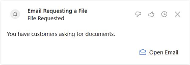 | Dynamics 365 Sales | **Description**:  An email from a known contact in your inbox appears to include a request for a file. **Features**: Shows the name of the contact. Tells you that a request for a file has arrived. Displays the sentence from the email that appears to be asking for a file. **Actions**: Open email Send file |
| **Missed email**    | Dynamics 365 Sales | **Description**:   Tells you that an important email has remained unread for a configured number of days. **Actions**: Open email Mark as read **Configuration options**: The threshold number of days is configurable in [assistant settings](assistant.md).<!--Edit okay?--> By default, the number of days for unread email is three. |
| **Today's top people**   | Dynamics 365 Sales | **Description**:  The system analyzes your appointments, tasks, and other work for the day and generates this card to show the contacts you're most likely to interact with. **Features**: Shows each contact's name and portrait. Shows each contact's title and any business they have with you today (such as a meeting, task, or phone call). Select the contact to view full contact details. |
| **Today's top Records**  | Dynamics 365 Sales | **Description**:  The system analyzes all the sales records that are related to you, and lists the records that you're most likely to be working with today based on your recent activities and date information (such as a due date or appointment) in each record. **Features**:  Shows a thumbnail image and a summary of each found record. Select the thumbnail to view the full record. |
| **Upcoming flight**    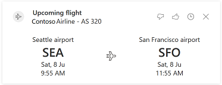 | Dynamics 365 Sales Insights | **Description**:  This card is generated when your Exchange inbox includes an email message that contains a flight confirmation. The system then matches the flight dates to upcoming meetings and finds other information related to the location that you're flying to, such as nearby customers. **Note**: This card doesn't show live or updated flight information, just information from the flight confirmation email message that triggered it. **Features**:  Airline and flight number, with a link to the flight record. Departure and arrival times, with airport codes. Related meeting record, with link. Up to three meetings can be listed here. List of customer offices near the destination airport, with links.  **Actions**: Open a related email message with flight details (if available).|
| **Suggested activities**   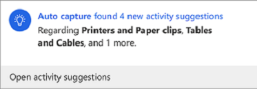 | Dynamics 365 Sales Insights | **Description**:  Alerts you when new activity suggestions are available in Dynamics 365 Sales. **Feature**: Indicates that new activities are available for you, along with the total number and what they're about.  **Actions**:  Open activity suggestions **Prerequisite**:  [Enable premium auto capture](configure-auto-capture.md#how-to-enable-and-configure-premium-auto-capture) to use this card. |
| **Suggested contacts**   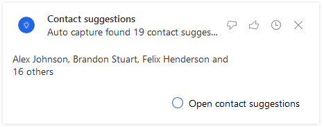 | Dynamics 365 Sales Insights | **Description**:  Alerts you when new contact suggestions are available in Dynamics 365 Sales. **Feature**: Indicates that new contacts are available for you, along with the total number and who they are.  **Actions**:   Open contact suggestions **Prerequisite**:   [Enable premium auto capture](configure-auto-capture.md#how-to-enable-and-configure-premium-auto-capture) to use this card. |
| **Consent suggestion**   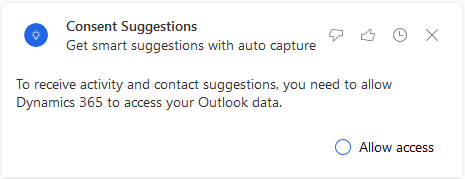 | Dynamics 365 Sales Insights | **Description**: Allows you to provide consent for Dynamics 365 Sales to access your Exchange data so that auto capture can provide suggestions for activities and contacts. **Actions**: Allow access Maybe later **Prerequisite**:  [Enable premium auto capture](configure-auto-capture.md#how-to-enable-and-configure-premium-auto-capture) to use this card.|
| **Contact moved to a new org**   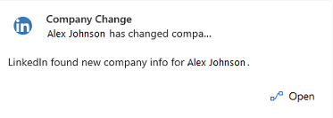 | Dynamics 365 Sales Insights | **Description**: Tells you that one of your contacts has moved to a new organization, based on information from LinkedIn. **Features**: Indicates the contact who moved, where they moved from, and their new organization. **Actions**: View contact Go to LinkedIn profile  **Prerequisite**:  [Enable LinkedIn Sales Navigator](https://docs.microsoft.com/dynamics365/linkedin/install-sales-navigator) to use this card. |

## What if I get an alert that I have insufficient permissions?
<!--Suggest this or something similar, just to make this heading stand out in the article TOC so people realize this can happen, and that the answer is here.-->
If you see an alert about having insufficient permissions to use an Insight card, do the following:

1. Go to **Settings** > **Security** > **Security Roles**.
2. Choose the user role viewing the insight cards.
3. Select the **Core Records** tab.
4. Set the privileges to Read and Write access for **Action card** and **Action card User Settings**.

   
 
## Privacy notice  
[!INCLUDE[cc_privacy_relationship_insights_relationship_assistant](../includes/cc-privacy-relationship-insights-relationship-assistant.md)]

### See also

[Use Sales Insights Assistant to guide customer communications](assistant.md)