# Adaptive sequences

Use adaptive sequences to define conditions for steps. These conditions such as, user opens email for email step determine the branch that sequence moves to next. The condition evaluates either a Yes or No result and follows the flow as defined. The conditions are available for the following activities:      
-	[Email](#define-conditions-for-email-activity)
-	[Phone call](#define-conditions-for-phone-call-activity)

## Define conditions for email activity    
When you add email activity to the sequence and select the add icon, the activity selection box displays the Conditions tab, according to which the next course of action in the sequence is determined.     
When seller skips the email activity with a condition, the flow follows the **No** path.     

>[!IMPORTANT]
>[Configure the Email engagement feature](configure-email-engagement.md) in your organization before you start using the conditions for Email activity. The actions that are performed by customers on emails are displayed in the condition list. 

The following interactions are available in email conditions:   

| Interaction | Description |
|-------------|-------------|
| Email open | When customer opens the email, the flow follows the **Yes** path. If not, the **No** path is followed. |
| Recipient reply | When customer replies to the email, the flow follows the **Yes** path. If not, the **No** path is followed. |
| Link opened | When customer opens a link that is included in the email, the flow follows the **Yes** path. If not, the **No** path is followed. |
| Attachment downloaded | When customer downloads an attachment that is linked to your email, the flow follows the **Yes** path. If not, the **No** path is followed. |

Let’s define a flow so that if a customer opens your email, the next step is to schedule a phone call, and if the customer doesn’t open your email, the next step is to send a reminder email.    
1.	Select the Add (**+**) icon, after the email activity.   
    >[!div class="mx-imgBorder"]
    >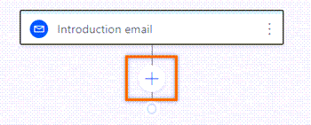    
2.	In the activity selection box, select **Conditions** tab.     
    A list of interactions that are defined in the Email engagement feature displays.      
    >[!div class="mx-imgBorder"]
    >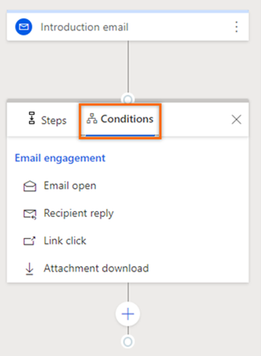    
3.	Select **Email open**.     
4.	On the **Email open result** step, configure the time limit until the condition is satisfied to proceed to next step.    
    Here we configure the wait time as one day. If the condition is met within the day, the **Yes** path initiated and moved to next step after a day.   
    To immediately move to the next step through **Yes** path in the sequence, select the check box corresponding to the **If the action is completed within the time limit, the sequence will move to the yes path** option.    
    If the customer doesn't open the email within the time limit, the **No** path is executed.   
    >[!div class="mx-imgBorder"]
    >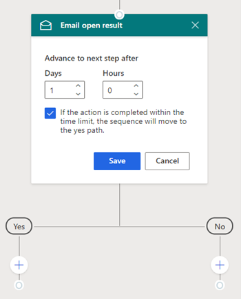     
5.	Select **Save** and the condition is created.     
    >[!div class="mx-imgBorder"]
    >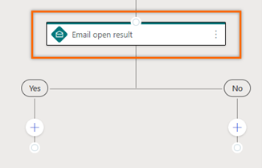      
6.	To schedule a phone call activity to talk with customer in **Yes** path:    
    1.	Select the Add (**+**) icon and then select the **Phone call** activity under **Steps**.     
        >[!div class="mx-imgBorder"]
        >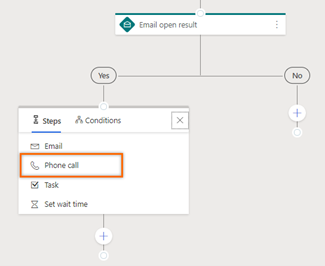     
    2.	Create the phone call activity and save the step.     
        >[!div class="mx-imgBorder"]
        >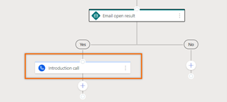      
7.	To send a follow-up email when customer didn’t respond within the time limit of one day in No path:     
    1.	Select the Add (**+**) icon and then select the **Email** activity under **Steps**.    
        >[!div class="mx-imgBorder"]
        >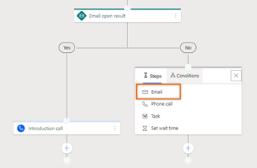     
    2.	Create the email activity and save the step.     
        >[!div class="mx-imgBorder"]
        >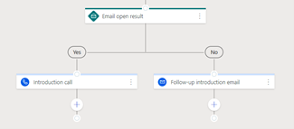     

You can create activities based on flow and complete the sequence.

>[!NOTE]
>You can’t delete a step that is followed by a condition. To delete such steps, remove the conditions and then delete the step. 

## Define conditions for phone call activity     
When you add phone call activity to the sequence and select the add icon, the activity selection box displays conditions tab based on which you can take next course of action in the sequence. The actions that are performed on phone call activity are displayed in the condition list. However, these actions vary from organization to organization depending on their requirements and added by the administrator.    
When seller skips the email activity with a condition, the flow follows the **No** path.   

>[!NOTE]
>To know how to add custom status for your organization, see [Define status reason transitions for the Case or custom tables](https://docs.microsoft.com/powerapps/maker/data-platform/define-status-reason-transitions).

Let’s define a flow, when seller makes a call to discuss product details with customer and changes the status of the phone call to make, an email must be sent with more details about the product for customer to proceed further with the deal. If the call status is other than made, an email must be sent to request for an appointment.    
 
1.	Select the Add (**+**) icon, after the phone call activity.    
    >[!div class="mx-imgBorder"]
    >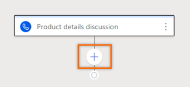     
2.	On the activity selection box, select **Conditions** tab.    
    A list of actions that is defined for the phone call status displays.    
    >[!div class="mx-imgBorder"]
    >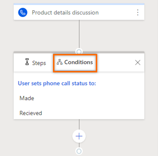     
3.	Select **Made**.   
    The **Call status is made** step is created along with **Yes** and **No** paths.   
    >[!div class="mx-imgBorder"]
    >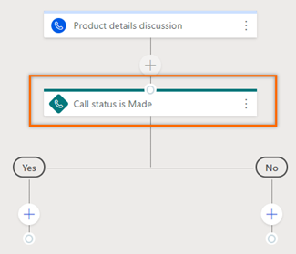      
4.	To create an email activity to send more details about the product to customer in **Yes** path:    
    1.	Select the Add (**+**) icon and then select the **Email** activity under **Steps**.     
        >[!div class="mx-imgBorder"]
        >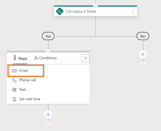     
    2.	Create the email activity with necessary details and save the step.     
        >[!div class="mx-imgBorder"]
        >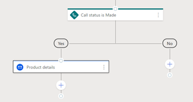       
5.	To create email activity to request for an appointment with customer in No path:     
    1.	Select the Add (**+**) icon and then select the **Email** activity under **Steps**.     
        >[!div class="mx-imgBorder"]
        >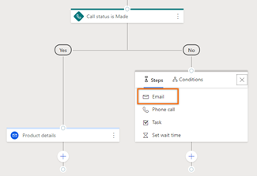     
    2.	Create the email activity with necessary details and save the step.     
        >[!div class="mx-imgBorder"]
        >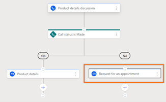     
 
Further you can create activities based on flow and complete the sequence.

### See also

[Create and activate a sequence](create-and-activate-a-sequence.md)

[!INCLUDE[footer-include](../includes/footer-banner.md)]