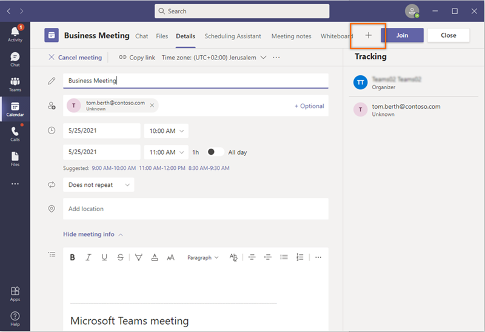
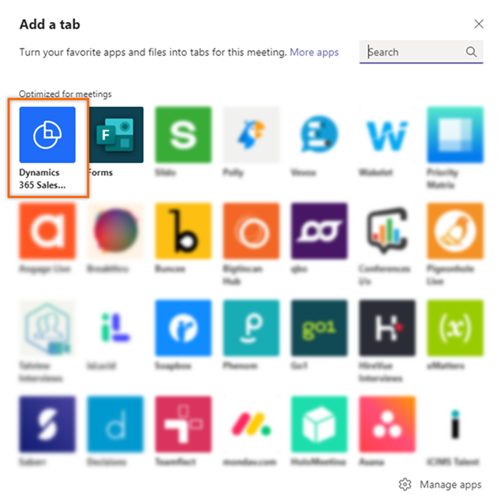
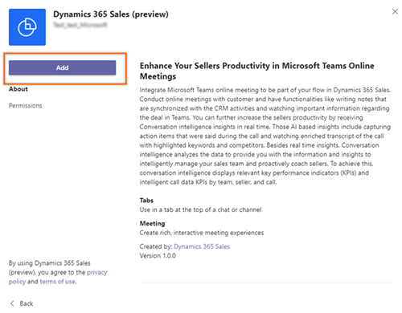
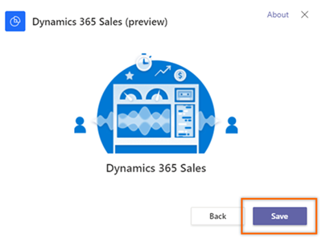
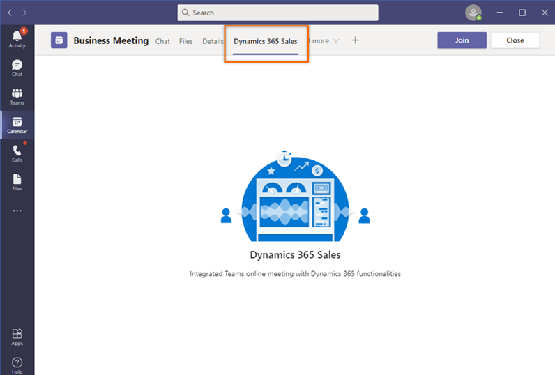

# Add conversation intelligence tab to Microsoft Teams meeting 

> [!IMPORTANT]
> - The enhanced experience of adding conversation intelligence tab to  Microsoft Teams is a preview feature. [!INCLUDE[cc-preview-features-definition](../includes/cc-preview-features-definition.md)]
> - [!INCLUDE[cc-preview-features-expect-changes](../includes/cc-preview-features-expect-changes.md)]
> - [!INCLUDE[cc-preview-features-no-ms-support](../includes/cc-preview-features-no-ms-support.md)]   

The Dynamics 365 Sales app on Microsoft Teams allows you to enrich your remote selling experience by conducting valuable and meaningful customer conversations&mdash;which translate into revenue, by adding conversation intelligence as an integral part of any Teams meeting.    

As a seller, you don’t need to move between apps to take notes and action items, which takes your attention off the business. Use the app during a Teams meeting to get a real-time transcript with highlighted points of interest and captured action items. Additionally, you can take notes, when necessary. 

**Prerequisites**

Before you start using the Dynamics 365 Sales app, be sure you've met the following prerequisites:   
- Conversation intelligence is enabled in your organization. More information: [Microsoft Teams for conversation intelligence](fre-setup-sales-insight-app.md#microsoft-teams-for-conversation-intelligence).
- Purchase a Sales Insights license or Dynamics 365 Sales Premium license.

**To add the conversation intelligence tab**

1.	On Microsoft Teams, go to **Calendar**.     
2.	Open the meeting and select **+** (add tab).  
    > [!div class="mx-imgBorder"]	
    >  

3.	On the **Add a tab** dialog, search, and open the **Dynamics 365 Sales (preview)** extension.   
    > [!div class="mx-imgBorder"]	
    >  
 
4.	On the **Dynamics 365 Sales (preview)** extension, select **Add**.   
    > [!div class="mx-imgBorder"]	
    >  
 
5.	On the confirmation dialog, select **Save**.   
    > [!div class="mx-imgBorder"]	
    >   
    
    The **Dynamics 365 Sales** tab is added to the meeting page which displays real-time transcript with highlights.    
    
    > [!div class="mx-imgBorder"]	
    >  

### See also

[First-run set up experience](../sales/fre-setup-sales-insight-app.md)

[!INCLUDE[footer-include](../includes/footer-banner.md)]
