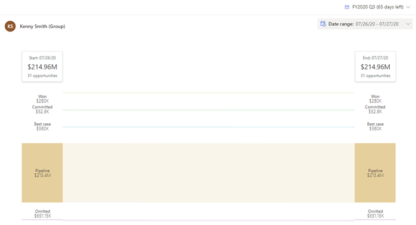
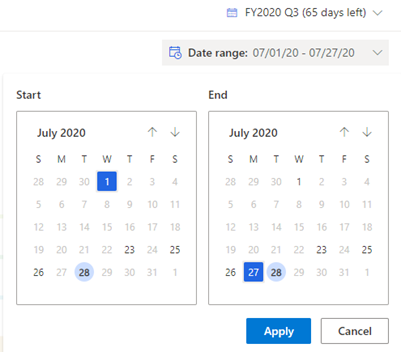
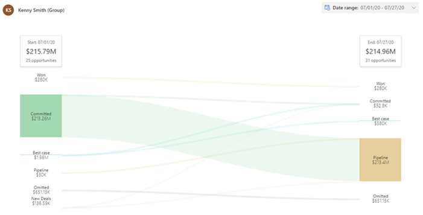
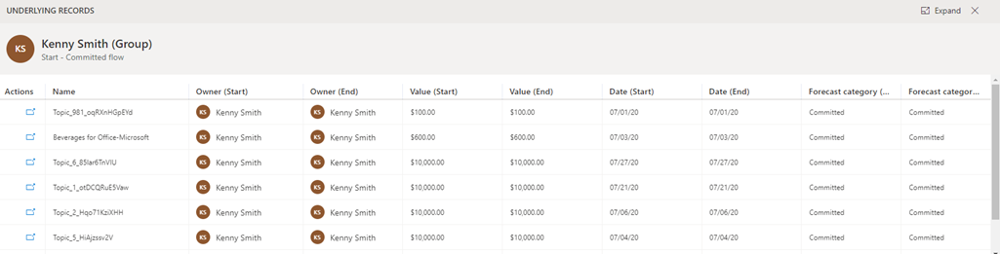

# Analyze deal flow between dates

<!-- Early access preview note will be added here -->

The Flow chart provides a visual representation of how the forecast changes between two moments in time. Managers can use flow charts to drill into the specific deals that have contributed to the increase or decrease in forecast commitment, thus, enabling them to follow up with their teams and coach their teams on how to improve their forecast accuracy.

Review the following prerequisite before you start using deals flow analysis:

- Verify that at least two snapshots have been created for the forecast. To learn more, see [Take snapshot daily](take-snapshots-daily.md).

**View and understand a deals flow**

1.	Sign in to the **Sales Hub** app and go to **Performance** > **Forecasts**.

2.	Select a forecast, and then choose a forecast period for the forecast.

3.	Select the **Flow** tab.

    A sankey chart is displayed, showing the comparison between the two latest snapshots for the selected forecast.

    > [!div class="mx-imgBorder"]
    >  

4.	To compare snapshots, choose a **Start** and **End** dates from the calendar. The start date should always be older than the end date. In this example, the start date is selected as **1** and end date is selected as **27** in the month of July.

    > [!div class="mx-imgBorder"]
    > 
 
    After choosing the dates, select **Apply**. The chart is updated to display the deal flow.

    > [!div class="mx-imgBorder"]
    >     
 
    The topmost stack in the column displays the date with aggregated opportunity amount, and the number of opportunities that are influencing the aggregated amount.
    
    When you hover over a forecast category in the stack, a summary of the category is displayed, including the forecast category, the aggregated budget amount, and the number of opportunities that are influencing the aggregated amount. Also, the flow is highlighted to show how the opportunities are trending between the snapshots.

5.	To view underlying opportunities, select a forecast category. The opportunities are displayed in a grid with side-by-side comparison of how the granular data for each opportunity—such as owner, value, date, and forecast category—is changing in columns from start date to end date.

    > [!div class="mx-imgBorder"]
    > 

    You can't edit the opportunities inline. However, you can select and open the opportunity in an opportunity form and make the necessary changes. The saved changes won't affect the status of the opportunity in the snapshot, because the snapshots are taken at a moment in time by using frozen data.

To learn more about deal flows and understand the chart, see [Analyze deals flow between snapshots](analyze-deals-flow-between-snapshots.md).

### See also

[Take snapshots automaticlly](take-snapshots-daily.md)

[View snapshot history](view-snapshot-history.md)