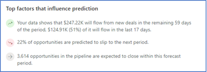

# Analyze revenue outcome by using predictive forecasting

Predictive forecasting helps sellers and managers improve their forecast accuracy by providing forecast projections based on data. To achieve this, predictive forecasting uses AI-driven models that look at historical data and the open sales pipeline to predict future revenue outcome.

## Prerequisites

Review the following prerequisite before you start using predictive forecasting:

  -	Ensure that the predictive forecasting feature is enabled and a forecast is configured accordingly. To learn more, see [About premium forecasting](configure-premium-forecasting.md).

## Understand the prediction column and details in a forecast

The **Prediction** column shows the predicted revenue for each seller and manager. Predictions are based on the **Status** field of an opportunity. To optimize the accuracy of the predictions, ensure the **Forecast Category** values are kept in sync with the **Status** field. For the out-of-the-box forecast category, a workflow ensures that when an opportunity is closed as **Won** or **Lost**, the forecast category is updated with the proper value. 

> [!NOTE]
> If there's not enough data for predictive forecasting to work, it displays an error with an empty value in the column. 

### Prediction column

Open a forecast that includes a **Prediction** column. To learn more, see [View a forecast](https://docs.microsoft.com/dynamics365/sales-enterprise/view-forecasts). 

The following screen shows an example of a **Prediction** column. 

> [!div class="mx-imgBorder"]
> 

When you hover over the information icon on the column header, the last recalculation date of the prediction is shown. Predictions are recalculated every seven days.

### Prediction details

Select a value in the prediction column to display the **Prediction details** pane.

> [!div class="mx-imgBorder"]
> 

The prediction details graph consists of the following values:  
-	**Closed won**: Total actual revenue of opportunities that have been closed as won during the current forecast period.  
-	**Predicted from open**: Total estimated revenue from open opportunities predicted to close during the current forecasting period and are contributing to the prediction.  
-	**Predicted from new**: Total estimated revenue from new opportunities that are predicted to close during the current forecasting period and are contributing to the prediction.   
-	**Total prediction**: Total predicted amount for the current forecasting period.

The top factors that influence prediction are displayed below the graph. These factors help you to understand the key points of the graph that is displayed in the Prediction details pane. You can see up to five top factors that are influencing the prediction. The top factors are categorized into three types:  
-	A Green icon with upward trend represents a positive influencing factor.  
-	A Red icon with downward trend represents a negative influencing factor.  
-	A Grey icon with left arrow represents a neutral influencing factor.  
The following screen is an example of top influencing factors section:  
> [!div class="mx-imgBorder"]
>   
Here, you can see the positive influencing factor is that $247.22K will flow from new deals in the remaining 59 days of the period, $124.91K (51%) of it will flow in the last 17 days.  
Similarly, the negative influencing factor is that 22% of opportunities are predicted to slip to the next period and neutral influencing factor is that 3,614 opportunities in the pipeline are expected to close within this forecast period.

### See also

[About premium forecasting](configure-premium-forecasting.md)
