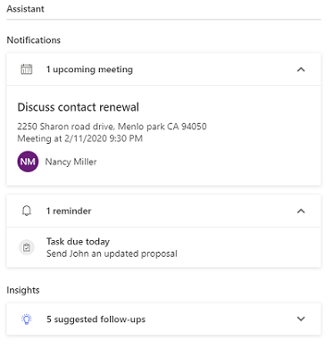
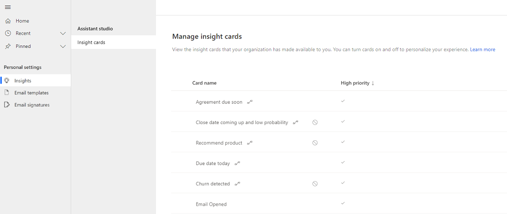

# Use Sales Insights Assistant to guide customer communications

Sales Insights Assistant (formerly known as Relationship Assistant) is part of Dynamics 365 Sales Insights. The assistant keeps an eye on your daily actions and communications, and helps you stay on top of your day with insight cards that are displayed prominently throughout the application to provide tailored and actionable insights. 

<!--Edit suggested, because the last list item shouldn't end with "and much more".-->Some ways the assistant reminds you of upcoming activities are:

- Evaluating your communications and notifying you when a contact or account has been inactive for a while.

- Identifying email messages that might be waiting for a reply.

- Alerting you when an opportunity is nearing its close date.
  
>[!NOTE]
>The administrator must enable assistant before you can try it out. For complete details about prerequisites, how to enable the feature, and how to set it up, see [Configure Assistant](configure-assistant.md).

## How and where the assistant can help you  

The assistant works by analyzing the data at its disposal and generating a collection of insight cards, each of which includes a message that summarizes the content of the card and presents a set of actions. The assistant sorts the cards by priority and filters them for your current context. You can access the assistant in a variety of ways in the Sales Insights app.

> [!NOTE]
> The locations where you access the assistant might vary depending on the configuration set by your administrator. 

- **Navigation bar**: When you select the bulb icon to open the assistant, insight cards are displayed in a pane as shown in the following example.<!--Do you really need to show this whole dashboard? It seems you could crop this image down to just show the nav bar and pane, because otherwise the image for the next list item is going to look almost the same (once you add it; it seems to be missing now).-->

   > [!div class="mx-imgBorder"]
   > 

- **Dashboards**: The following image shows an assistant widget displayed on the **Sales Activity Social Dashboard**.

<!--Missing an image here.-->

- **Entities**: An assistant widget displays insight cards related to the following entities: accounts, contacts, leads, opportunities, and cases. The following image is an example of an assistant widget displayed on an entity<!--I deleted "dashboards and" because you imply in the next section that the widget looks the same on the nav bar and dashboards, but different on entity records. In the following image, can you use another name besides Nancy Miller? (Unless she's part of sample data.) Also, please use a different street address. The CELA guidelines say "For street addresses, you should use sequential numbers, common street names, and incorrect zip codes." I recommend something like 3456 Elm Dr. The zip code is fine as it is because it's not valid for Menlo Park.-->.

   > [!div class="mx-imgBorder"]
   > 

## What cards do I see?

- When you open the assistant by using the navigation bar or a dashboard, you'll see the cards that are relevant to you.

- When you open the assistant through an entity record<!--Edit okay? You call them "entities" above, I wanted to make the association here.-->, you'll see the cards that are related to that record. 

## Categorization of insight cards

<!--I've deleted "typically" here and elsewhere because it implies there are exceptions. If you're not going to explain the exceptions, it's just a filler word that doesn't add anything and leads the reader to wonder what you're not telling him.-->Insight cards are categorized either as notifications that need immediate attention, or insights that provide information to be acted on later.

- **Notifications** display insight cards about your upcoming&mdash;and past-due&mdash;items and events. They include **upcoming meetings** cards for any meetings scheduled for the day and **reminders** for items that require your attention.

   > [!NOTE]
   > Any custom insight cards created by your organization through Assistant Studio will be displayed as reminders.<!--This is confusing to me. The next paragraph says that Insights are custom cards generated by Assistant Studio. What's the difference between those cards and the ones my own organization created?-->

### Characteristics of assistant categories

By default, the latest five insight cards are displayed in the assistant for upcoming meetings, reminders, and insights<!--Edit suggested as a way to ease the transition between the two "categories" described above and the three functional categories that you're describing here.-->. Select **Show more** to view more available cards. The heading displays the total number of insight cards that are available for you or for the record you're associated with in each category.

-	**Insight**: Displays suggestions based on AI-driven models for things that requires your attention. For example, a card might highlight an email with a negative sentiment that could put an opportunity at risk, suggest ways to prioritize an opportunity, suggest a cross-sale, or prompt you to look at recent items that have been auto-captured.

### Characteristics of assistant categories

By default, top five insight cards are displayed on the assistant in each category. Select Show more to view more available cards. The heading displays the total number of insight cards that are available for you or for the record you're associated with in each category.

In this example, we're viewing the **reminders** category. The heading specifies that there's a total of 13 reminders available. The latest five are displayed, along with summary information about them. 

> [!div class="mx-imgBorder"]
> 

To view complete details of the activity, select the card. In this example, we've selected the meeting **Stage changed**. You can select **Open** to view more details.

> [!div class="mx-imgBorder"]
> 

You can perform actions such as open, snooze, dismiss, like, or dislike on the card. These actions are described in the following section.

## Elements of an insight card

When you open the assistant, it displays the name and basic description of each card. Select and open the card to view further details. Typically<!--Do they ever look different than this? If not, there's no need to say "typically."-->, a card consists of the elements illustrated in the following image.

> [!div class="mx-imgBorder"]
> 

1. **Main content area**: Shows the title of the record the card refers to, its summary, card type, and other basic information.

2. **Actions area**: Provides convenient links to help you complete whatever action the card is recommending. The type of links and number of links (up to two) vary by card type. More information: [Insight cards reference](action-cards-reference.md)

3. **Snooze**: Select the clock icon to hide the card temporarily. The snooze time varies by card type. After the snooze time expires, the card will again be visible. The snooze time varies from 5 minutes to 12 hours, depending on the type of card.

4. **Dismiss**: Select this button to dismiss the card permanently, regardless of whether you've completed the action it recommends.

   > [!NOTE]
   > - When you snooze or dismiss a card, a confirmation message is displayed for a specified time. If you don't undo the action before the time expires, the card is automatically snoozed or dismissed. You can configure how long to display the confirmation message. More information: [Configure Sales Insights Assistant](configure-assistant.md)
   > - After a certain period of time, insight cards are automatically dismissed if no action has been performed on the cards.

5. **Feedback**: Helps you give feedback about whether the card was useful for you. <!--I don't think you need to explain what to do here.-->The feedback helps Microsoft and your organization administrators to improve the card experience and make it more helpful for you. More information: [View card usage metrics](edit-insight-cards.md#view-card-usage-metrics)

## Manage insight cards

You can configure the assistant by choosing which types of insight cards you'd like to see or hide. 

>[!NOTE]
>You can override the administrator configuration for certain cards, such as **No activity with a record**, where you can display the card when there is activity for the set number of days on the record. This configuration will be applicable only for you.<!--Will the reader know why you're mentioning this here? Would it be useful to add some steps to the procedure below to describe how to do this?-->

1. Sign in to the **Dynamics 365 Sales Hub** app.

2. At the bottom of the site map, select **Change area**, and then select **Sales Insights settings**.

3. Select **Personal settings**, and under **Assistant studio**, select **Insight cards**.

   The **Manage insight cards** page appears with the list of insight cards ordered by status and priority.

   > [!div class="mx-imgBorder"]
   > 

**To turn on a card**

- Choose a card that's turned off, and then select **Turn on cards**.  

   Alternatively, you can select the **More options** icon on the card, and then select **Turn on card**. 

   > [!div class="mx-imgBorder"]
   > 

   >[!NOTE]
   >You can select multiple cards that are turned off, and then turn them on simultaneously. 

**To turn off a card**

- Choose a card that's turned on, and then select **Turn off cards**. The card will no longer be displayed for you. 

  Alternatively, you can select the **More options** icon on the card, and then select **Turn off card**. 

   > [!div class="mx-imgBorder"]
   > 

   >[!NOTE]
   >You can select multiple cards that are turned on, and then turn them off simultaneously. 

### See also  

[Configure Sales Insights Assistant](configure-assistant.md)  
[Insight cards reference](action-cards-reference.md)