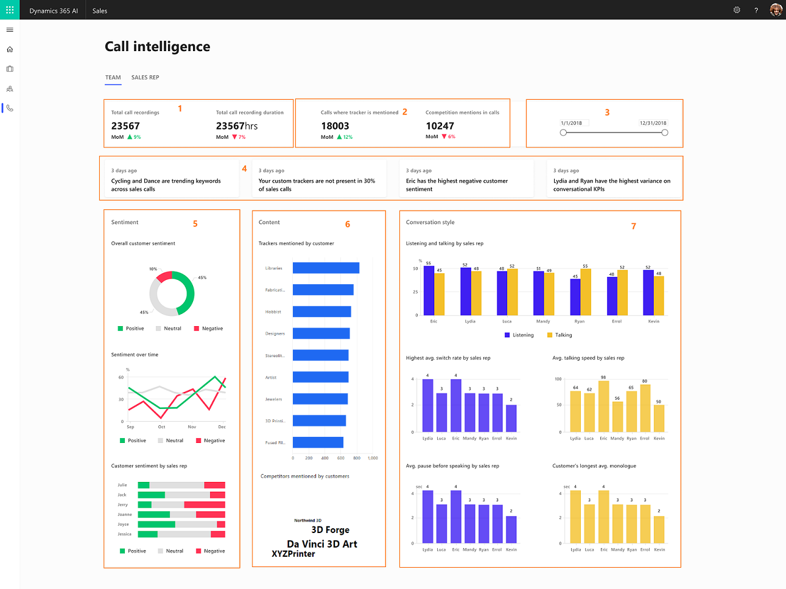
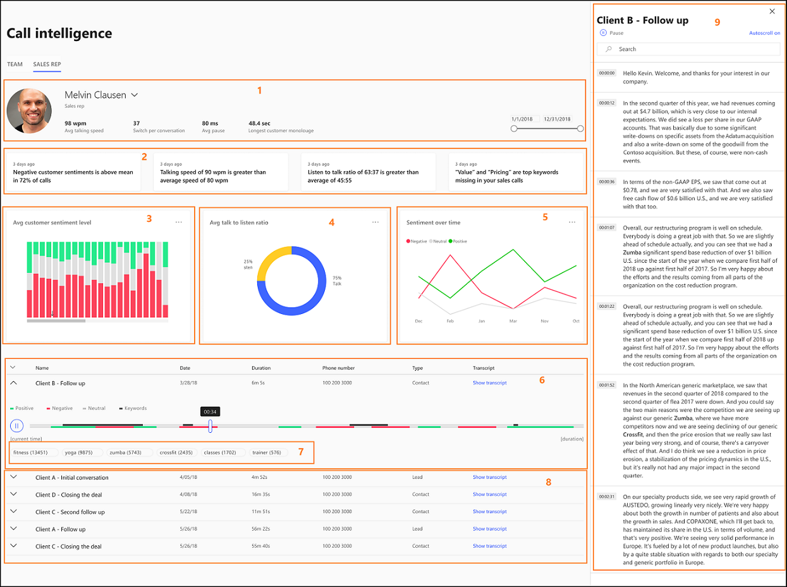

# Preview feature: Analyze customer calls to improve sales

Applies to Dynamics 365 (online), version 9.1.0

<!--from editor: Changed the first sentence to "Sales calls are an important part ..." instead of "the most important part," because that might not be the case for every business customer.-->

Sales calls are an important part of your business. They help you grow your business by improving sales and generating revenue. [!INCLUDE[pn-dynamics-ai-sales](../includes/pn-dynamics-ai-sales.md)] provides you with **Call intelligence**, an intelligent solution to analyze these calls. Analyzing the data from Call intelligence helps you to:

- Increase sales wins.
- Reduce new salesperson ramp-up time. 
- Increase productivity gains for the business.

As a sales manager, you can open the **Call intelligence** feature to view the overall team performance and the individual performances of sales reps. This helps you to:

- Assess overall customer sentiments and sentiment trends. 
- Identify keywords that customers use most during calls.
- Identify competitor names that customers bring up during calls.
- Assess your team's contributions toward customer sentiment.
- Gain insight into what’s going on with your team.
- Identify potential sales reps who might need coaching.
- Drill down into the sales rep view and analyze the data such as conversational KPIs, insights, and customer sentiment of sales reps.
- Analyze call transcripts and identify the areas where sales reps need coaching.
<!---	Comment on call transcripts and share with sales reps-->

To view the KPIs and insights of Call intelligence, go to **Call intelligence** in the **Dynamics 365 AI for Sales** app. 

<!--from editor: In the following image, is the name Sam Smith from an approved fictitious names list?-->

> [!div class="mx-imgBorder"]
> 

## View team information

When you open the **Teams** page, you'll see the pulse of the team through the insights across customer sentiments, content, and conversational KPIs. You can assess the insights of each individual and identify sales reps who require coaching to perform better.

<!--from editor: In No. 6, Competition mentioned by customers, it says "competitor names that sales reps use most..." Wouldn't it be names that customers use most?-->

|KPI/Insights|Description|
|------------|-----------|
|**1. Insights**|Displays what’s happening in your team and the latest trends such as sales reps who are underperforming, sales reps who are scoring high in customer satisfaction, and keywords that are trending.|
|**2. Date filter**|Provides a timeline for which you want to view the data of your team.|
|**3. Total calls recorded and Total call recording duration**|Specifies the total calls that were recorded during the specified time and the total duration of the recorded calls.|
|**4. Calls where tracker is mentioned and Calls where competitor is mentioned**|Specifies the number of calls in which the defined keywords are mentioned and number of calls where the defined competitors are mentioned.|
|**5. Sentiment**|• **Overall customer sentiment:** Specifies the customer sentiment in percentage—positive, negative, or neutral. •	**Sentiment over time:** Displays how the three customer sentiments (positive, negative, and neutral) are spanning across the specified timeframe.  •	**Customer sentiment generated by sales rep:** Specifies how each of your sales reps contributed toward generating the overall customer sentiment. Also, shows which sales rep has the highest or lowest contributions.|
|**6. Content**|• **Trackers mentioned by customers:** Displays the defined keywords that customers use most during conversations with sales reps.  • **Competition mentioned by customers:** Displays the defined competitor names that sales reps use most during conversations with customers.|
|**7. Conversation style**|• **Listening and talking ratio:** Specifies the average listen and talk ratio of sales reps in conversations with customers.  •	**Highest average switch rate:** Displays the average switches between a sales rep and customer in a conversation; this is a sign of engagement during conversations. •	**Average talking speed:** Displays the average number of words used per minute by sales reps. •	**Average pause before speaking:** Displays how many milliseconds the sales rep paused before responding to customer queries; this is a signal of patience by the sales rep. •	**Average longest monologue by customer:** Displays the length of speech without a break by the customer with a sales rep in seconds; this is a signal that sales reps are asking good questions and showing understanding of customer needs.|

## View sales rep information 

Open the **Sales rep** view to drill down into each individual sales rep to assess their performance and identify areas where the sales rep requires coaching. Also, you can get a quick peek into the customer sentiments and conversational KPIs across all the calls for the sales rep. You can filter a specific call that has negative customer sentiment and view the transcript of the call. You can look at the keywords and sentiments across the timeline of the call, go to a moment, and look at the call transcript. You can post comments on how the sales rep could handle the situation better and share these comments via email. 

Select the name of the sales rep from the drop-down list to view that rep's performance information.

<!--from editor: in the following image, is Sam Boocock from an approved fictitious names list? Also, are Rimsa and Actavis approved fictitious company names?-->

> [!div class="mx-imgBorder"]
> 

|KPI/Insights|Description|
|------------|-----------|
|**1. Basic information**|Displays the basic information of the sales rep such as average talking speed, switch per conversations, average pause, and longest customer monologue. **Date filter:** Provides a timeline for which you want to view the data of your team.|
|**2. Insights**|Displays what’s happening with the sales rep and the latest trends such as customer sentiments and keywords that are trending.|
|**3. Customer sentiment level**|Displays the customer sentiments (positive, negative, and neutral) for each call that the sales rep handled. |
|**4. Talk to listen ratio**|Displays the average talk and listen ratio of the sales rep during calls with a customer.|
|**5. Sentiment over time**|Displays how the three customer sentiments (positive, negative, and neutral) are behaving and spanning across the specified timeframe for the sales rep.|
|**6. Call details**|Displays the sentiments and keywords across the call.|
|**7. Most used keywords**|Displays the defined keywords that customers used most during conversations with the sales rep.|
|**8. Calls**|Displays the list of calls handled by the sales rep. Select the call to display the transcript and timeline. |
|**9. Transcript**|Provides a written record of the call that you selected.<!-- • Select **Add comment** to provide necessary inputs to the sales rep at the selected timeline.-->|

<!--from editor: Unhide heding when link is available
### See also
-->
<!--link to the d365 AI for sales admin guide>
