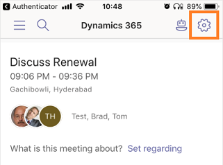

# Change sales organization

[!INCLUDE [cc-beta-prerelease-disclaimer](../includes/cc-beta-prerelease-disclaimer.md)]

> [!IMPORTANT]
> - [!INCLUDE[cc_preview_features_definition](../includes/cc-preview-features-definition.md)]  
> - [!INCLUDE[cc_preview_features_expect_changes](../includes/cc-preview-features-expect-changes.md)]
> - Microsoft doesn't provide support for this preview feature. Microsoft Dynamics 365 Technical Support won’t be able to help you with issues or questions. Preview features aren't meant for production use and are subject to a separate [supplemental terms of use](https://go.microsoft.com/fwlink/p/?linkid=870960).

By default, when you access the Dynamics 365 assistant app for Teams on mobile, the app assigns the most recent organization that you are associated with. If you are associated with multiple organizations, the Dynamics 365 for Teams app provides an option to choose another organization from the list of organizations. This helps keep you up to date with different organizations that you are associated with.

To change an organization, follow these steps:

1.	Open the Microsoft Teams mobile app and then go to the Dynamics 365 app.

2.	On the home page, select the **Settings** icon.

    > [!div class="mx-imgBorder"]
    >  

    You'll see the organization that the app currently uses.
 
    > [!div class="mx-imgBorder"]
    >  

3.	Select the organization to see a list of organizations that are associated with you.
 
    > [!div class="mx-imgBorder"]
    >  

4.	Select the organization that you want to change to and then select **Continue**.

    Your organization changes to the selected one and you can start using application.

### See also

[Install Dynamics 365 assistant application on Microsoft Teams](install-assistant-application-microsoft-teams.md)

[Access Dynamics 365 assistant application](access-assistant-application-teams.md)
