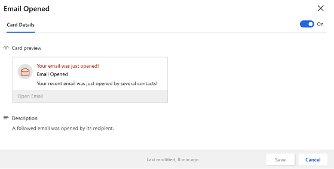

<!--from editor: There were many mentions of action cards in this topic that I changed to insight cards (based on the info later in this topic that says insight cards used to be called action cards. -->

# Configure Sales Insights Assistant

The Dynamics 365 Sales Insights Assistant (formerly known as Relationship assistant) helps sellers track their daily actions and communications through a collection of actionable cards known as insight cards. 

The Sales Insights Assistant is available in two forms:

- **Assistant (free)**: This feature is available for free with Dynamics 365 Sales. As an administrator, you must configure this feature for sellers in your organization to view insight cards such as task due today, custom activity due today, and email due today. These cards are available out of the box with Dynamics 365 Sales. By default, the base cards are available in your organization, even if you do not enable the Assistant. To configure Assistant (free), see [Configure and manage insight cards for Assistant (free)](#configure-and-manage-insight-cards-for-assistant-free).

- **Assistant with advanced features through Studio**: The advanced Assistant is available in Dynamics 365 Sales through the **Dynamics 365 Sales Insights** license. As an administrator, you must configure this feature for sales managers and sellers to create and manage insight cards through Studio. The Assistant (full capabilities) contains the **Home** and **Optimize ranking** tabs along with the tab **Insight cards** for you to configure and manage the custom insight cards. To configure the advanced Assistant, see [Configure and manage insight cards for Assistant (full capabilities)](#configure-and-manage-insight-cards-for-assistant-full-capabilities).

## Configure and manage insight cards for Assistant (free)

> [!IMPORTANT]
> By enabling this feature, you consent to share data about your customers' email activity with an external system. Data imported from external systems into Dynamics 365 Sales are subject to our privacy statement.

1. Assign user privileges to give access to the Assistant features. The privileges required to access Sales Insights features are automatically enabled for all out-of-the-box security roles, but they're initially disabled for all custom roles. If you enable any Sales Insights features, you must check the settings listed in the following table to help ensure that your users can access those features, and to help ensure that other features don't stop working because of privilege cascades related to these features.

    |Privilege| Security role tab |Description and requirements|
    |--|--|--|
    |**Insight card**| **Core records**  |Gives the ability to view and interact with insight cards that are generated by Assistant.   **Warning:** If Assistant is enabled, all users *must* have a role with read access for this privilege. Because of cascading, users without this privilege will lose access to many Dynamics 365 Sales features when assistant is enabled.|
    | **Insight card user settings** | **Core records**  | Gives the ability to view and change user preferences for insight cards that are generated by Assistant. **Warning:** If Assistant is enabled, all users *must* have a role with read access for this privilege. Because of cascading, users without this privilege will lose access to many Dynamics 365 Sales features when Assistant is enabled. |

    To learn more, see [Security roles and privileges](/dynamics365/customer-engagement/admin/security-roles-privileges).

2. Verify that you have [enabled and configured free Sales Insights features](intro-admin-guide-sales-insights.md#enable-and-configure-free-sales-insights-features).

3. On the sitemap, select **Insight cards** under **Assistant** to go to the **Manage insight cards** page.

    > [!TIP]
    > Alternatively, on the **Sales Insights settings** page, select **Manage** from the **Assistant (free)** section to go to the **Manage insight cards** page.

    The list of available cards is displayed. For details about each available insight card, including details about the configuration settings available for each and other details, see [Insight cards reference](action-cards-reference.md).

    > [!div class="mx-imgBorder"]
    > 
    
4. To enable or turn on the insight cards, select the cards that are grayed out and select **Turn on cards**.
    
    In this example, we have selected the cards **Recent Meetings (Exchange)** and **Email Opened**.

    > [!div class="mx-imgBorder"]
    > 
    
5. To disable or turn off the insight cards, select the cards that are enabled and select **Turn off cards**.
    
    In this example, we have selected the cards **SuggestedContacts** and **Upcoming Flight**.

    > [!div class="mx-imgBorder"]
    > 
    
6. To view more details of the cards such as preview of the cards, last modified time, turn on or off the card, and description, select the card.

    <!--from editor: Is there an image of the icon? I can't tell what it looks like. Also, here's what the style guide says about icon names: When referring to an icon, use bold formatting for the icon name. In instructions, use the name of the icon and its image, but don't use the word icon. -->

    > [!TIP]
    > Alternatively, select the more options icon corresponding to the card and then select **Edit**. 

    > [!div class="mx-imgBorder"]
    > 

Sellers can also set their own personal preferences for their insight cards. They can't add cards that you disable here, but they can disable cards that you have enabled if they don't find them useful. They can also change the configuration settings for those cards that have them, though your settings will be the defaults. To learn more, see [Use assistant to guide customer communications](assistant.md).

> [!NOTE]
> When custom insight cards are created in your organization, an option to enable these cards is displayed under the **Extended Cards** section. [!INCLUDE[proc_more_information](../includes/proc-more-information.md)] [Create custom cards in Assistant](extend-relationship-assistant-card.md) 

## Configure and manage insight cards for Assistant (full capabilities)

> [!NOTE]
> If you are using the preview assistant, you will see the tabs **Home** and **Optimize ranking** already available and you don't need to do any additional configuration to enable the feature. However, a banner is displayed at the top of the page to upgrade to the latest Sales Insights. Select **Update now** to update the solution to the latest version.
> > [!div class="mx-imgBorder"]
> >  

The Assistant (formerly known as Relationship assistant) displays actionable insight cards (formerly called action cards) for users in Dynamics 365 Sales. The Assistant is evolving and we're introducing new capabilities such as customized insight cards to your team.

With the new redesigned assistant administration, you can perform tasks that were freely available, such as turn on and off the insight cards and set thresholds for certain cards. Additionally, you can use advanced capabilities to create customized insight cards and optimize card ranking for your Dynamics 365 Sales organization. These features include:

- [Creating custom insight cards](create-insight-cards-flow.md)

- [Prioritizing individual cards](edit-insight-cards.md#set-priority-for-a-card)

- [Optimizing card ranking](optimize-ranking-insight-cards.md)

- [Assigning cards to users by roles](edit-insight-cards.md#assign-roles-to-or-remove-roles-from-a-card)

- [Turn on or off insights cards](edit-insight-cards.md#turn-cards-on-or-off)

- [Edit flow of an insight card](edit-insight-cards.md#edit-flow-of-a-card)

> [!NOTE]
> To learn more about the characteristics of insight cards (formerly called action cards), see [Create custom cards in Assistant](extend-relationship-assistant-card.md).

1. Verify that you have [enabled and configured advanced Sales Insights features](intro-admin-guide-sales-insights.md#enable-and-configure-advanced-sales-insights-features).

2. Go to **Change area** and select **Sales Insights settings**.

3. On the sitemap, select **Home** under **Assistant** to go to the **Assistant Studio** page.

    > [!TIP]
    > Alternatively, on the **Sales Insights settings** page, select **Manage** from the **Assistant (full capabilities)** section to go to the **Assistant Studio** page.

4. On the **Home** tab (**Assistant Studio** page), you can:
    
    - Create custom insight cards.

    - View popular, recent, high priority, and cards created by your organization. 

    - View the information on the cards that are available for your organization in a tabular format.

    - Search for cards.
    
    The following is an example of the **Assistant Studio** page:

    > [!div class="mx-imgBorder"]
    > 

    <!--from editor: What does S.No. mean - screenshot number? Instead, could it just be Number? -->

    | S.No. | Feature | Description |
    |-------|---------|-------------|
    | **1** | **Create cards with Microsoft Flow** | This allows you to create cards that are custom made for your organization. To learn more, see [Creating custom insight cards](create-insight-cards-flow.md). |
    | **2** | **Quick view cards through tabs** | The tabs allows you to quickly view cards that are most popular, recently used, high in priority, and created by your organization. |
    | **3** | **Table with card details** | This displays the cards that are available in your organization. On the cards, you can perform actions such as edit the settings, disable, assign to security roles, and prioritize. To learn more, see [Edit insight cards](edit-insight-cards.md). |
    | **4** | **Search cards** | This allows you to search cards that you want to view or manage. |
    
5. On the **Optimize ranking** tab, you can create rules to prioritize cards to appear in the application.

    The following is an example of the **Optimize ranking** tab:

    > [!div class="mx-imgBorder"]
    > 

    To learn more, see [Optimize ranking of insight cards](optimize-ranking-insight-cards.md).

### See also

[Introduction to administer Sales Insights](../sales/intro-admin-guide-sales-insights.md)

[Create insight cards](create-insight-cards-flow.md)

[Edit insight cards](edit-insight-cards.md)

[Optimize ranking of insight cards](optimize-ranking-insight-cards.md)

[Create custom cards in Assistant](extend-relationship-assistant-card.md)

[Sales Insights privacy notice](privacy-notice.md)
