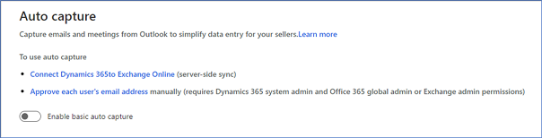

# Configure and enable auto capture

To help users in your organization to automatically add relative activities of their customers to Dynamics 365 Sales, enable auto capture.

> [!IMPORTANT]
> By enabling this feature, you consent to share data about your customers' email activity with an external system. Data imported from external systems into Dynamics 365 Sales Insights are subject to our privacy statement.

## Prerequisites

Verify the following prerequisites before enabling Auto capture for your organization: 

- To configure, enable free Sales Insights features. To learn more, see [Enable and configure free Sales Insights features](intro-admin-guide-sales-insights.md#enable-and-configure-free-sales-insights-features).

- You must use [!INCLUDE[pn_Microsoft_Exchange_Online](../includes/pn-microsoft-exchange-online.md)] as your email server. 

- Users must use the web client for Dynamics 365 Sales (other front ends aren't supported)].  

- For each user that requires access to this feature, you must approve their email address to allow queries against [!INCLUDE[pn_Exchange](../includes/pn-exchange.md)] (requires tenant-level admin privileges). To learn more, see [Approve email](/dynamics365/customer-engagement/admin/connect-exchange-online#approve-email) 

- To track incoming email messages, you must set up server-side synchronization. To learn more, see [Set up server-side synchronization of email, appointments, contacts, and tasks](/dynamics365/customer-engagement/admin/set-up-server-side-synchronization-of-email-appointments-contacts-and-tasks)  

### Enable auto capture

After you accept the privacy statement for embedded intelligence, Auto capture is enabled by default. If it's not enabled, select the toggle button to enable Auto capture.

   > [!div class="mx-imgBorder"]
   > 

> [!NOTE]
> For more information about Auto capture and how it can help your users, see [Auto capture](auto-capture.md)

### See also

[Introduction to administer Sales Insights](../sales/intro-admin-guide-sales-insights.md)

[Display related emails with auto capture](auto-capture.md)