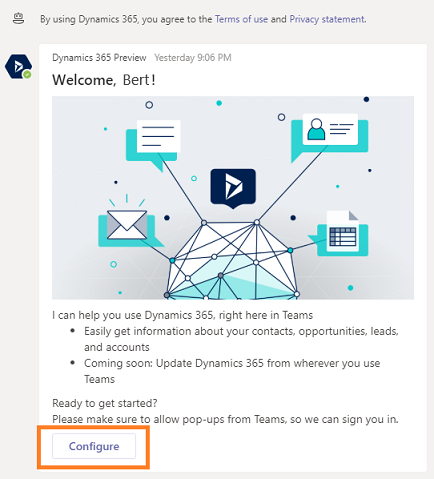

# Configure Dynamics 365 bot

The Dynamics 365 app for Teams bot helps you to get information from your Dynamics 365 organization in the Microsoft Teams conversations tab.

As a user when you first access the Dynamics 365 app asks you to configure the bot. You can configure the bot only through your desktop app.

To configure the bot, follow these steps:

1. Verify that you have reviewed prerequisites and installation procedures. To learn more, see [Enable Dynamics 365 assistant application on Microsoft Teams](intro-admin-guide-sales-insights.md#enable-dynamics-365-assistant-application-on-microsoft-teams).

2. On desktop, sign into **Microsoft Teams** and open the **Dynamics 365** app.

3. On the welcome message, select **Configure**.

3.	Select an environment, and then select **Next**.

    > [!div class="mx-imgBorder"]
    > 
    
    If the environment has multiple app modules (Sales, Marketing, Service, and so on), then you'll also select an app module.

4.	Enter credentials and sign in.
    
    The bot setup is complete, and you can start using the bot.

### See also

[Install Dynamics 365 application on Microsoft Teams](install-assistant-application-microsoft-teams.md)

[Access the application on Microsoft Teams](access-assistant-application-teams.md)

[Get answers through bot assistant](use-bot-assistant.md)