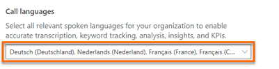

# Configure conversation content   
Using the conversation content, you can configure the following settings:   
- [Add keywords and competitors](#add-keywords-and-competitors)  
- [Select call languages](#select-call-languages)

## Open conversation content settings page    
> [!NOTE]
> Review the prerequisites. To learn more, see [Prerequisites to configure conversation intelligence](prereq-sales-insights-app.md).    

**In conversation intelligence app**   
1.	Open the **Conversation intelligence** application.  
2.	Select the **Settings** icon on the top-right of the page and then select **Settings**.  
    > [!div class="mx-imgBorder"]
    >   
3.	On the **Settings** page, select **Conversation content**.  
    In the Conversation content page, you can:   
    - [Add keywords and competitors](#add-keywords-and-competitors)  
    - [Select call languages](#select-call-languages)

**In Sales Hub app**  
1.	Go to **Change area** in the lower-left corner of the page and select **Sales Insights settings**.  
    > [!div class="mx-imgBorder"]
    >   
2.	In the configuration page, under **Productivity**, select **Conversation intelligence**.  
    > [!div class="mx-imgBorder"]
    > 
3.	Select **Conversation tracking**.  
    In the Conversation content page, you can:   
    - [Add keywords and competitors](#add-keywords-and-competitors)  
    - [Select call languages](#select-call-languages)

## Add keywords and competitors    
Configure tracked keywords and competitors that are relevant to you and your organization so you can track them in calls. Whenever the defined keywords or competitors are mentioned in a call, conversation intelligence will gather the data and display it appropriately on the dashboard.    
> [!NOTE]
> As a sales manager, you can define tracked keywords and competitors that are specific to your team. That is, you want to track these keywords and competitors only for your team member calls. 
> The changes you made apply only to your team and doesn't impact the administrator-defined settings for your organization.    

1. Open Conversation tacking settings page.	
2. On the **Tracked keywords** section, enter a keyword in the **Add a keyword**, and press **Enter**.  
    > [!div class="mx-imgBorder"]
    >   
3.	Repeat **step 1** to add other keywords.  
4.	In the **Competitors** section, enter a competitor's name in the **Add a competitor**, and press **Enter**.  
    > [!div class="mx-imgBorder"]
    >   
5.	Repeat **step 3** to add other competitors' names.  
6.	Select **Save**.

## Select call languages  
**Automatic language detection**    
Currently, you upload the conversation or transcript file along with a metadata file to process. In the metadata file, you specify the language (`locale`) to process the files for more accurate transcription, keyword tracking, analysis, insights, and KPIs to display in the call summary page. To know how to upload conversations and transcripts, see [Upload call recordings or transcripts](configure-conversation-intelligence-call-data.md#upload-call-recordings-or-transcripts). Conversation intelligence supports the following languages to process the files: en-US, en-GB, de-DE, fr-FR, it-IT, es-ES, es-MX, ja-JP, pt-BR, zh-CN, nl-NL, fr-CA, pt-PT, and ar-BH.

Selecting the languages through the **Call language** section helps you to avoid specifying the language (`locale`) in the metadata file. The selected languages are automatically detecting to process the conversation or transcript for more accurate transcription, keyword tracking, analysis, insights, and KPIs to display in the call summary page. Currently, application supports the autodetection of following languages: English (en-US and en-GB), French (fr-FR), and German (de-DE).     
>[!NOTE]
>Though other languages are displayed in the list for autodetection, you must specify the `locale` in the metadata file to process. 

Let's look at how each role can select the languages:  
- **As an administrator**, you can select a list of languages that your organization uses while talking with customers over calls.      
- **As a manager**, you can select a subset of languages from the list of administrator chosen languages and these languages are available for your team to select and use.      
- **As a seller**, you can select relevant languages that you use to talk with customers over calls. The selected languages are a subset of languages that your manager has selected from the list selected by administrator. Each time when you sign into the application, the languages you chose are saved in your settings and you can always update the list, as required. If you see that there is a supported language that is not available for you to choose, contact your administrator and manager to add more languages.     

**Select the languages**   
>[!NOTE]
>By default all languages are selected.   
1. Open **Conversation tracking** settings page.	
2. On the **Call languages** section, select the language selector drop-down and then select the languages that you want to use during your calls with customers.   
    > [!div class="mx-imgBorder"]
    >    
3.	Select **Save**.

### See also

[Introduction to administer conversation intelligence](intro-admin-guide-sales-insights-app.md)   
[Prerequisites to configure conversation intelligence](prereq-sales-insights-app.md)