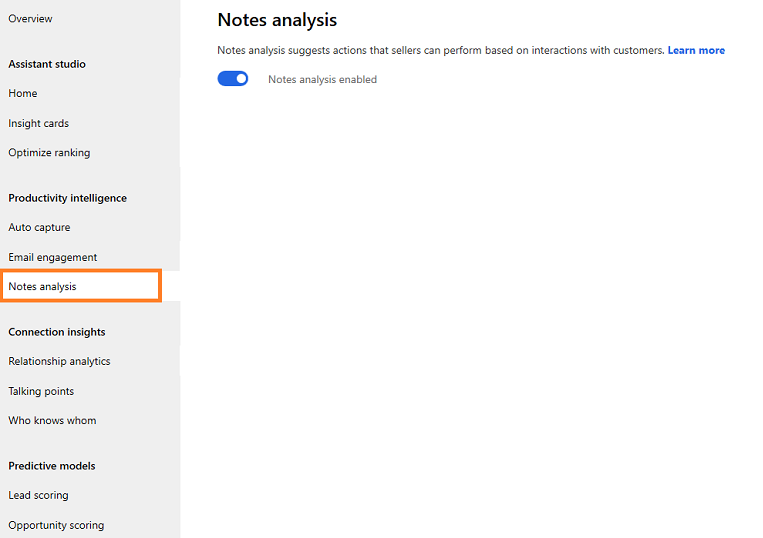

# Configure Notes analysis

To help users with intelligent auto-suggestions when they enter notes regarding a recent meeting or discussion with a customer in [!INCLUDE[pn-dyn-365-sales](../includes/pn-dyn-365-sales.md)], enable Notes analysis.

1. Verify that advanced Sales Insights features are enabled. To learn more, see [Enable and configure advanced Sales Insights features](intro-admin-guide-sales-insights.md#enable-and-configure-advanced-sales-insights-features) 

2.	Go to **Change area** and select **Sales Insights settings**.

    > [!div class="mx-imgBorder"]
    > 

3.  On the sitemap, select **Notes analysis** under **Productivity intelligence**.

    > [!TIP]
    > Alternatively, in the **Sales Insights settings** page, select **Manage** from the **Notes analysis** section to go to configuration page.

    The configuration page opens.

    > [!div class="mx-imgBorder"]
    > 

4. Select the toggle button to enable **Notes analysis**.

    > [!div class="mx-imgBorder"]
    > 

### See also

[How Notes analysis assists you with intelligent suggestion](notes-analysis.md)

[Enable and configure advanced Sales Insights features](intro-admin-guide-sales-insights.md#enable-and-configure-advanced-sales-insights-features)