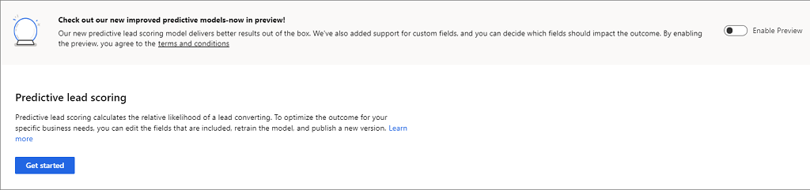

# Configure Predictive lead scoring

Predictive lead scoring helps users to focus on revenue generation efforts by providing scores to prioritize efforts on quality leads. To configure Predictive lead scoring, follow these steps:

1. Verify that advanced Sales Insights features are enabled. To learn more, see [Enable and configure advanced Sales Insights features](intro-admin-guide-sales-insights.md#enable-and-configure-advanced-sales-insights-features) 

2.	Go to **Change area** and select **Sales Insights settings**.

    > [!div class="mx-imgBorder"]
    > 

3.  On the sitemap, select **Lead scoring** under **Predictive models**.

    > [!TIP]
    > Alternatively, in the **Sales Insights settings** page, select **Set up** from the **Predictive lead scoring** section to go to configuration page.

    The **Getting started** page opens.

    > [!div class="mx-imgBorder"]
    > 

4. Select **Create Model**.

    > [!div class="mx-imgBorder"]
    > 

   Creating a model takes a few minutes. You will see the progress on the screen.

5. Verify that the **Prediction Accuracy** score matches your organizational requirements and select **Apply Model**.

    > [!div class="mx-imgBorder"]
    > 
  
    The prediction lead scoring is applied in your organization and users can see the lead scoring in their views under the **Lead Score** column.

6. (Optional) If you are not satisfied with the **Prediction Accuracy** score, select **Discard Model** to discard the current model. Select **Retrain Model** to create a updated model and then select **Apply**.
   
   > [!NOTE]
   > We recommend that you train the model once the data is refreshed in your organization for better prediction accuracy scoring.
   
7. If you want to configure the lead score range, enter a minimum value of the range in the **Lead score range**.

   When you change lead score range for a grade, the preceding grade's maximum range value changes automatically depending on the changed minimum grade value. For example, when you change the minimum range value score for **Grade A** to 51, the maximum lead score range for **Grade B** changes to 50.
   
    > [!div class="mx-imgBorder"]
    > 

8. Save and apply the model.

   The predictive lead scoring is configured and ready to use in your organization. The score refreshes every 24 hours. When you recreate a model, the application takes 24 hours to apply the new model.

### See also

[Convert leads into opportunities](../sales/work-predictive-lead-scoring.md)

[Enable and configure advanced Sales Insights features](intro-admin-guide-sales-insights.md#enable-and-configure-advanced-sales-insights-features)