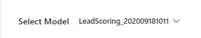
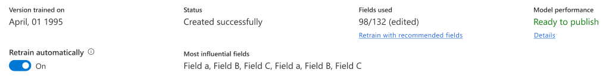
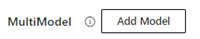
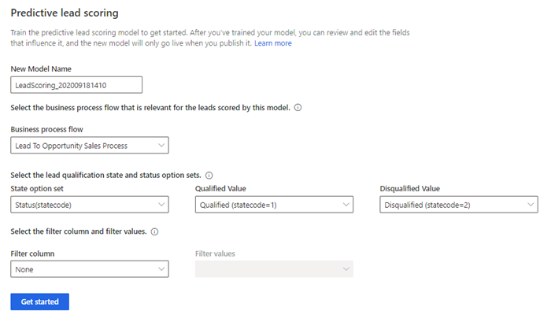
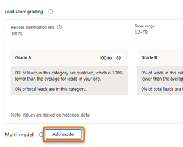
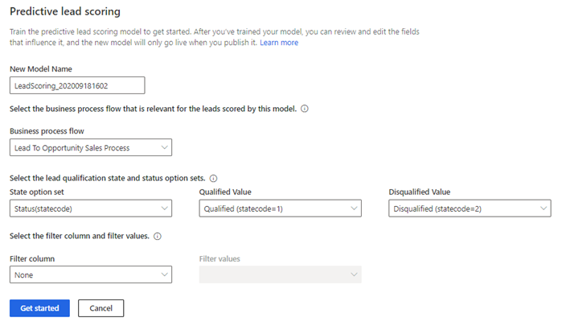
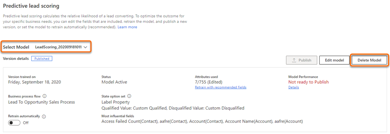

# Configure predictive lead scoring

Predictive lead scoring uses a predictive machine learning model to calculate a score for all open leads. The score helps salespeople prioritize leads, achieve higher lead qualification rates, and reduce the time that it takes to qualify a lead.

Using this score, you can:

- Identify quality leads and convert them into opportunities.
- Spend time on leads that have low scores, and convert them into possible opportunities.

For example, say you have two leads&mdash;Lead A and Lead B&mdash;in your pipeline. The lead scoring model applies a score of 80 for Lead A and 50 for Lead B. By looking at the score, you can predict that Lead A has a greater chance of being converted into an opportunity, and you can engage it. Also, you can further analyze why the score of Lead B is low by looking at the top reasons influencing the score and deciding whether to improve this score.

The following image shows an example of a lead scoring widget.

> [!div class="mx-imgBorder"]
> 

>[!IMPORTANT]
>If you're using a version of predictive lead scoring earlier than 2020 release wave 2 for Dynamics 365, delete the model. This is necessary because the previous version of the model will be applied on all leads in your organization, and the newly generated models won't have any effect on the leads. More information: [Delete a model](#delete-a-model)

You can add custom fields to generate an accurate model for predictive lead scoring. The custom fields can be specific to your organization so that you can decide the impact of the outcome.

## Prerequisites

Verify that you meet the following requirement before adding predictive lead scoring models for your organization:

- A minimum of 40 qualified and 40 disqualified leads within the past 18 months.

    >[!NOTE]
    >These numbers represent the minimum requirement. The more leads you can include to train the model, the better the prediction results will be.

## Understand the configuration page

Before we configure the predictive lead scoring, let's understand the configuration summary page. When a model is generated and published, the configuration summary page is displayed as shown in the following image.

> [!div class="mx-imgBorder"]
> 

The configuration page is organized into the following sections:

- [Select a model](#select-model)
- [Actions you can perform on the model](#actions-you-can-perform-on-the-model)
- [Version details](#version-details)
- [Lead score grading](#lead-score-grading)
- [MultiModel](#multimodel)

### Select a model

In the upper-left corner of the page, you can use the **Select model** drop-down list to choose the model you want to view, edit, or delete. The list consists of both published and unpublished models.

> [!div class="mx-imgBorder"]
> 

### Actions you can perform on the model

In the upper-right corner of the page, you can choose from actions that you can perform on the model.

> [!div class="mx-imgBorder"]
> 

- **Publish**: When you publish a model in your organization, users in your organization can see the My Open Leads Scored system view and the Lead score widget on lead forms. After you publish, this button appears dimmed and will be available only after you retrain or edit the model.
- **Edit model**: You can update or add fields that affect the prediction accuracy score. This is useful when you want to modify fields to consider or include a unique business process. More information: [Edit and retrain a model](#edit-and-retrain-a-model)
- **Revert version**: You can return the model to its previous version when the retrained model isn't satisfactory or doesn't meet an acceptable level of your organization's requirements. This action is only available when you've retrained the model but haven't published it yet.
- **Delete model**: You can delete models that aren't required in your organization. This option is displayed for published models. More information: [Delete a model](#delete-a-model)

### Version details

The parameters displayed in this section show information about the status and performance of the model.

> [!div class="mx-imgBorder"]
> 

| Parameter | Description |
|-----------|-------------|
| Version trained on | Displays a date that lets you know when the model was last trained. |
| Status | Displays whether the model is active or inactive. |
| Attributes used | Displays the number of attributes used from the available list to train the model. If you're not satisfied with the outcome of the trained model, you can select **Retrain with recommended fields** to retrain the model with the standard (out-of-the-box) attributes. If the parameter displays **Edited** next to the number of attributes used, this specifies that the attributes used are custom-selected. |
| Model performance | Displays information about the model's accuracy and projected performance based on the data available and selected to train the model. **Note**: The range of the accuracy score is defined based on the area under the curve (AUC) classification measurements. - **Ready to publish** specifies that the model accuracy is above the range, and you can expect that the model will perform well. - **OK to publish** specifies that the model accuracy is within range, and you can expect that the model might perform reasonably well. - **Not ready to publish** specifies that the model accuracy is below the range, and you can expect that the model will perform poorly. |
| Business process flow | Displays the business process flow that's applied on the leads that are scored by this model. |
| Filter column and filter values | When multiple models are used, this selection defines which column and which values within that column correspond to the leads that this specific model should score. |
| State option set | Displays the option set that's used to qualify and disqualify leads in this model. |
| Retrain automatically | Allows you to set the model to be retrained automatically. More information: [Automatic retraining](#automatic-retraining) |
| Most influential fields | Displays the top five attributes that most affect the outcome of the prediction accuracy score. |

### Lead score grading

When a model is published, the leads that are in your organization's pipeline are graded according to the range defined in this section. Each lead in the pipeline is graded A, B, C, or D, according to the lead score. Leads in the top score range are graded A while leads within the lowest score range are graded D. 

> [!div class="mx-imgBorder"]
> 

You can configure the range for the grading according to your organizational requirements. When you change the lead score range for a grade, the maximum range value for the adjacent grade changes automatically in accordance with the change in the minimum value. For example, when you change the minimum range value score for **Grade A** to 51, the maximum lead score range for **Grade B** changes to 50.

### MultiModel

In the lower-left corner of the page, you can use **Add model** to generate a new model to represent a line of business that might use different leads than your first model. The **Add model** command will be disabled as soon as you reach the maximum limit of 10 models (both published and unpublished). More information: [Add a model](#add-a-model)

> [!div class="mx-imgBorder"]
> 

## First-run setup experience

When the predictive lead scoring configuration section is opened for the first time in your organization and no models have been trained on the installation of Sales Insights, you must add the model.

However, if your organization has enough leads that match the application default configurations, a model is generated by default and a pop-up window is displayed with the prediction accuracy score and top five fields that are influencing the score. Based on your organization's requirements, you can publish the model, or you can edit and then publish the model.

If you're using custom attributes for lead generation, you can generate the model by configuring the parameters with your custom attributes.

>[!NOTE]
>Before you configure the model, review the [prerequisites](#prerequisites).

1. Verify that advanced Sales Insights features are enabled. More information: [Install and configure premium Sales Insights features](intro-admin-guide-sales-insights.md#install-and-configure-premium-sales-insights-features)

2. Go to **Change area** in the lower-left corner of the page, and select **Sales Insights settings**.

    > [!div class="mx-imgBorder"]
    > 

3. On the site map under **Predictive models**, select **Lead scoring**.

    The **Predictive lead scoring** configuration page is displayed.

    > [!div class="mx-imgBorder"]
    > 

4. In the **New model name** box, enter a name that contains alphanumeric characters. Underscores are allowed, but not spaces or other special characters.

    By default, the name is **LeadScoring_**<***YYYYMMDD***><***Time***> (for example, **LeadScoring_202009181410**). The date and time are based on Coordinated Universal Time (UTC).

5. In the **Business process flow** list, select a flow that's relevant for the leads for which you're generating the model. The values displayed in the list are the business process flows that are defined for leads in your organization.

    A business process flow defines a set of steps that users can perform to achieve an outcome. An organization can have multiple business process flows to represent the work of different security roles or lines of business.

    You must enable custom business process flow entities for analytics and to be able to select them. More information: [Configure Entity For Managed Lake](https://dynamics.wiki/index.php/Configure_Entity_For_Managed_Lake)

6. In the **State option set** list, select the option set in which the status of the leads is defined, and then select the corresponding qualified and disqualified values in the **Qualified value** and **Disqualified value** lists, respectively. 

    Leads are marked as:
    - **Qualified** when they've met certain criteria that denotes that they're ready to purchase a product or service from a business. 
    - **Disqualified** when the criteria aren't met. 

    The out-of-the-box **Status** state option set contains the qualified and disqualified values as **Qualified** and **Disqualified**, respectively. You can also select your custom option set that's relevant to your business.

7. Select **Filter column** and **Filter values** to define the leads for which the model must score. 

    With multiple models, each model can be directed to score a specific set of leads based on the line of business they belong to, or based on other criteria. The filter column is the column that holds the value that distinguishes which leads the model should score. These selections determine which column and which values within that column correspond to the leads that this model will score.

8. Select **Get started**.

    The application starts generating a model, and a notification is displayed. The application uses the standard attributes to generate the model.

    > [!div class="mx-imgBorder"]
    > 

    >[!NOTE]
    >If there aren't enough leads to generate the model, an error message is displayed. Review and edit the configurations, and try generating the model again.

9. After the model is generated, the lead scoring configuration page is displayed with the version summary, including model performance, the top fields that are influencing the outcome, and the option to choose to automatically retrain the model. 

10. Select **Publish**, if the accuracy of the score is at an acceptable level in accordance with the standards of your organization.

    The model is applied to the selected set of leads in your organization. Users can see the lead scoring in their views under the **Lead score** column and a widget in the lead form. More information: [Convert leads into opportunities](../sales/work-predictive-lead-scoring.md)

    >[!NOTE]
    >If the accuracy of the score isn't acceptable, select **View details**. You can review the details of the model and edit the fields to improve the score's accuracy. More information: [Edit and retrain a model](#edit-and-retrain-a-model)

## Add a model

In organizations that have different lines of business, you might need different models to score the corresponding leads. To accomplish this, you can add and publish multiple models that are specific to each line of business in your organization. To ensure that these models are accurate for your organization, you can choose custom attributes (fields) to be used to generate the lead score for a model. 

1. Go to the predictive lead scoring configuration summary page.

2. In the lower-left corner of the page, select **Add model**.

    > [!div class="mx-imgBorder"]
    > 

    >[!NOTE]
    >If you already have 10 models (both published and unpublished), the **Add model** option is disabled. Delete the models that are no longer required in your organization. More information: [Delete a model](#delete-a-model)

    > [!div class="mx-imgBorder"]
    >  

3. Perform steps 4 through 8 in [First-run setup experience](#first-run-setup-experience), earlier in this topic, to add the model. 

4. After the model is generated, a confirmation message appears with a summary of model performance, the top fields that are influencing the outcome, and the option to choose to automatically retrain the model. 

    > [!div class="mx-imgBorder"]
    > 

5. Select **Publish**, if the accuracy of the score is at an acceptable level in accordance with the standards of your organization.

    The model is applied to the selected set of opportunities in your organization. Users can see the lead scoring in their views under the **Lead score** column and a widget in the lead form. More information: [Prioritize leads through scores](../sales/work-predictive-lead-scoring.md)

    >[!NOTE]
    >If the accuracy of the score isn't acceptable, select **View details**. You can review the details of the model and edit the fields to improve the score's accuracy. More information: [Edit and retrain a model](#edit-and-retrain-a-model)

## Edit and retrain a model

It's time to retrain a model when its prediction accuracy score doesn't meet your organization's standards, or the model simply gets old. Retraining generally increases the prediction accuracy score. The application uses the latest data (leads) from your organization to train the model so that it can provide more accurate scores for your users.

>[!NOTE]
>For better prediction accuracy scoring, retrain a model after the data in your organization is refreshed.

You can retrain the model [automatically](#automatic-retraining) or [manually](#manually-retraining). Both methods are described in the following sections.

### Automatic retraining

Automatic retraining allows the application to retrain a model automatically once every 15 days. This can allow the model to learn from historical data and improve its prediction accuracy over time. Depending on the model's accuracy, the application makes an informed decision whether to publish or ignore the retrained model.

To retrain a model automatically, go to the predictive lead scoring configuration page and select **Retrain automatically**. By default, this option is enabled when a model is published. Here are the scenarios where the application automatically publishes the model:

- When the accuracy of the retrained model is equal to or greater than 95 percent of the accuracy of the active model.
- When the current model is more than three months old.

    >[!NOTE]
    >A retrained model might not be published if the accuracy of the model isn't maintained at the application's standard and the existing user-published model will be retained.

### Manually retraining

1. Go to the predictive lead scoring configuration page, and select **Edit model**.

2. On the **Edit fields** page, select your custom attributes from **Main Entity** and **Related Entities**.

    > [!div class="mx-imgBorder"]
    > 

3. Select **Retrain model**. 

    The model starts to be generated by using the selected custom attributes, and a notification is displayed on the screen.

4. On the configuration summary page, review the model performance and other parameters. If the retrained model satisfies your organizational requirements, publish the model.

    >[!NOTE]
    >If the parameters of the retrained model aren't satisfactory, edit the attributes and retrain the model.

## Delete a model

You can delete a model when it's no longer required in your organization. You can only have 10 models&mdash;both published and unpublished&mdash;simultaneously.

1. Go to the predictive lead scoring configuration page.

2. Select a model from the **Select model** list, and then select **Delete model**. In this example, we've selected the model **LeadScoring_202009181011**.

    >[!NOTE]
    >You can't delete a model if the **Retrain automatically** option is enabled. Disable the option first.

    > [!div class="mx-imgBorder"]
    > 

3. In the confirmation message that appears, select **Delete**.

The model is deleted from your organization.

## Add the lead scoring widget to a form

By default, the predictive lead scoring widget is available only in the out-of-the-box **Sales Insights** form. If you're using customized forms for leads, you can display the predictive lead scoring widget on your custom forms by following these steps.

> [!IMPORTANT]
> - Adding lead scoring widgets is only supported in Unified Interface apps.
> - You can't use the legacy form designer to add a lead scoring widget to a form.

1. In your app, select **Settings** , and then select **Advanced Settings**.

    > [!div class="mx-imgBorder"]  
    > 

    The **Business Management settings** page opens in a new browser tab.

2. Select **Settings** > **Customizations** > **Customize the System**.

3. In the solution explorer, under **Components**, expand **Entities**, and then select **Lead** > **Forms**.

4. Select and open the form to which you want to add the widget.

    > [!div class="mx-imgBorder"]  
    > 

5. In the **Field Explorer** pane, clear the **Only show unused fields** check box.

    > [!div class="mx-imgBorder"]  
    > 

6. Select and drag the **Lead Score** field to the location you want. In this example, we're dragging it to the **General** section.

    > [!div class="mx-imgBorder"]  
    > 

7. Double-click to select the **Lead Score** field to open the **Field Properties** dialog box.

8. On the **Display** tab, in the **Label** section, clear the **Display label on the form** check box.

    > [!div class="mx-imgBorder"]  
    > 

9. On the **Control** tab, select **Add control**.

    The **Add control** dialog box opens.

10. Select **Predictive lead score**, and then select **Add**.

    > [!div class="mx-imgBorder"]  
    > 

    The **Predictive lead score** control is added.

11. For **Predictive lead score**, select the **Web**, **Phone**, and **Tablet** options, and then select **OK**. 

    > [!div class="mx-imgBorder"]  
    > 

    The predictive lead score widget is added to the form.

    > [!div class="mx-imgBorder"]  
    > 

12. Save and publish the form.

### See also

[Prioritize leads through scores](../sales/work-predictive-lead-scoring.md)  
[Install and configure premium Sales Insights features](intro-admin-guide-sales-insights.md#install-and-configure-premium-sales-insights-features)