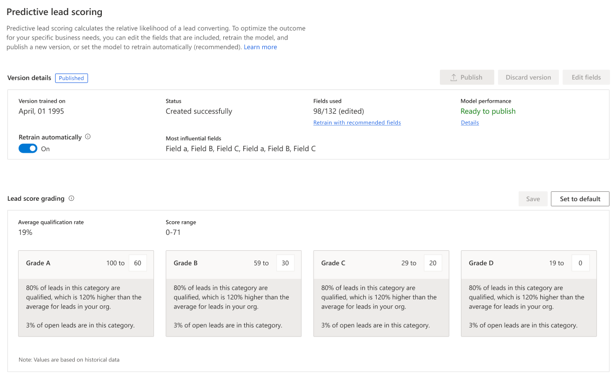
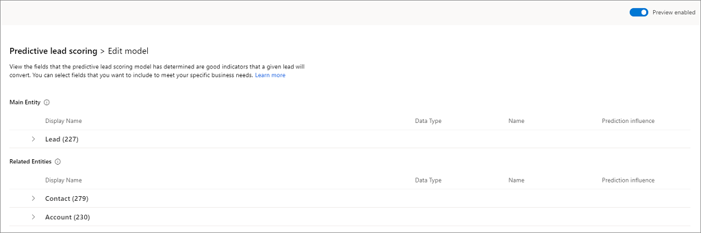

# Configure predictive lead scoring
<!--Neeraja: See the first sentence for the definition of Predictive lead scoring at https://docs.microsoft.com/en-us/business-applications-release-notes/april18/dynamics365-sales/predictive-lead-scoring. You might want to be consistent with what is already written.-->
<!--Neeraja: The topic comes under the Administrator Guide and therefore, do we need to mention "As an administrator"?-->
<!--Neeraja: For my understanding, please clarify what is the benefit of the model with a score? How is the information useful? Consider writing as "...the application uses out-of-the-box fields..."-->
<!--Neeraja: Users use the model or the score?-->
Predictive lead scoring helps users to focus on revenue generation efforts by providing scores for the leads based on which users can prioritize their leads. As an administrator, when you configure the predictive lead scoring feature, the system uses standard (out-of-the-box) fields related to leads to generate a model with a score. Using this score, users can do the following:
 
- Identify quality leads and convert them into opportunities.
 
- Spend time on leads that have low scores, and convert them into possible opportunities.
<!--Neeraja: Consider writing as "The custom fields can be specific...". Does the preview configure the enhanced model? Consider writing as "The feature is available in preview mode. You must enable the preview mode to configure predictive lead scoring."-->
The enhanced predictive lead scoring lets you add custom fields to generate a model for predictive lead scoring that is accurate. The custom fields could be specific to your organization so that you can decide the impact of the outcome. The feature is available as a preview, and you must enable the preview to configure the enhanced model.
<!--Neeraja: Use a period and not colon in lead in text for figures and illustrations. This is a global comment.-->
The following illustration explains how you can configure the predictive lead scoring:

> [!div class="mx-imgBorder"]
> 

<!---->
Before we configure the predictive lead scoring, let's understand the configuration page after a model is generated.

## Understand configuration page

when a model is generated, the configuration page displays as shown in the following screen shot:

> [!div class="mx-imgBorder"]
> 

| Number | Feature | Description |
|--------|---------|-------------|
<!--Neeraja: Consider writing as "...to your organization. Subsequently, users in your organization...-->
|1|Actions you can perform on the model|- **Publish**: The **Publish** button allows you to publish a model to your organization. When published, users in your organization can see **My Open Leads Scored** system view and lead score widget on lead forms. <!--Neeraja: Consider rewriting the sentence as follows: "After you publish, the Publish button is available only when you retrain or edit the model. --> When a model is published this option gets disabled and will be active only when you retrain or edit the model. - **Revert version**: The Revert version button allows you to return the model to the previous version when the retrained model is not satisfactory or not at an acceptable level of your organization's requirements. This option is available only when you retrain a model.  - **Edit fields**: This option is available only when the preview is enabled. The **Edit fields** button allows you to update or add the fields that affect the prediction accuracy score. To learn more, see [Retrain the model](#retrain-a-model).  - **Retrain Model**: This option is available only for standard model creation. You can select this option to regenerate a model with updated information that is available in your organization for improved predictive accuracy score.|
|2|version details|- **Version trained on**: This parameter displays a date that lets you know when the model was last trained. - **Status**: This parameter lets you know the status of the model. - **Attributes used**: This parameter lets you know the number of attributes (fields) used from the available list to generate the prediction accuracy score for the model. You can select the **Retrain with recommended fields** option to retrain the model with standard (out-of-the-box) attributes if the outcome of the trained model is not satisfactory.  - **Prediction accuracy**: This parameter displays the percentage of the model's accuracy in predicting the leads that could convert into opportunities.  - **Most influential fields**: This parameter displays the top five attributes (fields) that are most affecting the outcome of the prediction accuracy score. |
|3|Lead score grading|- **Lead qualification rate**: .  - **Max score**: .  - **Grading**: When a model is published, the leads that are in your organization's pipeline are graded according to the range defined in this section. Each lead in the pipeline is graded as A, B, C, or D according to the lead score that a lead has and this score is influenced by the attributes that we selected while creating the model. <!--Neeraja: The following sentence appears to be incomplete and incorrect. What is D being compared with? Consider rewriting the sentence.--> Leads that are graded as A has more chance of converting into opportunities and D being the least. You can configure the range for the grading according to your organizational requirements. When you change lead score range for a grade, the preceding grade's maximum range value changes automatically depending on the changed minimum grade value. For example, when you change the minimum range value score for **Grade A** to 51, the maximum lead score range for **Grade B** changes to 50. |

## Generate system default model 

This model is generated based on the standard attributes (fields) that are chosen by the application.  

1. Verify that advanced Sales Insights features are enabled. To learn more, see [Enable and configure advanced Sales Insights features](intro-admin-guide-sales-insights.md#enable-and-configure-advanced-sales-insights-features) 

2.	Go to **Change area** and select **Sales Insights settings**.

    > [!div class="mx-imgBorder"]
    > 

3.  On the sitemap, select **Lead scoring** under **Predictive models**.

    > [!TIP]
    > Alternatively, in the **Sales Insights settings** page, select **Set up** from the **Predictive lead scoring** section to go to configuration page.
<!--Neeraja: The word display is a transitive verb and requires an object. Write as "...page is displayed.-->
    The **predictive lead scoring** configuration page displays.

    > [!div class="mx-imgBorder"]
    > 
<!--Neeraja: Pop up is hyphenated as an adjective. See the guideline for pop up at https://docs.microsoft.com/en-us/style-guide/a-z-word-list-term-collections/p/pop-up-->
4. Select **Get started** and a pop up dialog displays to enable the preview.

    > [!div class="mx-imgBorder"]
    > 

5. Select **Continue without preview**. The application starts generating a model and a notification is displayed on the screen.

    > [!div class="mx-imgBorder"]
    > 
<!--Neeraja: Use the "ing" form of verb sparingly. Consider rewriting the phrase "are influencing"-->
6. After the model is generated, a confirmation notification displays that displays prediction accuracy score and top five fields that are influencing the score. Select **Publish** or **View details**. 

    > [!div class="mx-imgBorder"]
    > 

    - **Publish**: Select **Publish** if the score's accuracy is at an acceptable level as per your organization's standard.

    - **View details**: Select **View details** if the score's accuracy is not at an acceptable level. You can review the details of the model and edit the fields to improve the score's accuracy. To learn more, see [Retrain the model](#retrain-a-model). 

    To learn more about the configuration page, see [Understand configuration page](#understand-configuration-page).

7. Publish the model. The prediction lead scoring is applied in your organization and users can see the lead scoring in their views under the **Lead Score** column.

## Generate custom defined model

At times, the system defined model does not be accurate for your organization, as your organization might not use the standard attributes for leads that are used to generate the model. The enhanced predictive lead scoring allows you to choose your organizational specific attributes (fields) that are used to generate lead score for a model. You must enable preview before you generate the lead score.

Follow these steps:

1. Verify that advanced Sales Insights features are enabled. To learn more, see [Enable and configure advanced Sales Insights features](intro-admin-guide-sales-insights.md#enable-and-configure-advanced-sales-insights-features) 

2.	Go to **Change area** and select **Sales Insights settings**.

    > [!div class="mx-imgBorder"]
    > 

3.  On the sitemap, select **Lead scoring** under **Predictive models**.

    > [!TIP]
    > Alternatively, in the **Sales Insights settings** page, select **Set up** from the **Predictive lead scoring** section to go to configuration page.

    The **predictive lead scoring** configuration page displays.

    > [!div class="mx-imgBorder"]
    > 

4. Select **Enable preview** and then select **Get started**. 

    > [!TIP]
    > Alternatively, without enabling the preview, select **Get started** and a pop up dialog displays to enable the preview. Accept terms and conditions and then select **Enable preview**. 

    The application starts generating a model and a notification is displayed on the screen. The application uses the standard attributes to generate the model.

    > [!div class="mx-imgBorder"]
    > 

5. After the model is generated, a confirmation notification displays that displays prediction accuracy score and top five fields that are influencing the score. Select **Publish** or **View details**. 

    > [!div class="mx-imgBorder"]
    > 

    - **Publish**: Select **Publish** if the score's accuracy is at an acceptable level as per your organization's standard.

    - **View details**: Select **View details** if the score's accuracy is not at an acceptable level. You can review the details of the model and edit the fields to improve the score's accuracy. To learn more, see [Retrain the model](#retrain-a-model). 

6. On the **Edit model** page, select your custom attributes from **Main Entity** and **Related Entities**.

    > [!div class="mx-imgBorder"]
    > 

7. Select **Retrain model**. A confirmation message is displayed. 

    > [!div class="mx-imgBorder"]
    > 

8. Select **OK**. The model starts to generate with the selected custom attributes and and a notification is displayed on the screen.

9. After the model is generated, publish the model.

    The prediction lead scoring is applied in your organization and users can see the lead scoring in their views under the **Lead Score** column.

## Retrain a model

4. Select **Create Model**.

    > [!div class="mx-imgBorder"]
    > 

   Creating a model takes a few minutes. You will see the progress on the screen.

5. Verify that the **Prediction Accuracy** score matches your organizational requirements and select **Apply Model**.

    > [!div class="mx-imgBorder"]
    > 
  
    The prediction lead scoring is applied in your organization and users can see the lead scoring in their views under the **Lead Score** column.

6. (Optional) If you are not satisfied with the **Prediction Accuracy** score, select **Discard Model** to discard the current model. Select **Retrain Model** to create a updated model and then select **Apply**.
   
   > [!NOTE]
   > We recommend that you train the model once the data is refreshed in your organization for better prediction accuracy scoring.
   
7. If you want to configure the lead score range, enter a minimum value of the range in the **Lead score range**.

   When you change lead score range for a grade, the preceding grade's maximum range value changes automatically depending on the changed minimum grade value. For example, when you change the minimum range value score for **Grade A** to 51, the maximum lead score range for **Grade B** changes to 50.
   
    > [!div class="mx-imgBorder"]
    > 

8. Save and apply the model.

   The predictive lead scoring is configured and ready to use in your organization. The score refreshes every 24 hours. When you recreate a model, the application takes 24 hours to apply the new model.

### See also

[Convert leads into opportunities](../sales/work-predictive-lead-scoring.md)

[Enable and configure advanced Sales Insights features](intro-admin-guide-sales-insights.md#enable-and-configure-advanced-sales-insights-features)
