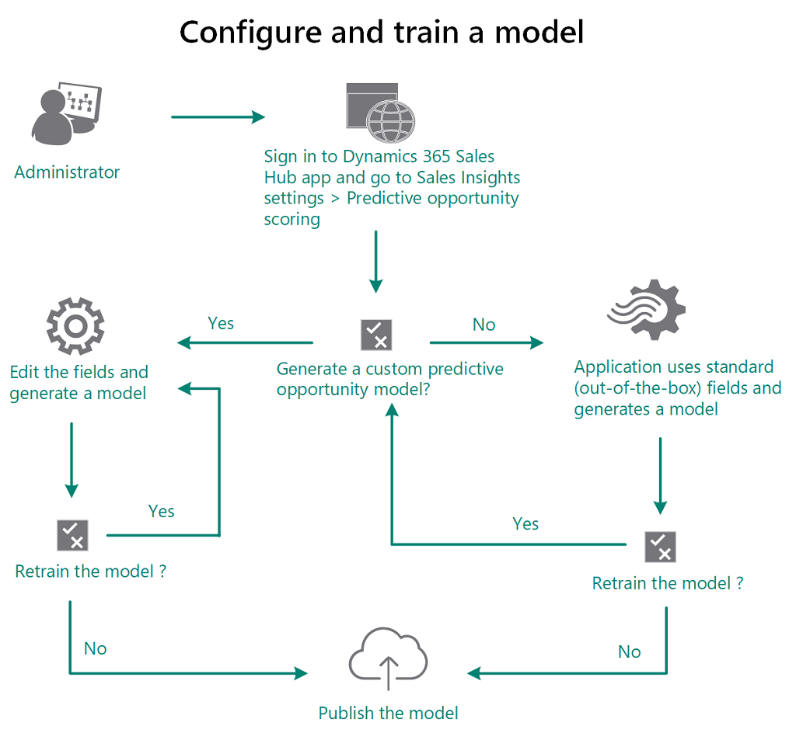
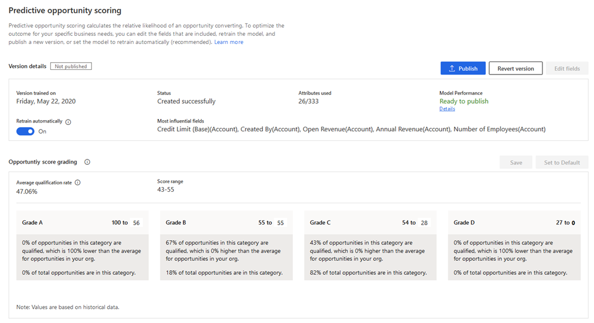
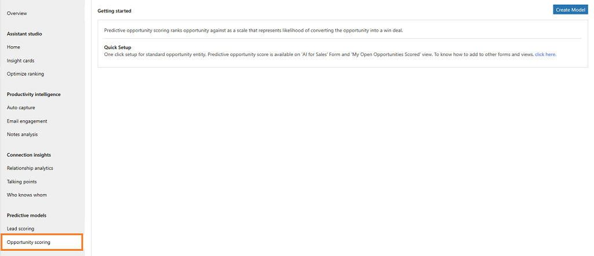
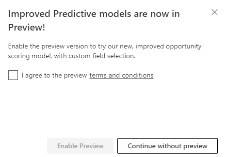
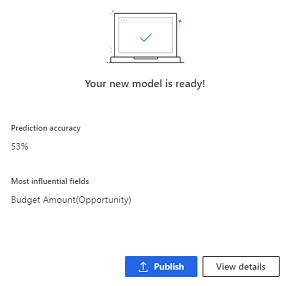
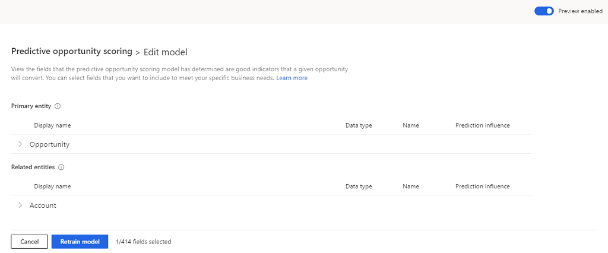

# Configure Predictive opportunity scoring

Predictive opportunity scoring uses a predictive machine learning model to calculate a score for all open opportunities. The score helps salespeople prioritize opportunities, achieve higher opportunity qualification rates, and reduce the time that it takes to qualify an opportunity.

When you configure the predictive opportunity scoring feature, the application uses out-of-the-box fields related to opportunities to generate a model with a score. Using this score, users can do the following:
 
- Identify quality opportunities and convert them into win deals.
 
- Spend time on opportunities that have low scores, and convert them into possible deals.

The enhanced predictive opportunity scoring lets you add custom fields to generate a model for predictive opportunity scoring that is accurate. The custom fields can be specific to your organization so that you can decide the impact of the outcome. The feature is available in preview mode. You must enable the preview mode to configure predictive opportunity scoring.

<!--
The following illustration explains how you can configure the predictive opportunity scoring.

> [!div class="mx-imgBorder"]
> 
-->

Before we configure the predictive opportunity scoring, let's understand the configuration page after a model is generated.

## Understand configuration page

when a model is generated, the configuration page displays as shown in the following screen shot:

> [!div class="mx-imgBorder"]
> 

| Number | Feature | Description |
|--------|---------|-------------|
|1|Actions you can perform on the model|- **Publish**: The **Publish** button allows you to publish a model to your organization. Subsequently, users in your organization can see **My Open opportunity Scored** system view and opportunity score widget on opportunity forms. After you publish, the Publish button is available only when you retrain or edit the model. - **Revert version**: The Revert version button allows you to return the model to the previous version when the retrained model is not satisfactory or not at an acceptable level of your organization's requirements. This option is available only when you retrain a model.  - **Edit fields**: This option is available only when the preview is enabled. The **Edit fields** button allows you to update or add the fields that affect the prediction accuracy score. To learn more, see [Retrain the model](#retrain-a-model).  - **Retrain Model**: This option is available only for standard model creation. You can select this option to regenerate a model with updated information that is available in your organization for improved predictive accuracy score.|
|2|version details|- **Version trained on**: This parameter displays a date that lets you know when the model was last trained. - **Status**: This parameter lets you know the status of the model. - **Attributes used**: This parameter lets you know the number of attributes (fields) used from the available list to generate the prediction accuracy score for the model. You can select the **Retrain with recommended fields** option to retrain the model with standard (out-of-the-box) attributes if the outcome of the trained model is not satisfactory.  - **Prediction accuracy**: This parameter displays the percentage of the model's accuracy in predicting the opportunities that could convert into opportunities.  - **Most influential fields**: This parameter displays the top five attributes (fields) that are most affecting the outcome of the prediction accuracy score. |
|3|Opportunity score grading| **Grading**: When a model is published, the opportunities that are in your organization's pipeline are graded according to the range defined in this section. Each opportunity in the pipeline is graded as A, B, C, or D according to the opportunity score that an opportunity has and this score is influenced by the attributes that we selected while creating the model. Opportunities that are graded as A are more likely to be converted into deals than opportunities that are graded D. You can configure the range for the grading according to your organizational requirements. When you change opportunity score range for a grade, the preceding grade's maximum range value changes automatically depending on the changed minimum grade value. For example, when you change the minimum range value score for **Grade A** to 51, the maximum opportunity score range for **Grade B** changes to 50. |

## Generate system default model 

This model is generated based on the standard attributes (fields) that are chosen by the application.  

1. Verify that advanced Sales Insights features are enabled. To learn more, see [Enable and configure advanced Sales Insights features](intro-admin-guide-sales-insights.md#enable-and-configure-advanced-sales-insights-features) 

2.	Go to **Change area** and select **Sales Insights settings**.

    > [!div class="mx-imgBorder"]
    > 

3.  On the sitemap, select **Opportunity scoring** under **Predictive models**.

    > [!TIP]
    > Alternatively, in the **Sales Insights settings** page, select **Set up** from the **Predictive opportunity scoring** section to go to configuration page.

    The **predictive opportunity scoring** configuration page is displayed.

    > [!div class="mx-imgBorder"]
    > 

4. Select **Get started** and a pop-up dialog displays to enable the preview.

    > [!div class="mx-imgBorder"]
    > 

5. Select **Continue without preview**. The application starts generating a model and a notification is displayed on the screen.

    > [!div class="mx-imgBorder"]
    > 

6. After the model is generated, a confirmation notification displays with the prediction accuracy score and top five fields that are influencing the score. Select **Publish** or **View details**. 

    > [!div class="mx-imgBorder"]
    > 

    - **Publish**: Select **Publish** if the score's accuracy is at an acceptable level as per your organization's standard.

    - **View details**: Select **View details** if the score's accuracy is not at an acceptable level. You can review the details of the model and edit the fields to improve the score's accuracy. To learn more, see [Retrain the model](#retrain-a-model). 

    To learn more about the configuration page, see [Understand configuration page](#understand-configuration-page).

7. Publish the model. The prediction opportunity scoring is applied in your organization and users can see the opportunity scoring in their views under the **Opportunity Score** column.

> [!NOTE]
> For more information on how predictive opportunity scoring helps users, see [Convert opportunities into deals](../sales/work-predictive-opportunity-scoring.md).

## Generate custom defined model

At times, the system defined model cannot be accurate for your organization, as your organization might not use the standard attributes for opportunities that are used to generate the model. The enhanced predictive opportunity scoring chooses custom attributes that are specific to your organization to generate a model. Also, it allows you to choose custom attributes (fields) that are used to generate the opportunity score for a model. You must enable preview before you generate the opportunity score.

Follow these steps:

1. Verify that advanced Sales Insights features are enabled. To learn more, see [Enable and configure advanced Sales Insights features](intro-admin-guide-sales-insights.md#enable-and-configure-advanced-sales-insights-features). 

2.	Go to **Change area** and select **Sales Insights settings**.

    > [!div class="mx-imgBorder"]
    > 

3.  On the sitemap, select **Opportunity scoring** under **Predictive models**.

    > [!TIP]
    > Alternatively, in the **Sales Insights settings** page, select **Set up** from the **Predictive opportunity scoring** section to go to configuration page.

    The **predictive opportunity scoring** configuration page displays.

    > [!div class="mx-imgBorder"]
    > 

4. Select **Enable preview** and then select **Get started**. 

    > [!TIP]
    > Alternatively, without enabling the preview, select **Get started** and a pop-up dialog displays to enable the preview. Accept terms and conditions and then select **Enable preview**. 

    The application starts generating a model and a notification is displayed on the screen. The application uses the standard attributes to generate the model.

    > [!div class="mx-imgBorder"]
    > 

5. After the model is generated, a confirmation notification displays with the prediction accuracy score and top five fields that are influencing the score. Select **Publish** or **View details**. 

    > [!div class="mx-imgBorder"]
    > 

    - **Publish**: Select **Publish** if the score's accuracy is at an acceptable level as per your organization's standard.

    - **View details**: Select **View details** if the score's accuracy is not at an acceptable level. You can review the details of the model and edit the fields to improve the score's accuracy. To learn more, see [Retrain the model](#retrain-a-model). 

6. On the **Edit model** page, select your custom attributes from **Main Entity** and **Related Entities**.

    > [!div class="mx-imgBorder"]
    > 

7. Select **Retrain model**. 

    The model starts to generate with the selected custom attributes and and a notification is displayed on the screen.

9. After the model is generated, publish the model.

    The prediction opportunity scoring is applied in your organization and users can see the opportunity scoring in their views under the **Opportunity Score** column.

> [!NOTE]
> For more information on how predictive opportunity scoring helps users, see [Convert opportunities into deals](../sales/work-predictive-opportunity-scoring.md).

## Retrain a model

When your model is old or the prediction accuracy score doesn't match your organization's standards, you can retrain the model, which in turn increases the prediction accuracy score. The application uses the latest data (opportunities) from your organization to train the model so that it can provide better accuracy of the opportunity score for your users. 

> [!NOTE]
> We recommend that you train the model once the data is refreshed in your organization for better prediction accuracy scoring.

**When preview is enabled**

1. Go to the predictive opportunity scoring configuration page and select **Edit fields**.

2. Perform Steps 6 to 9 from [Generate custom defined model](#generate-custom-defined-model).

**When preview is not enabled**

1. Go to the predictive opportunity scoring configuration page and select **Retrain model**.

     The application starts generating a model and a notification is displayed on the screen.

    > [!div class="mx-imgBorder"]
    > 

2. Review and publish the model.

### See also

[Convert opportunities into deals](../sales/work-predictive-opportunity-scoring.md)

[Enable and configure advanced Sales Insights features](intro-admin-guide-sales-insights.md#enable-and-configure-advanced-sales-insights-features)