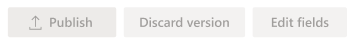
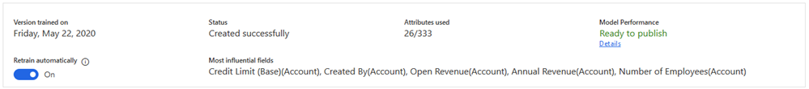

# Configure predictive opportunity scoring

Predictive opportunity scoring uses a predictive machine learning model to calculate a score for all open opportunities. The score helps salespeople prioritize opportunities, achieve higher opportunity qualification rates, and reduce the time that it takes to qualify an opportunity.

When you configure the predictive opportunity scoring feature, the application uses out-of-the-box fields related to opportunities to generate a model with a score. Using this score, users can do the following:
 
- Identify quality opportunities and convert them into win deals.
 
- Spend time on opportunities that have low scores, and convert them into possible deals.

The predictive opportunity scoring lets you add custom fields to generate a model for predictive opportunity scoring that is accurate. The custom fields can be specific to your organization so that you can decide the impact of the outcome.

The following illustration explains how you can configure the predictive opportunity scoring.

> [!div class="mx-imgBorder"]
> 

Before we configure the predictive opportunity scoring, let's understand the configuration page after a model is generated.

## Understand the configuration page

When a model is generated and published, the configuration page is displayed as shown in the following image.

> [!div class="mx-imgBorder"]
> 

Typically, the configuration page is organized into the following sections:

-	[Actions you can perform on the model](#actions-you-can-perform-on-the-model)

-	[Version details](#version-details)

-	[Opportunity score grading](#opportunity-score-grading)

### Actions you can perform on the model

The uppermost section of the page displays the actions that you can perform on the model.

> [!div class="mx-imgBorder"]
> 

- **Publish**: When you publish a model to your organization, users in your organization can see the **My Open Opportunities Scored** system view and the **Opportunity score** widget on opportunity forms. After you publish, the **Publish** button will only become available after you retrain or edit the model.

- **Revert version**: You can return the model to its previous version when the retrained model isn't satisfactory or doesn't meet an acceptable level of your organization's requirements. This action is available only when you retrain a model but you haven't yet published it.

- **Edit fields**: You can update or add fields that affect the prediction accuracy score. This is useful when you want to tweak the model to consider a unique business process. More information: [Retrain a model](#retrain-a-model)

- **Retrain model**: This action is available only for standard model creation. To improve the model's predictive accuracy score, you can select this button to regenerate the model by using updated information that's available in your organization.

### Version details

The parameters displayed in this section show information about the status and performance of the model.

> [!div class="mx-imgBorder"]
> 

-	**Version trained on** displays a date that lets you know when the model was last trained.

-	**Status** lets you know the status of the model.

-	**Fields used** lets you know the number of attributes (fields) used from the available list to generate the prediction accuracy score for the model. You can select **Retrain with recommended fields** to retrain the model by using standard (out-of-the-box) attributes if you're not satisfied with the outcome of the trained model.

    If the parameter displays **edited** corresponding to the number of fields used, this specifies that the model generated is custom-defined.

-	**Model performance** displays information about the model's performance in predicting the opportunities that might be converted into deals. Depending on the information, you can take appropriate action on what you want to do with the model.

    >[!NOTE]
    >The range of the accuracy score is defined based on the area under the curve (AUC) classification measurements.

  -	**Ready to publish** specifies that the model accuracy is above the range, and you can expect that the model will perform well. 

  -	**OK to publish** specifies that the model accuracy is within range, and you can expect that the model might perform reasonably well.

  -	**Not ready to publish** specifies that the model accuracy is below the range, and you can expect that the model will perform poorly.

-	**Retrain automatically** allows you to retrain the model automatically. More information: [Automatic retraining](#automatic-retraining)

-	**Most influential fields** displays the top five attributes (fields) that most affect the outcome of the prediction accuracy score.

### Opportunity score grading

When a model is published, the opportunities that are in your organization's pipeline are graded according to the range defined in this section. Each opportunity in the pipeline is graded A, B, C, or D, according to the opportunity's opportunity score. This score is influenced by the attributes that we selected while creating the model. Opportunities that are graded A are more likely to be converted into deals than opportunities that are given a D. 

> [!div class="mx-imgBorder"]
> 

You can configure the range for the grading according to your organizational requirements. When you change the opportunity score range for a grade, the maximum range value for the adjacent grade changes automatically in accordance with the change in the minimum value. For example, when you change the minimum range value score for **Grade A** to 51, the maximum opportunity score range for **Grade B** changes to 50.

## Generate system-default model 

This model is generated based on the standard attributes (fields) that are chosen by the application.  

1. Verify that advanced Sales Insights features are enabled. To learn more, see [Enable and configure advanced Sales Insights features](intro-admin-guide-sales-insights.md#enable-and-configure-advanced-sales-insights-features). 

2.	Go to **Change area**, and select **Sales Insights settings**.

    > [!div class="mx-imgBorder"]
    > 

3.  On the sitemap, select **Opportunity scoring** under **Predictive models**.

    > [!TIP]
    > Alternatively, in the **Sales Insights settings** page, select **Set up** from the **Predictive opportunity scoring** section to go to configuration page.

    The **Predictive opportunity scoring** configuration page is displayed.

    > [!div class="mx-imgBorder"]
    > 

4. Select **Get started**. The application starts generating a model and a notification is displayed on the screen.

    > [!div class="mx-imgBorder"]
    > 

6. After the model is generated, a confirmation notification displays with the prediction accuracy score and top five fields that are influencing the score. Select **Publish** or **View details**. 

    > [!div class="mx-imgBorder"]
    > 

    - **Publish**: Select **Publish** if the score's accuracy is at an acceptable level as per your organization's standard.

    - **View details**: Select **View details** if the score's accuracy is not at an acceptable level. You can review the details of the model and edit the fields to improve the score's accuracy. To learn more, see [Retrain the model](#retrain-a-model). 

    To learn more about the configuration page, see [Understand the configuration page](#understand-the-configuration-page).

7. Publish the model. 
 
   The prediction opportunity scoring is applied in your organization. Users can see the opportunity scoring in their views under the **Opportunity score** column and a widget in the opportunity form.

>[!IMPORTANT]
>Adding the predictive opportunity scoring widget to a form through legacy form designer is not supported. 

> [!NOTE]
> For more information on how predictive opportunity scoring helps users, see [Convert opportunities into deals](../sales/work-predictive-opportunity-scoring.md).

## Generate custom-defined model

At times, the system-defined model may not be accurate for your organization, as your organization might not use the standard attributes for opportunities that are used to generate the model. The enhanced predictive opportunity scoring chooses custom attributes that are specific to your organization to generate a model. Also, it allows you to choose custom attributes (fields) that are used to generate the opportunity score for a model.

Follow these steps:

1. Verify that advanced Sales Insights features are enabled. To learn more, see [Enable and configure advanced Sales Insights features](intro-admin-guide-sales-insights.md#enable-and-configure-advanced-sales-insights-features). 

2.	Go to **Change area**, and select **Sales Insights settings**.

    > [!div class="mx-imgBorder"]
    > 

3.  On the sitemap, select **Opportunity scoring** under **Predictive models**.

    > [!TIP]
    > Alternatively, in the **Sales Insights settings** page, select **Set up** from the **Predictive opportunity scoring** section to go to configuration page.

    The **Predictive opportunity scoring** configuration page displays.

    > [!div class="mx-imgBorder"]
    > 

4. Select **Get started**. 

    The application starts generating a model, and a notification is displayed on the screen. The application uses the standard attributes to generate the model.

    > [!div class="mx-imgBorder"]
    > 

5. After the model is generated, a confirmation notification displays with the prediction accuracy score and top five fields that are influencing the score. Select **Publish** or **View details**. 

    > [!div class="mx-imgBorder"]
    > 

    - **Publish**: Select **Publish** if the score's accuracy is at an acceptable level as per your organization's standard.

    - **View details**: Select **View details** if the score's accuracy is not at an acceptable level. You can review the details of the model and edit the fields to improve the score's accuracy. To learn more, see [Retrain the model](#retrain-a-model). 

6. On the **Edit model** page, select your custom attributes from **Main Entity** and **Related Entities**.

    > [!div class="mx-imgBorder"]
    > 

7. Select **Retrain model**. 

    The model starts to generate with the selected custom attributes, and a notification is displayed on the screen.

8. After the model is generated, publish the model.

    The prediction opportunity scoring is applied in your organization. Users can see the opportunity scoring in their views under the **Opportunity score** column and a widget in the opportunity form.
    
>[!IMPORTANT]
>Adding the predictive opportunity scoring widget to a form through legacy form designer is not supported. 

> [!NOTE]
> For more information on how predictive opportunity scoring helps users, see [Convert opportunities into deals](../sales/work-predictive-opportunity-scoring.md).

## Retrain a model

It's time to retrain a model when its prediction accuracy score doesn't match your organization's standards, or simply when it gets old. Retraining generally increases the prediction accuracy score. The application uses the latest data (opportunities) from your organization to train the model so that it can provide more accurate opportunity scores for your users.

>[!NOTE]
>We recommend that you train the model after the data is refreshed in your organization, for better prediction accuracy scoring.

You can retrain the model automatically or manually. Both methods are described in the following sections.

### Automatic retraining

Automatic retraining allows the application to retrain a model automatically once every 15 days. This can allow the model to learn from historical data and improve its prediction accuracy over time. Depending on the model's accuracy, the application makes an informed decision whether to publish or ignore the retrained model.

To retrain a model automatically, go to the predictive opportunity scoring configuration page and enable **Retrain automatically**.

Here are the scenarios where the application automatically publishes the model:

-	When the accuracy of the retrained model is equal to or greater than 95&nbsp;percent of the accuracy of the active model.

-	When the current model is more than three months old.

>[!NOTE]
>If the accuracy of the retrained model is below the range of the application's standard, the model won't be published automatically. 

For example, the accuracy of a retrained model is good and this indicates that the model is better than the current model. In this case, the retrained model will be published automatically.

### Manual retraining

1. Go to the predictive opportunity scoring configuration page, and select **Edit fields**.

2. Perform steps 6 through 8 from the [Generate custom-defined model](#generate-custom-defined-model) procedure, earlier in this article.

## Add the opportunity scoring widget to a form

By default, the predictive opportunity scoring widget is available only in the out-of-the-box **Sales Insights** form. If you're using customized forms for opportunities, you can display the predictive opportunity scoring widget on your custom forms by following these steps..

> [!NOTE]
> Adding opportunity scoring widgets is only supported in Unified Interface apps.

1. In your app, select **Settings** , and then select **Advanced Settings**.

    > [!div class="mx-imgBorder"]  
    > 

    The **Business Management settings** page opens in a new browser tab.

2. Select **Settings** > **Customizations** > **Customize the System**.

3. In the solution explorer, under **Components**, expand **Entities**, and then select **Opportunity** > **Forms**.

4. Select and open the form to which you want to add the widget.

    > [!div class="mx-imgBorder"]  
    > 

5. In the **Field Explorer** pane, clear the **Only show unused fields** check box.

    > [!div class="mx-imgBorder"]  
    > 

6. Select and drag the **Opportunity Score** field to the location you want. In this example, we're dragging it to the **General** section.

    > [!div class="mx-imgBorder"]  
    > 

7. Double-click the **Opportunity Score** field to open the **Field Properties** dialog box.

8. On the **Display** tab, in the **Label** section, clear the **Display label on the form** check box.

    > [!div class="mx-imgBorder"]  
    > 

9. On the **Control** tab, select **Add control**.

    The **Add control** dialog box opens.

10.	Select **Predictive opportunity score**, and then select **Add**.

    > [!div class="mx-imgBorder"]  
    > 

    The **Predictive opportunity score** control is added.

11.	For **Predictive opportunity score** control, select the **Web**, **Phone**, and **Tablet** options, and then select **OK**. 

    > [!div class="mx-imgBorder"]  
    > 
 
	The predictive opportunity score widget is added to the form.

    > [!div class="mx-imgBorder"]  
    > 
 
12.	Save and publish the form.

### See also

[Convert opportunities into deals](../sales/work-predictive-opportunity-scoring.md)  
[Enable and configure advanced Sales Insights features](intro-admin-guide-sales-insights.md#enable-and-configure-advanced-sales-insights-features)
