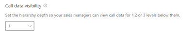
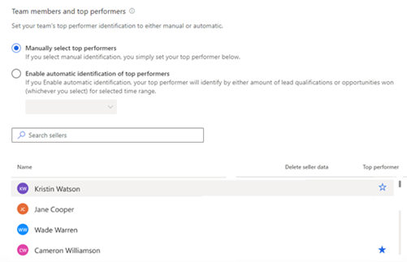
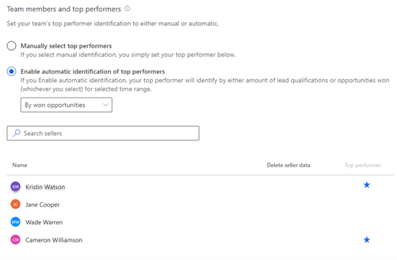
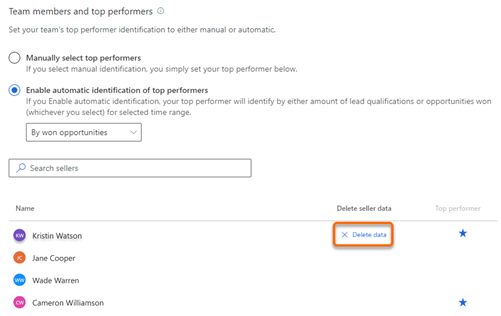

# Configure and view your team page

[!INCLUDE [cc-beta-prerelease-disclaimer](../includes/cc-beta-prerelease-disclaimer.md)]

> [!IMPORTANT]
> - [!INCLUDE[cc_preview_features_definition](../includes/cc-preview-features-definition.md)]  
> - [!INCLUDE[cc_preview_features_expect_changes](../includes/cc-preview-features-expect-changes.md)]
> - Microsoft doesn't provide support for this preview feature. Microsoft Technical Support won't be able to help you with issues or questions. Preview features aren't meant for production use and are subject to a separate [supplemental terms of use](https://go.microsoft.com/fwlink/p/?linkid=870960).

As an administrator, you can configure the levels of hierarchy for which sales managers can view in conversation intelligence. When configured, sales managers will be able to view the hierarchy under **Your team**.

Let's look at the example to understand hierarchy levels:

The matrix explains which data you'll view as a sales manager, for different hierarchy levels. 

> [!div class="mx-imgBorder"]
> 

| Managerial level	| View user hierarchy |
|-------------------|---------------------|
| Level 1 | Choose this option to get insights on your direct team members. |
| Level 2 | Choose this option to get insights on both your direct team members and their direct team members. |
| Level 3 | Choose this option to get insights on level 1, level 2, and level 2's team members. |

> [!NOTE]
> Conversation intelligence supports up to three levels of hierarchy. To learn more about hierarchy, see [Set up Manager and Position hierarchies](https://docs.microsoft.com/power-platform/admin/hierarchy-security#set-up-manager-and-position-hierarchies).

## Configure hierarchy levels

1.	Review the prerequisites. To learn more, see [Prerequisites to configure conversation intelligence](prereq-sales-insights-app.md).

2.	Open the **Conversation intelligence** application. 

3.	Select the **Settings** icon on the upper-right corner of the page, and then select **Settings**.

    > [!div class="mx-imgBorder"]
    > 

4.	On the **Settings** page, select **Your team**. 

5.	Choose the hierarchy level from the **Call data visibility** list to display team members for managers.

    > [!div class="mx-imgBorder"]
    > 

6.	Save and close the settings.

    Sales managers can see the employees in the hierarchy levels as configured.

## View your team

As a sales manager, when you open the Your team page in settings, you can view the list of employees who are part of your hierarchy as configured by the administrator. 

> [!NOTE]
> To view this page, sales managers must have a manager hierarchy defined under them, with sellers or individuals added to the hierarchy. Currently, only administrators can change levels of hierarchy. For sales managers to change it, they should contact an administrator to change the hierarchy on their behalf.

1.	Open the **Conversation intelligence** application. 

2.	Select the **Settings** icon on the top-right of the page and then select **Settings**.

    > [!div class="mx-imgBorder"]
    > 

3.	On the **Settings** page, select **Your team**. 
    
    > [!div class="mx-imgBorder"]
    > 

    The list is updated every 24 hours to display the current active sellers in the manager's hierarchy. Also, you can select **Refresh now** to refresh the list right away and view any changes.

## Configure sales team information in the Sales Hub app

As an administrator or sales manager, you can:

-	Configure the levels of hierarchy that you can view. 
-	View the list of employees who are part of your hierarchy.
-	Select the top performers in your hierarchy.  
-	Delete seller data.

**To configure sales team information**

1.	Sign in to Dynamics 365 Sales, and go to the **Sales Hub** app.

2.  Select the **change area**  in the lower-left corner of the page, and then select **Sales Insights settings**. 

    > [!div class="mx-imgBorder"]
    > 

3.	On the configuration page, under **Productivity**, select **Conversation intelligence**. 

    > [!div class="mx-imgBorder"]
    > 

4.	Open the **Sales team management** section.

    > [!div class="mx-imgBorder"]
    >          

5.	Configure the hierarchy levels.

    Choose a hierarchy level from the **Call data visibility** list to display team members for managers. You can choose up to three levels. More information: [understand hierarchy levels](#understand-hierarchy-levels)

    > [!div class="mx-imgBorder"]
    > 

    A list of team members is displayed under **Team members and top performers**. The list is updatee every 24 hours to display the current active sellers in the manager's hierarchy.

6.	Choose the top performers. 

    The top performers who are selected here are compared against other sellers in your team. The comparisons project how the other sellers are performing against top performers' best results<!--note from editor: Edit okay? "Best practices" didn't seem to work here.-->, and display KPIs and relevant data on the home page in [What characterizes top sellers?](../sales/dynamics365-sales-insights-app-home-page.md#what-characterizes-top-sellers).  

    Under **Team members and top performers**, choose the top performers manually or let the application choose automatically. Select one of the following options:

    - **Manually select top performers**: Choose the top performers from the list of sellers. In the **Top performer** column, select the star icon corresponding to a seller.  
        
        > [!div class="mx-imgBorder"]
        > 

    - **Enable automatic identification of top performers**: The application automatically selects the top performers based on the number of leads they qualified or opportunities they won. When you select this option, you choose whether to rank performers **by won opportunities** or **by lead qualification**.<!--note from editor: Suggested.-->

        > [!div class="mx-imgBorder"]
        > 

6.	Delete seller data. 

    You can delete a seller's data when the seller no longer reports to you, has moved to another team, is leaving your organization, or has requested that you delete their data. This data includes the seller's statistics and call history. 

    Hover over the name of the seller for whom you want to delete data. In the **Delete sellers data** column, select **Delete data**.  

    > [!div class="mx-imgBorder"]
    > 

    The selected seller data is deleted from conversation intelligence.

7.	Save the configuration.

### See also

[Prerequisites to configure conversation intelligence](prereq-sales-insights-app.md)

[Improve seller coaching and sales potential with conversation intelligence](dynamics365-sales-insights-app.md)
