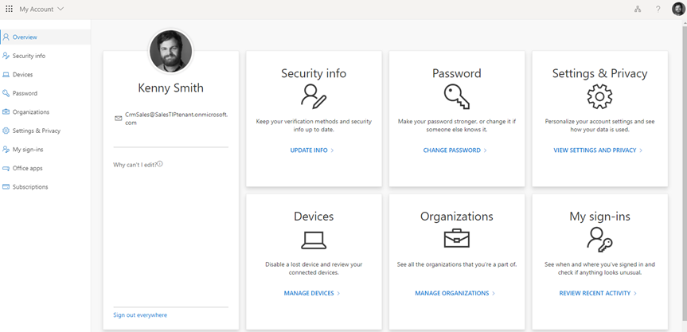
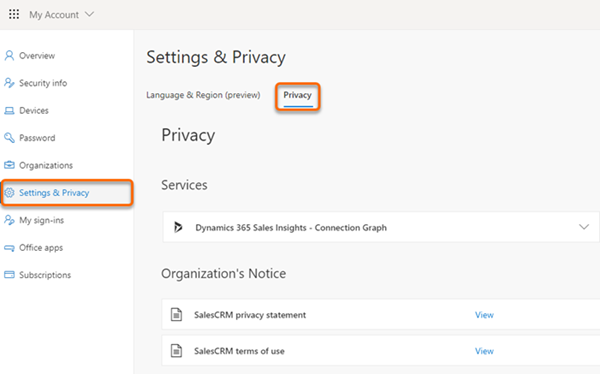
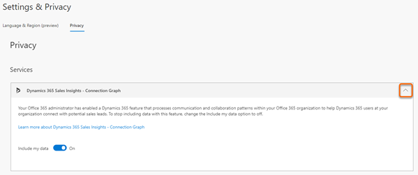
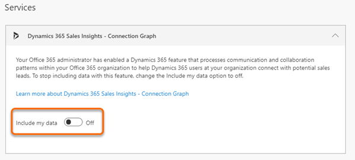

# Configure who knows whom

The Who knows whom feature helps users to quickly identify colleagues within their organization who can introduce them to leads or contacts.

>[!NOTE]
>- Who knows whom is currently available in Europe, Middle East, and Africa (EMEA), and North American (NAM) regions.
>- For Office 365 data, you organization's data location must be in one of the following locations and not in your region specific data canter location:
>   - Global Geography 1 – EMEA (Austria, Finland, France, Ireland, Netherlands).
>   - Global Geography 2 – Asia Pacific	(Hong Kong, Japan, Malaysia, Singapore, South Korea).
>   - Global Geography 3 – Americas (Brazil, Chile, United States). 
>   To learn more on data center locations, see [Data Center Locations](https://docs.microsoft.com/microsoft-365/enterprise/o365-data-locations?view=o365-worldwide#data-center-locations).

To configure who knows whom, follow these steps:

1. Verify that advanced Sales Insights features are enabled. To learn more, see [Install and configure premium Sales Insights features](intro-admin-guide-sales-insights.md#install-and-configure-premium-sales-insights-features). 

2.	Go to **Change area** and select **Sales Insights settings**.

    > [!div class="mx-imgBorder"]
    > 

3.  On the sitemap, select **Who knows whom** under **Connection insights**.

    > [!div class="mx-imgBorder"]
    > 

4. On the **Who knows whom** section, select **Turn on Who Knows Whom for your organization**.

    > [!div class="mx-imgBorder"]
    > 
        
5. Optionally, you can select an email template according to your organizational requirements. By default, an out-of-the-box email template will be selected.

6. Select **Save**.

   The who knows whom feature is configured and ready to use in your organization.

## Enable connection graph

After you enable the who knows whom feature in your organization, verify that the connection graph is enabled in the admin center. This allows [!INCLUDE[pn-dyn-365-sales](../includes/pn-dyn-365-sales.md)] to collect the communication and collaboration details of users from Exchange server.

> [!NOTE]
> Contact your Office 365 administrator to enable the Dynamics 365 Sales Insights connection graph if you don't have sufficient privileges to enable. 
 
To configure the Dynamics 365 Sales Insights connection graph, follow these steps:

1. Go to the **Admin** center.

    > [!div class="mx-imgBorder"]
    > 

2. Select **Settings** > **Services & add-ins** > **Dynamics 365 Sales Insights – Connection Graph**.

    > [!div class="mx-imgBorder"]
    > 

3.  Read the description carefully and then select the **Enable Dynamics 365 Sales Insights - Connection Graph for your entire organization**‎ option.

    > [!div class="mx-imgBorder"]
    > 

4. (Optional) If you don't want to collect information on a group of users in your organization, add the group ID in the text box. 

5. Select **Save**.

## Opt out of connection graph

As a user, you can always choose to opt out of the connection graph if you don't want Dynamics 365 Sales Insights to analyze your data such as, communication and collaboration with in Office 365 organization. 

>[!NOTE]
>You can opt out of the connection graph only if your Office 365 organization is in EMEA or Asia Pacific global geography. To learn more, see [Data Center Locations](https://docs.microsoft.com/microsoft-365/enterprise/o365-data-locations?view=o365-worldwide#data-center-locations).

1. Sign in to your [Office 365 account](https://myprofile.microsoft.com/) settings.

    > [!div class="mx-imgBorder"]
    > 

2. Select **Settings & Privacy** and then select the **Privacy** tab. 

    > [!div class="mx-imgBorder"]
    > 

3. In the **Services** section, select arrow next to the **Dynamics 365 Sales Insights - Connection Graph** option.  

    > [!div class="mx-imgBorder"]
    > 

4. Select the **Include my data** toggle to disable.

    > [!div class="mx-imgBorder"]
    > 

    You're opted out of the connection graph and Dynamics 365 Sales Insights will not analyze your data.

### See also

[Get introduced to lead](../sales/who-knows-whom.md)

[Install and configure premium Sales Insights features](intro-admin-guide-sales-insights.md#install-and-configure-premium-sales-insights-features)