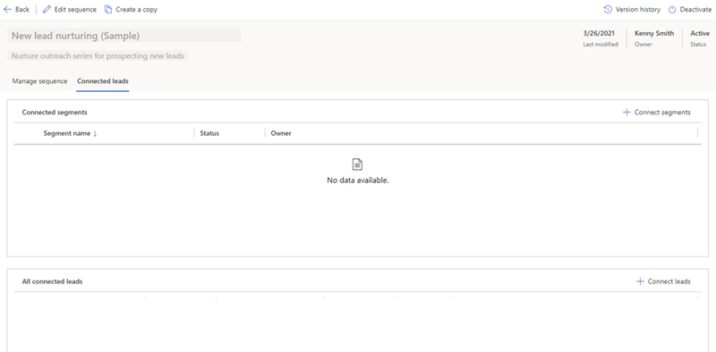
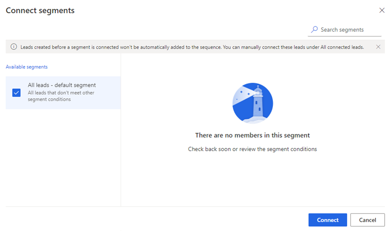
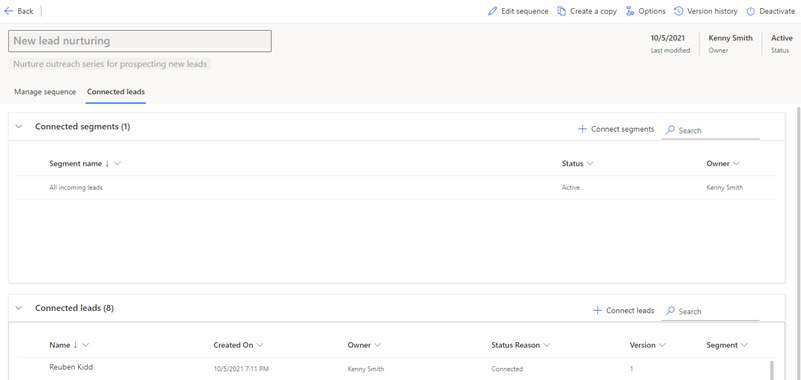

# Connect a segment to a sequence

After you create and activate a segment, you connect the segment to a sequence depending on the entity that you've created the sequence for. You can add segments to existing sequences. Open the sequences to view their details, and then add segments to them. More information: [View details of a sequence and its connected records](view-sequence-details-connected-records.md)<!--note from editor: I think this "More information" link works better up here so you don't interrupt the procedure. (Also, it's rare that we'd devote an entire note to a "More information" cross-reference.) Usually you wouldn't need to have an additional procedure heading like the one I've added below, but with the "More information" link here, I think it would be nice to make it clear where the procedure begins.-->
<!--markdownlint-disable MD036-->
**To connect a segment to a sequence**
<!--markdownlint-enable MD036-->
1. Sign in to your Dynamics 365 Sales Hub app.    
2. Go to **Change area** in the lower-left corner of the page, and select **Sales Insights settings**.    
3. Under **Sales accelerator**, select **Sequence**.    
4. On the **Sequences** page, select the **Active** tab.    
5. Select and open the sequence, and then go to the **Connected leads** tab.<!--note from editor: Edit to the tab (plural "leads") okay? Also, the edit to the following alt text could also be "View the Connected leads tab".-->    

   >[!div class="mx-imgBorder"]
   >

6. From the **Connected segments** section, select **+ Connect segments**. 

   A list of available segments is displayed in the **Connect records**<!--note from editor: Should this be "Connect segments," which seems to match the screenshot?--> window. If there are no segments connected to the sequence, an empty grid is displayed.

    1. Select the segments that you want to connect to<!--note from editor: We have "associate with," "apply to," and  "connect to." Unless they have different meanings, I think we want to settle on one, at least in regard to connecting segments to a sequence.--> the sequence.

       In this example, the segments **Leads from contact us form**, **North US leads interested in printers**, and **South US leads interested in laptops** are selected.<!--note from editor: I took the liberty of changing these names here, assuming that you can change "USA" to "US" in the screenshot (and/or sample data). Our Style Guide says not to use "USA." It would actually be best to use "Northern US" and "Southern US," if possible.-->

       >[!div class="mx-imgBorder"]
       >

    2. Select **Connect**. The selected segments are connected to the sequence, and include details such as status, owner, and number of records associated with the segment.

       >[!div class="mx-imgBorder"]
       >      

    3. Open each associated segment, and choose which records you want to connect to this sequence.   

    >[!NOTE]
    >To disassociate a segment from this sequence, select the segment, and then select **Disconnect**. In the confirmation message, select **Disconnect**.<!--note from editor: Edit assumes the actual button name is "Disconnect."-->

8. Close the sequence.

### See also

[Create and activate a segment](create-and-activate-a-segment.md)   

[!INCLUDE[footer-include](../includes/footer-banner.md)]
