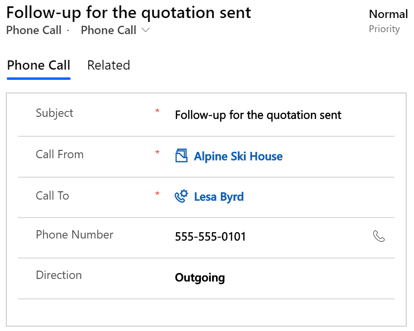
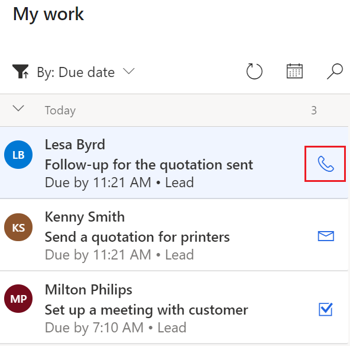
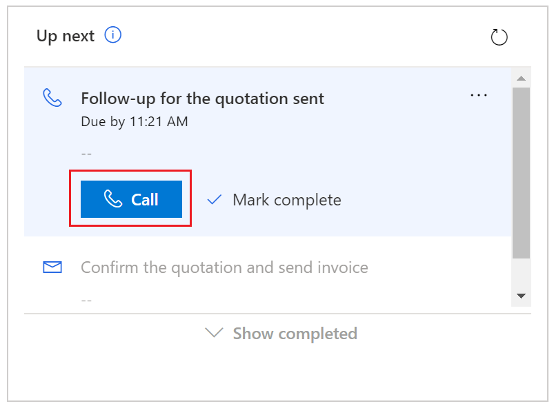
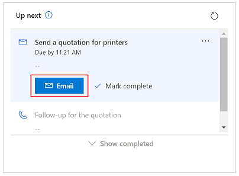
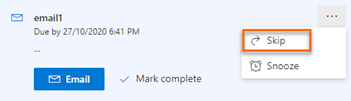
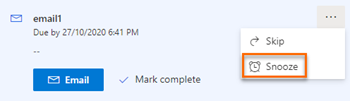
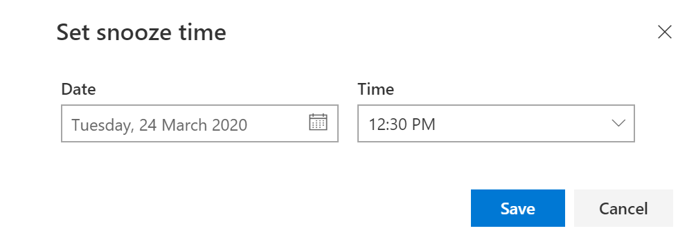

# Connect with customers by using a record or the Up next widget

As a seller using Dynamics 365 Sales<!--Edit okay? I think this context should be mentioned somewhere in the body of the article.-->, you can connect with your customers daily by using multiple channels, such as phone and email, without losing context or needing to switch among multiple applications. When an activity for contacting customers through a phone call or email appears in a sequence<!--Edit okay? -->, the corresponding phone or email icons are displayed in your **My work** list and the **Up next** widget. After you make the phone call or send the email, you mark the activity as complete in the **Up next** widget and continue with the next activity defined in the sequence.

If an activity isn't required to be completed by the due date or you're unable to connect with a customer, you can [skip or postpone the activity](#skip-or-postpone-an-activity).

## Call a customer

You can make a phone call to your customer from the **My work** list or the **Up next** widget.

When you make a phone call, a Phone Call activity is created and linked to the lead or opportunity. The Phone Call activity captures the following information:

- **Subject**: Name of the task in the **Up next** widget.
- **Call From**: Name of the contact who made the call.
- **Call To**: Name of the contact to whom the call is made.
- **Phone Number**: Mobile<!--Style Guide says we don't need to specify "mobile" unless we're emphasizing the form factor of the device. Is there actually a restriction that this call can't go to a landline? If so, should that be explained somewhere?--> phone number of the contact to whom the call is made.
- **Direction**: Direction of the call. This value will always be **Outgoing**, because the call is made and not received.

> [!div class="mx-imgBorder"]
> 

The phone number of the contact is used to initiate the call. If the phone number isn't available, the softphone dialer is displayed so you can dial the number manually. If the contact has set their preference not to be contacted by phone, that setting is displayed in a corresponding message<!--Not sure what "corresponding" means here. Is this message displayed in the **Phone number** field?-->. After you've successfully made the phone call, you must mark the Phone Call activity as complete.  

**To make a phone call**

Do either of the following:

- Select the phone icon in the **My work** list record.

    > [!div class="mx-imgBorder"]
    > 

- Select **Call** in the activity in the **Up next** widget.<!--Edit okay? I think we're using "widget" to indicate the container for an activity, rather than saying that it's an activity itself?-->

    > [!div class="mx-imgBorder"]
    > 

## Send an email to a customer

You can send an email to your customer from the **My work** list or the **Up next** widget. If the email address of a contact isn't available, a warning message is displayed. When you send an email, an Email activity is created and linked to the lead or opportunity.

While composing an email, if you try to navigate to another record or send an email from another lead or opportunity, a warning message is displayed to save the email first.

**To send an email**

Do either of the following:

- Select the email icon in the **My work** list record.

    > [!div class="mx-imgBorder"]
    > 

- Select **Email** in the activity in the **Up next** widget.

    > [!div class="mx-imgBorder"]
    > 

## Skip or postpone an activity

You can skip an activity if it's not required to be completed by the due date. When you skip an activity, it's removed from the sequence and the next activity is displayed for taking action. The skipped activity is moved to the completed list. If you skip a manual task, it's marked as cancelled.

If you're unable to connect with a customer by the due date&mdash;but still need to follow up later&mdash;you can postpone the activity, and select a new date and time to connect with the customer.

**To skip an activity**

1. In the **Up next** widget, go to the activity you want to skip.

2. Select **More actions** > **Skip item**.

    > [!div class="mx-imgBorder"]
    > 

The activity is skipped, and the next activity in the sequence is displayed.

**To postpone an activity**

1. In the **Up next** widget, go to the activity you want to postpone.

2. Select **More actions** > **Postpone**.

    > [!div class="mx-imgBorder"]
    > 

3. Select the new date and time by which the activity should be completed.

    > [!div class="mx-imgBorder"]
    > 

### See also

[Integrate a sample softphone dialer with Dynamics 365 Sales](integrate-sample-softphone.md)