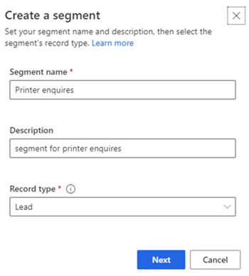
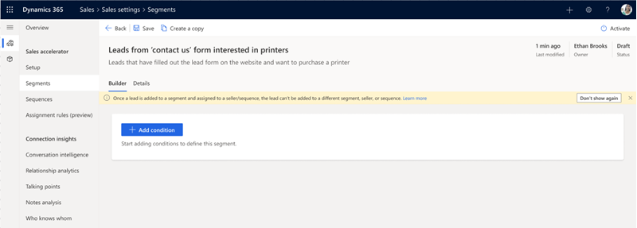
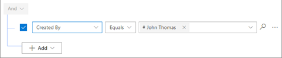
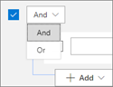
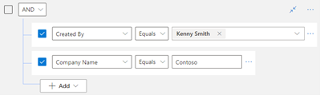
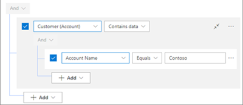
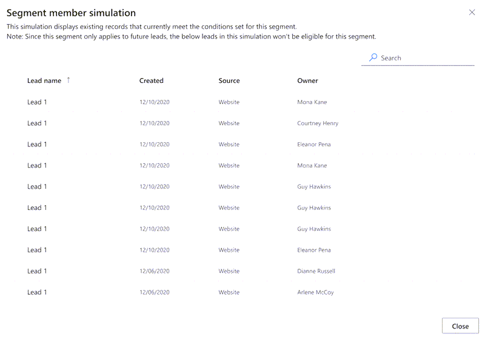

# Create and activate a segment

As a sequence manager, you create groups for records by defining different conditions for each segment. After activating the segments, when a record satisfies the conditions that are defined in the segments, they automatically become segment members. A sequence that is associated with the segment is then automatically assigned to records in the segment. Sales managers  don’t have to manually assign the sequence to a new record that is created in Dynamics 365 Sales.  

To create and activate a segment:

1.	Sign in to your Dynamics 365 Sales Hub app.    
2.	Go to **Change area** in the lower-left corner of the page and select **Sales Insights settings**.   
3.	Under **Sales accelerator**, select **Segments**.   
4.	On the **Segments** page, select **+ New segment**.    
    The create a segment dialog box opens.    
    >[!div class="mx-imgBorder"]
    >          
 
5.	In the **Create a segment** dialog box, enter the following information:     
    | Parameter | Description |
    |-----------|-------------|
    | Segment name | The name of the segment. |
    | Description | A description of the segment (optional). |
    | Record type | The type of record to be grouped in this segment. By default, the **Lead** record type is selected. Currently, only Leads and Opportunities are supported. |
	
6.	Select **Next**.   
    The segment builder page opens.    
    >[!div class="mx-imgBorder"]
    >          
7.	In the condition builder tab, under **AND** condition, select **+ Add**. Use the following options to define the criteria for the condition to be evaluated:     
    -	**Add row**: Add conditions for when the segment should be applied. For example, you can add rows to specify conditions to apply this segment for leads created by the user John Thomas.    
        1.	Select an attribute from the drop-down list in the first column.    
        2.	Select an operator from the drop-down list in the second column.    
        3.	Enter a value to filter by in the third column.   
            >[!div class="mx-imgBorder"]
            >          
        
            Similarly, you can create more conditions to further filter the leads to apply the segment.    
    -	**Add group**: Add multiple conditions as a group to your segment if you want to filter leads by using more than one field.   
        1.	Select **AND** or **Or** to group the conditions.     
            >[!div class="mx-imgBorder"]
            >        
        2.	Select the conditions that you want to add to the group.    
            >[!div class="mx-imgBorder"]
            >        
        3.	When you select AND, only leads that meet both criteria are applied to this segment. When you select Or, leads that meet any of the filter criteria are applied to this segment. For example, to apply this segment to leads that are created by Kenny Smith, and company name as Contoso, select **AND**.   
            Similarly, you can create multiple groups and further filter the leads based on the conditions defined in the groups.    
    -	**Add related entity**: Add condition based on the attributes of related entities.   
        Select an attribute from the **Related Entity** list in the topmost field, and then choose **Contains data** or **Does not contain data** option. This enables the condition section.   
        >[!div class="mx-imgBorder"]
        >        

        Define the condition as required.   
8.	To verify conditions for the segment work as defined, select **Simulate results**.    
    A list of records  that satisfy the conditions defined for the segment in the application are displayed.    
    >[!NOTE]
    >The displayed records are only simulated results and may not be the records that can be applied to the segment.   

    >[!div class="mx-imgBorder"]
    >       
 
9.	Select **Activate**.    
    The segment is activated. Now you can connect the segment to a sequence or a record. 

<table>
<tr><td>

> [!div class="nextstepaction"] 
> [Next step: Connect a segment to sequence](connect-a-segment-to-sequence.md)
</td></tr>
</table> 

### See also

[Manage Segments](manage-segments.md)

[!INCLUDE[footer-include](../includes/footer-banner.md)]

