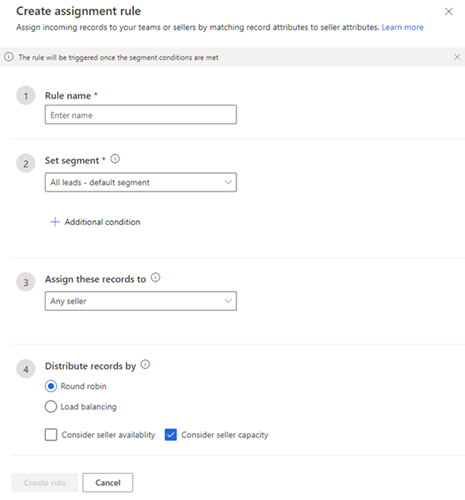
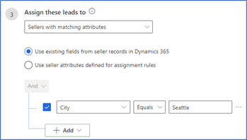
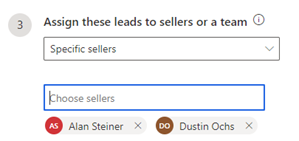
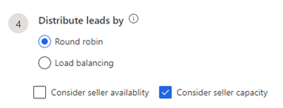

# Create and activate an assignment rule

As a sequence manager, you create assignment rule by defining different conditions such as selecting segment, sellers, and lead distribution. After a rule is activated and a lead satisfies the conditions that are defined in the rule, the lead is automatically assigned to a seller. You don't have to manually assign leads to sellers when they’re created in Dynamics 365 Sales.

The created rules are listed in ascending order. The application always considers the order of the rule while applying on a lead. When a lead is created in the organization, the lead is assessed for assignment from the top of order. When the lead satisfies conditions defined for the rule, then that rule is applied to the lead. To change the order of a rule, hold and drag the rule at the desired location in the order. 

**To create and activate an assignment rule**   
1.	Sign in to your Dynamics 365 Sales Hub app.   
2.	Go to **Change area** in the lower-left corner of the page and select **Sales Insights settings**.   
3.	Under **Sales accelerator**, select **Assignment rules (preview)**.   
4.	On the **Assignment rules** page, select **+ New assignment rule**.   
    The **Create assignment rule** pane opens on the right.   
    >[!div class="mx-imgBorder"]
    >   
5.	In the **Create assignment rule** pane, configure the rules as required.    
    -	**Rule name**: Enter a name for the rule.   
    -	**Set lead segment**: Select a [segment](create-and-activate-a-segment.md) to apply for this assignment rule. When the rule is activated, all leads in the segment will be assigned to sellers in accordance with the defined conditions in the rule.   
        >[!NOTE]
        >If no segment is selected for a rule, or no segment is defined in the application, you can select the default segment that is applied on all leads.     

        Also, you can configure more settings on how the leads in the segment must be assigned to sellers. Select **Additional condition** and then select **+ Add**. Configure the conditions as required.    
        -	**Add row**: Add conditions for when the segment should be applied. For example, you can add rows to specify that this segment be applied to leads created by the user **John Thomas**.    
            1.	Select an attribute from the dropdown list in the first column.    
            2.	Select an operator from the dropdown list in the second column.    
            3.	Enter a value to filter by in the third column.   
                >[!div class="mx-imgBorder"]
                >          
        
                Similarly, you can create more conditions to further filter the leads to apply the segment to.    

        -	**Add group**: Add multiple conditions as a group to your segment if you want to filter leads by using more than one field.   
            1.	Select **AND** or **Or** to group the conditions.     
                >[!div class="mx-imgBorder"]
                >        
            2.	Select the conditions that you want to add to the group.    
                >[!div class="mx-imgBorder"]
                >        
            3.	When you select **AND**, this segment is only applied to leads that meet both criteria. When you select **Or**, the segment is applied to leads that meet any of the filter criteria. For example, to apply this segment to leads that are created by Kenny Smith and have the company name Contoso, select **AND**.  
                Similarly, you can create multiple groups and further filter the leads based on the conditions defined in the groups.    
        -	**Add related entity**: Add a condition based on the attributes of related entities.   
            Select an attribute from the **Related Entity** list in the topmost field, and then choose **Contains data** or **Does not contain data**. This enables the condition section.   
            >[!div class="mx-imgBorder"]
            >        
    -	**Assign these leads to**: Choose an option to assign the leads to sellers or teams.   

        | Option | Description |
        |--------|-------------|
        | Any seller | Select this option to assign the leads to any seller according to their availability, capacity, or distribution pattern. |
        | Seller with matching attributes | Select   this option to assign the leads to sellers who satisfy the conditions defined through attributes selected from Dynamics 365 or assignment rules. The following options are available: •	Use existing fields from seller records in Dynamics 365. •	Use seller attributes defined for assignment rules. For more information about seller attributes in assignment rules, see [Create and manage seller attributes](create-manage-seller-attributes.md).  For example, you want to assign leads to sellers who are based out Seattle. Select the **Use existing fields from seller records in Dynamics 365** option and then select **+ Add** > **Add row**. Enter the condition as **City** (attribute) **Equals** (condition) **Seattle** (value).  |
        | Specific sellers | Choose this option to assign the leads to specific sellers. Select the sellers from the Choose sellers lookup. **Note**: Sellers displayed in the list have their security role added while configuring the sales accelerator.  For more information, see step 4 in [Configure sales accelerator](enable-configure-sales-accelerator.md).  |
        | Specific teams | Select this option to assign the leads to specific team and the lead is available for all the members who are part of the selected team. The teams must be defined in your organization. More information: [Manage teams](/power-platform/admin/manage-teams#ownergroup-team-or-access-team) |
    -	**Distribute leads by**: This option is available only when you select the seller option in the **Assign these leads to** section.    
        >[!NOTE]
        >The **Distribute leads by** option is not available for teams.    

        Select the options as required:   
        -	**Round robin**: The leads are distributed on a cyclical basis to sellers who qualify to receive the lead based on the assignment rules' conditions.    
        -	**Load balancing**: When the leads match to sellers, the leads are distributed among the sellers depending on their current work load  so that sellers are equally occupied.   
        -	Select the **Consider seller availability** option to consider the assignment of leads according to the availability of the seller. More information: [Configure your work availability](personalize-sales-accelerator.md#configure-your-work-availability).    
        -	Select the **Consider sellers capacity** option to take into consideration the seller's capacity of max numbers of leads that can be handled by them in parallel. More information: [Set lead capacity to a seller](manage-sales-teams.md#set-lead-capacity-to-sellers).    
            >[!div class="mx-imgBorder"]
            >      

6.	Select **Create rule**.     
    The rule is created and activated. Also, the rule is listed in the Rules section in ascending order. The newly created rule is always listed at the bottom of the list.

### See also

[Manage assignment rules for lead routing](create-manage-assignment-rules-lead-routing.md)

[!INCLUDE[footer-include](../includes/footer-banner.md)]