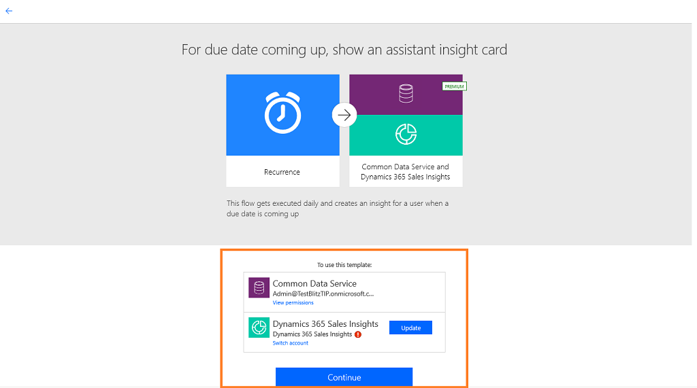

# Create custom insight cards

As an administrator or sales manager, you can create your own suggested actions that are more relevant to your organization through the assistant management feature. By using events and conditions, you can customize the circumstances on when to create suggestions and push information into the seller’s workflow. This helps the sellers to close deals faster. The following diagram illustrates a high-level flow of insight card creation:

> [!div class="mx-imgBorder"]
> 

In this procedure, we will show as an example how to create an insight to act when a property is updated. Let’s create the **When property is updated, create an insight to act** card.

1.	Sign in to **Dynamics 365 Sales** and go to **Sales Hub** app.

2.	Go to **Change area** and select **Sales Insights settings**.

    > [!div class="mx-imgBorder"]
    > 

3. On the sitemap, select **Home** under **Assistant** to go to **Assistant Studio** page.

    > [!TIP]
    > Alternatively, in the **Sales Insights settings** page, select **Manage** from the **Assistant (full capabilities)** section to go to **Assistant Studio** page.

4. On the Assistant Studio page, select **+ Create a new insight card**.
 
    A template selection page opens. 
    
    > [!NOTE]
    > We recommend you use templates to create insight cards.

5. Select a template to create the card.

    > [!NOTE]
    > If you want to create insight cards from an empty flow, select **Create from blank**. To learn more, see [Create a flow in Power Automate](/power-automate/get-started-logic-flow).
    
    In this example, we selected the **Due date is coming up** template to create the custom card.

    > [!div class="mx-imgBorder"]    
    > 

    The flow validates your accounts of the applications that the flow is going to connect. In this example, the flow is connecting to common data services and Dynamics Sales Insights. Once you are successfully signed in, you can continue creating the card.

    If any of the accounts is not valid, the **Continue** button is grayed out and you cannot proceed further. Select **Update** to sign in with a valid credential.

    > [!div class="mx-imgBorder"]       
    > 

6. Select **Continue**.

    The predefined flow is displayed. In this example, we are creating an insight when a due date is coming up for an opportunity. There are three steps associated with the predefined flow with the prepopulated data. 
    - **Step 1**: Create schedule
    - **Step 2**: Define operation
    - **Step 3**: Define control
    
    You can edit the steps according to your requirements.

    > [!div class="mx-imgBorder"]       
    > 

7. In step 1, a schedule when you want to display the card is defined. In this example, the frequency is set to daily and you can add other parameters such as time zone. 

    > [!div class="mx-imgBorder"]       
    > 

    If you want to change the flow, select the + icon on the connector that is linking to the next step and select **Add an action** as per your organizational requirements. To learn more, see [Add multiple actions and advanced options to a flow](/power-automate/multi-step-logic-flow).

8. In step 2, an operation is defined to get records from an organization to the selected entity. In this example, we have selected the entity as task and the organization. 

    Select **Show advanced options** to further update the step by configuring the parameters **Filter Query**, **Order By**, **Top Count**, and **Expand Query**.

    > [!div class="mx-imgBorder"]       
    > 

9. In step 3, an **apply to each** control is selected and enter the necessary information.

    a. The **Value** token is added to the **Select an output from previous steps** box. This value is obtained from the previous step where we defined the entity.
    
    > [!div class="mx-imgBorder"]       
    >   
  
    b. The condition step is defined to match the date of the task that is defined in step 2 to the current date to trigger the condition. Here, we are defining the value as **formatDateTime(item()?['scheduledend'],'yyyy-MM-dd')**, the condition as **is equal to**, and the threshold value as **formatDateTime(utcNow(),'yyyy-MM-dd')**.
    
    > [!div class="mx-imgBorder"]       
    > 
    
      To learn more about conditions, see [Add a condition to a flow](/power-automate/add-condition).

    c. The **If yes** section defines the properties of the card and actions you can take. Here we have selected an action to **Create a card for the assistant**. Enter the following information:

      -  **Organization Name**: The name of the organization for which you want to trigger the card.
      - **Card Name**: Name of the card to refer to in the list of available cards in the **Manage insight cards**.
      - **Description**: The summary or the basic information of the card that is to be displayed.
      - **Action**: The convenient links that will help you complete whatever type of action the card is recommending. The number (up to two) and types of links provided here vary by card type.
      - **Action Parameter**: The ID of the created action.
      - Optionally, you can configure the advanced options for the condition. Select **Show advanced options** and update the parameters **Title**, **Start Date**, **End Date**, **Display to**, **Reasons**, **Regarding Object ID**, **Action Parameter Entity ID Type**, and **Regarding Object Type**.
        
      When you select a text box, the dynamic content pane appears. You can select and add the relevant fields. These dynamic content field variables and values displayed by these fields change according to the information passed.

      > [!div class="mx-imgBorder"]       
      > 

    To learn more about expression conditions, see [Use expressions in conditions to check multiple values](/power-automate/use-expressions-in-conditions).

10. Use **Flow Checker** to verify errors and warnings in the flow. 

    Errors and warnings in the flow cause performance or reliability issues. Ensure that the flow is error and warning free. The checker is always active, appearing in the command bar in the designer. The checker shows a Red dot when it finds one or more errors in your flow.

    For example, while creating **For due date coming up** card, you have not entered **Card Name**. The flow checker identifies the error and displays a red dot.  

    > [!div class="mx-imgBorder"]       
    > 

    Select the **Flow Checker** and the corresponding error is displayed with more details. In this example, the error specifies that the **Card Name** is not entered. Resolve the error to continue.

    > [!div class="mx-imgBorder"]       
    > 

    > [!NOTE]
    > You must resolve all errors and warnings to save the flow.

11. (Optional) Select **Test** button to test your flow. 

    Ensure that all the configured steps are working as required. The test feature runs and validates each step in the flow and highlights if any error occurs on a step. You must resolve the error to proceed.

    Select an option to test the flow by triggering actions or by using the data from previous test runs, and then select **Save & Test**.

    > [!div class="mx-imgBorder"]
    > 

    In this example, you see that the step **Look at all tasks in Dynamics 365** has failed the test. Select the step and more information on the error is displayed. You must resolve the error to proceed.

    > [!div class="mx-imgBorder"]
    > 

12. Save the flow.

    When the card is saved, the **Manage insight cards** list gets updated and the **Due date coming up** card displays. Now you can edit the card to set priority and assign to different security roles.

## View your saved flows

After you create a flow, a card must be generated to based on the created flow to access the flow in the designer. Sometimes, cards may not be generated immediately and you may not find the created flow to update or view. 

To access the saved flows, follow these steps:

1. Go to [Microsoft Power Automate](https://flow.microsoft.com) and sign in with your Dynamics 365 Sales credentials.

    > [!NOTE]
    > By default, your organization is selected based on your latest association. If you have multiple organizations associated with you, select the proper organization from your profile settings. 

2. Select Solutions and then select Default Solution.

    > [!div class="mx-imgBorder"]
    > 

    All default solutions are listed.

3. On the tool bar, go to Search and search for the flow that you want update or view.

    > [!div class="mx-imgBorder"]
    > 

### See also

[Tutorial 1: Create Hello World card](assistant-tutorial1.md)

[Tutorial 2: Create a Hello World card for each user in your organization](assistant-tutorial2.md)

[Configure and manage insight cards for Assistant (full capabilities)](configure-assistant.md#configure-and-manage-insight-cards-for-assistant-full-capabilities)

[Edit insight cards](edit-insight-cards.md)

[Optimize ranking of insight cards](optimize-ranking-insight-cards.md)

