# Create and manage sequences

Sequences help sales managers enforce best practices by introducing a set of consecutive activities for sellers to follow during the course of their day. A manager can connect sequences to leads and opportunities that appear in a seller's work queue, to help sellers prioritize activities to focus on selling, be more productive, and better align to business processes.

As a sales manager, you can use the sequence designer to:

- [Create and activate a sequence](#create-and-activate-a-sequence).
- [Connect a sequence to records](#connect-a-sequence-to-records).
- [View details of a sequence and its connected records](#view-details-of-a-sequence-and-its-connected-records).
- [Edit a sequence](#edit-a-sequence).
- [Delete a sequence](#delete-a-sequence).

## Review prerequisites

Before you start, be sure you have met the following prerequisites:

- You have the **Sequence Manager** security role. More information: [Assign a security role to a user](https://docs.microsoft.com/power-platform/admin/create-users-assign-online-security-roles#assign-a-security-role-to-a-user).

- The sales accelerator has been enabled and installed in your organization. More information: [Enable and configure the sales accelerator](enable-configure-sales-accelerator.md)<!--Please stand by for the final titles for these related articles and features. I'm still not sure what the nomenclature should be. I need to verify with the editing team what they've learned. The release notes call it the "sales acceleration feature," but I see that the UI calls it "sales accelerator." -->

## Create and activate a sequence

Every organization has its own selling processes for sellers to follow. A sequence helps sellers overcome any inconsistencies in training or lack of documentation as they progress through the sales journey. When you create a sequence, you define the activities you want your sellers to perform&mdash;and the order to perform them in&mdash;as they handle leads and opportunities. This lets sellers concentrate on selling and gives them a better understanding of what to do next.

**To create and activate a sequence**

1. Sign in to the **Sales Hub** app.

2. At the bottom of the site map, select **Change area** > **Sales Insights settings**.

3. Under **Acceleration**, select **Sequence (preview)**.

4. On the **Sequences (preview)** page, select **+ New sequence**.

    > [!div class="mx-imgBorder"]
    > 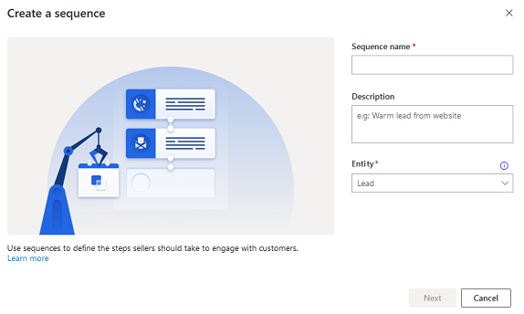

5. In the **Create a sequence** dialog dox, enter the following information:

    | Parameter | Description |
    |-----------|-------------|
    | Sequence name | The name of the sequence. |
    | Description | A description of the sequence. (Optional) |
    | Entity | The entity type for which you want to apply this sequence. By default, the Lead entity type is selected. |

6. Select **Next**.

7. Choose and configure one of the following activities:

    > [!div class="mx-imgBorder"]
    > 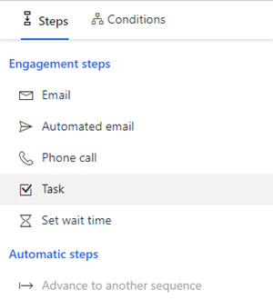
    
    - **Email**: Creates an email activity for sellers to communicate with customers. When this activity is shown to the seller, an envelope icon<!--Edit okay?--> is displayed on the record. When a seller selects the icon, an email composer opens with a template if one was selected. If no template was selected, an empty email composer opens.

        > [!div class="mx-imgBorder"]
        > 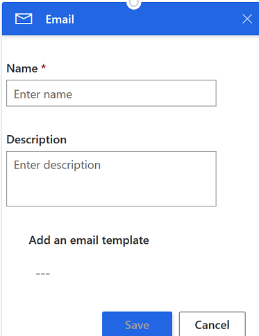 

        Enter the following information to configure the email activity:

        1. A name and description for the activity. The information you enter here will be displayed to sellers.

        2. If templates are available for your organization, in the **Assign email template** box, select the template you want to assign for this step.

        3. Save the activity.

         > [!div class="mx-imgBorder"]
         > 

    - **Phone call**: Creates a phone call activity for sellers to communicate with customers. When this activity is shown to the seller, a phone icon is displayed on the record. When sellers select the icon, a softphone appears on the app to dial the customer.

        > [!div class="mx-imgBorder"]
        >  

        Enter a name and description for the phone call activity, and then select **Save**. The information you enter here will be displayed to sellers.

        > [!div class="mx-imgBorder"]
        > 

    - **Task**: Creates a custom activity that you define, such as scheduling a meeting and <!--I don't know what the following clause means. What is the "activity selector"? If it's the screen shown at the beginning of this step, it does seem to have Task as one of its fields.-->meet the customer on the field that are not specified in the activity selector.

        > [!div class="mx-imgBorder"]
        > 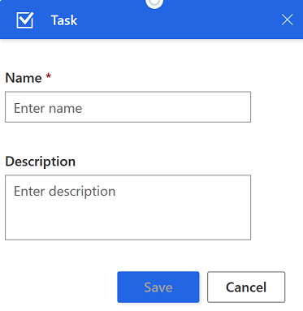

        Enter the name and description of the custom activity, and then select **Save**. The information you enter here will be displayed to sellers.

        > [!div class="mx-imgBorder"]
        > 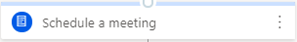

    - **Set wait time**: Specifies the interval between activities&mdash;that is, after an activity is completed and before the next activity occurs&mdash;during which sellers need to wait. A sequence can't start or end with this activity.  

        When this activity is shown to sellers on a record, they don't need to perform any action; they simply need to wait until the wait time expires before they perform the next activity.  

        > [!div class="mx-imgBorder"]
        > 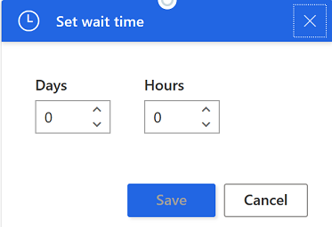

        Choose the duration in days and hours that you want sellers to wait before they perform the next activity, and then select **Save**. The maximum wait time is 30 days.

        > [!div class="mx-imgBorder"]
        > 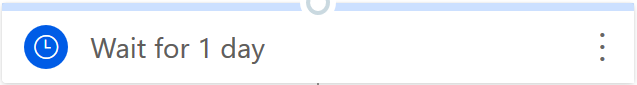

8. Select the **Add** icon, and then repeat **step 7** for all the activities that you want to add to the sequence. 

9. Select **More options** in the upper-right corner of the page, and then select **Save**.

10. Select **More options** again, and then select **Activate** to activate the sequence.
    
11. Select **Yes** in the confirmation message that appears.

    >[!NOTE]
    >An error might occur if you've added **Set wait time** as the last activity of the sequence. You must delete this last **Set wait time** activity, and then save and activate the sequence.  
    
    The sequence is activated and listed in the sequence designer home page.

   > [!div class="mx-imgBorder"]
   > 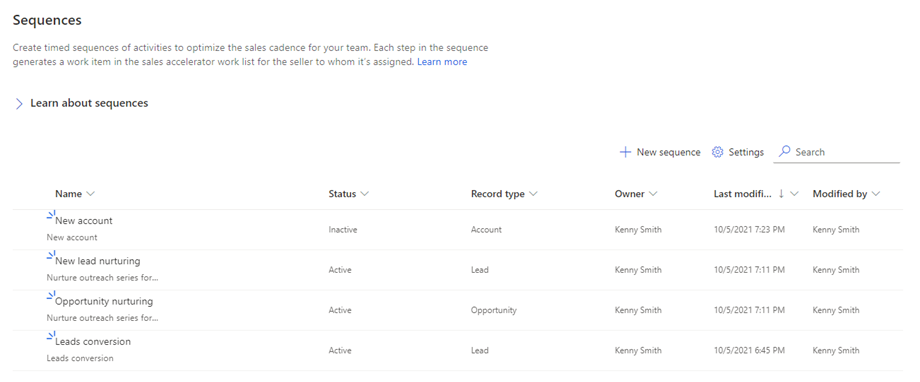 

Next, you connect the active sequence to lead or opportunity records.

## Connect a sequence to records

After you create and activate the sequence for the selling process, you connect the sequence to records depending on the entity that you've created the sequence for. When a sequence is connected to an entity, the activities defined in the sequence will be shown in order on the record's **Summary** under **Up next** in **My work**.

**To connect a sequence to records**

1. Sign in to the **Sales Hub** app.

2. At the bottom of the site map, select **Change area** > **Sales**.

3. Under **Sales**, select **Leads** or **Opportunities**, depending on the records you want to connect.

    In this example, we select **Leads**.

    > [!div class="mx-imgBorder"]
    > 
    
4. Select the records to which you want to connect the sequence. In this example, we select **Nancy Anderson** and **Maria Campbell**.

    > [!div class="mx-imgBorder"]
    > 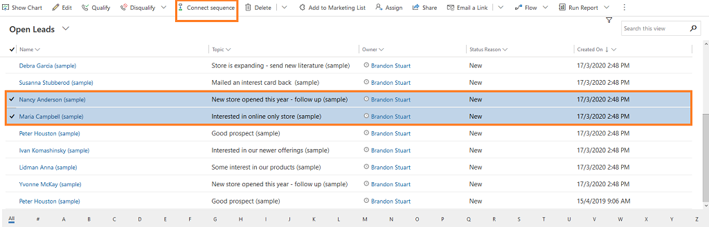

    >[!NOTE]
    >You can't connect a sequence to a record that has already been associated with a different sequence. You must remove the record from the sequence it's currently associated with, and then connect it to the sequence you want. More information: [View details of a sequence and its connected records](#view-details-of-a-sequence-and-its-connected-records)

5. Select **Connect sequence**. The list of available sequences that appears includes sequences created by you and other sales managers.

    In this example, a list of sequences that are configured for the **Lead** entity is displayed. 

    > [!div class="mx-imgBorder"]
    > 

6. Select a sequence, and then select **Connect**.

A confirmation message appears at the bottom of the page, and the sequence is connected to the selected lead records. Now, sellers who have access to the lead record can see the activities associated with it.

## View details of a sequence and its connected records

You can view the details of a sequence and the records associated with it. This view can also be used to remove records associated with the sequence.

**To view details of a sequence and its connected records**

1. Sign in to the **Sales Hub** app.

2. At the bottom of the site map, select **Change area** > **Sales Insights settings**.

3. Under **Acceleration**, select **Sequence (preview)**.

4. On the **Sequences (preview)** page, select the **Active** tab.

    > [!div class="mx-imgBorder"]
    > 
    
5. Hover over a sequence, and then select **More options** > **Properties**. 

    > [!div class="mx-imgBorder"]
    > 

    The sequence opens in the **Summary** view. You can view the details of the sequence such as the name of the sequence, its owner, its status, the entity that the sequence is associated with, and the total number of activities defined in it.

    > [!div class="mx-imgBorder"]
    > 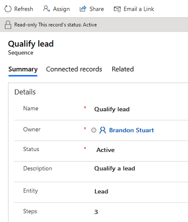
    
6. To view associated<!--Edit okay? We've called them "connected," "associated," and now "assigned." Is there a difference among these terms? If not, maybe we should just stick with "connected"?--> records, select the **Connected records** tab.

    > [!div class="mx-imgBorder"]
    > 

7. To remove a record from the sequence, select the record, and then select **Disconnect**.

    > [!div class="mx-imgBorder"]
    > 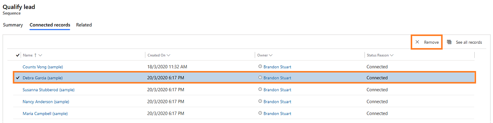

    In the confirmation message that appears, select **Disconnect**.

    > [!div class="mx-imgBorder"]
    >  

    The record is removed from the list and can be connected to a different sequence.

## Edit a sequence

If your organization changes its selling process, you might want to edit a sequence to reflect the changes. You can only edit a sequence that's in an inactive state, so you must deactivate it first.

**To edit a sequence**

1. Sign in to the **Sales Hub** app.

2. At the bottom of the site map, select **Change area** > **Sales Insights settings**.

3. Under **Acceleration**, select **Sequence (preview)**.

4. On the **Sequences (preview)** page, verify the state of the sequence you want to edit:

   - If the sequence is **Inactive**, skip to step 5.
   
   - If the sequence is **Active**, select it, and then select **More options** > **Deactivate**. 

4. Hover over the sequence, and then select **More options** > **Edit**.

    > [!div class="mx-imgBorder"]
    > 

5. Do one of the following:

    - To add an activity, perform **step 7** from [Create and activate a sequence](#create-and-activate-a-sequence), earlier in this article.
    
    - To edit an activity, select **More options** > **Edit**.

        > [!div class="mx-imgBorder"]
        > 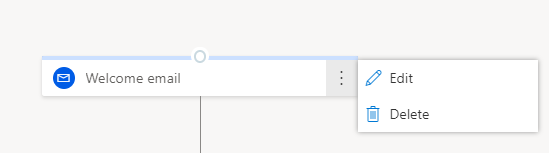    

        Make the edits you want, and then select **Save**. 

6. (Optional) If you want the sequence to be available to associate with records, select **Activate**. 

7. Exit the sequence designer.

## Delete a sequence

You can delete sequences that your organization no longer needs, and they'll be deleted permanently from the app. You can delete active or inactive sequences. When you delete an active sequence, the records that were associated with the sequence will be disassociated from it.

**To delete a sequence**

1. Sign in to the **Sales Hub** app.

2. At the bottom of the site map, select **Change area** > **Sales Insights settings**.

3. Under **Acceleration**, select **Sequence (preview)**.

4. On the **Sequences (preview)** page, hover over the sequence you want to delete, and then select **More options** > **Delete**.

5. In the confirmation message that appears, select **Delete permanently**.

    > [!div class="mx-imgBorder"]
    > 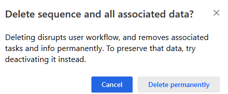

### See also

[Enable and configure the sales accelerator](enable-configure-sales-accelerator.md)  
[Prioritize the sales pipeline by using the work list](prioritize-sales-pipeline-through-work-list.md)